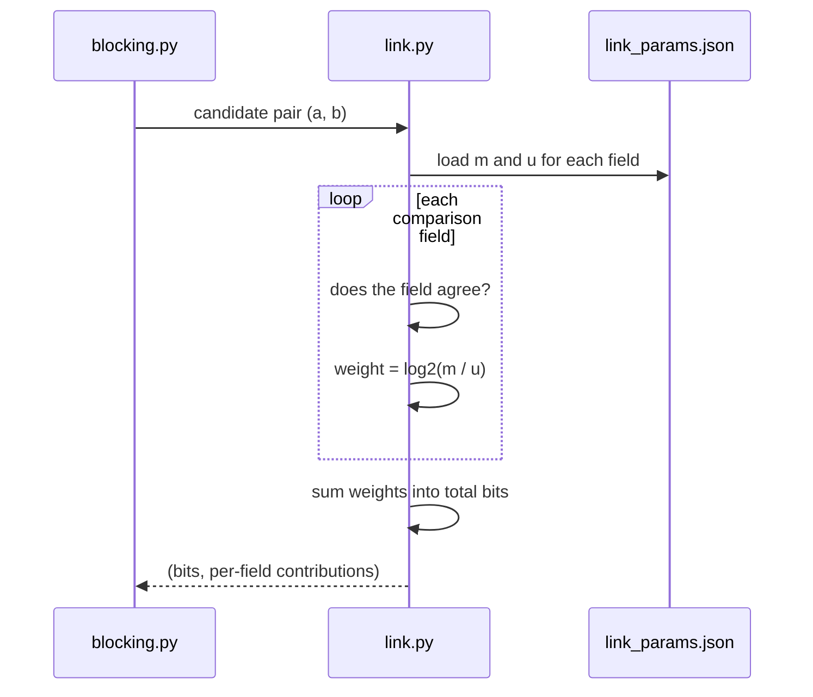

# CLAUDE.md

Instructions for building **Jaal**. Read this fully before writing any code.

---

## What this project is

Jaal detects **groups of accounts run by one person** farming a merchant's
first-order promo discount. It is a submission for the Razorpay Buildathon 2026,
Track 02 (AI Risk Manager).

The core idea, and the thing that shapes every decision: a ring of 50 accounts
each places one perfectly normal order. No single transaction looks wrong. The
fraud lives in the relationships between accounts, not inside any account. So
the unit of detection is the **cluster**, never the transaction.

Defence only. All data is synthetic. The generator is a test fixture.

---

## The specification

**`extras/plan.md`** is the full implementation plan. It has 11 phases with
steps, code sketches, checklists, and references.

That file is the source of truth. **Follow it.** If you believe a step is wrong,
write your reasoning into `docs/DECISIONS.md` and proceed with the better
approach. Do not silently deviate and do not leave the disagreement unrecorded.

Do not edit `extras/plan.md`.

---

## Skills

The project has a `.claude/` skills directory at
`/home/prawesh/All Projects/jaal/.claude`. Use the relevant skills in there
whenever they apply to the task at hand.

---

## Autonomous operation

You will be started once and expected to run the project to completion. Behave
accordingly.

### Proceed without asking

Do not pause for approval on ordinary work. Keep going through:

- Writing, running, debugging and committing code
- Creating documentation and diagrams
- Choosing between reasonable implementation options
- Fixing your own failing tests
- Moving from one phase to the next once its checklist passes

Record decisions in `docs/DECISIONS.md` rather than asking about them.

### Stop and ask only for

- Adding a dependency beyond the nine in the plan
- Any change that would break a non-negotiable rule below
- A phase that has failed three separate repair attempts
- Anything that would cost money

When you stop, write the blocker into `docs/STATUS.md` first, so the state
survives even if the session ends.

### When something fails

1. Read the actual error, do not guess
2. Form one hypothesis and test it
3. If three attempts fail, write what you tried into `docs/STATUS.md`, mark the
   phase blocked, and move to work that does not depend on it
4. Never fake a result to get past a failure

### Self-check loop

After every step: run the tests, run the relevant script, look at the real
output. If the output is wrong, fix it before committing. Do not carry a broken
state into the next step.

---

## System constraints

You are running on the developer's daily-use laptop. If you exhaust its
resources, their machine freezes and they lose work. Treat these as hard limits,
not suggestions.

### Measure before you run, never assume

**Do not trust any number written in this file.** Free memory changes constantly
depending on what the developer has open. Before every heavy operation, measure
what is actually available and size the job to fit.

Run this first:

```bash
free -h                                    # what is actually free right now
nproc                                      # threads available
uptime                                     # load average, are cores already busy
df -h .                                    # disk, for results and caches
```

Reference snapshot from when this project started, for context only. Do not code
against these numbers:

```
CPU     12th Gen Intel i5-12450H, 8 cores / 12 threads
RAM     15.6 GB total, roughly 8 GB in use by the desktop
GPU     RTX 2050. Not used. LLM calls go to Ollama Cloud.
OS      Ubuntu 24.04, GNOME running
```

### The budget helper

Write this early, in Phase 0, and use it everywhere:

```python
# detector/resources.py
"""Runtime resource budget. Measure, then decide."""

import os
import resource

DESKTOP_RESERVE_MB = 3000   # never take this from the developer
FLOOR_MB           = 1500   # below this, refuse to run
MAX_WORKERS        = 4      # ceiling regardless of what the machine offers


def available_mb() -> int:
    with open("/proc/meminfo") as f:
        for line in f:
            if line.startswith("MemAvailable:"):
                return int(line.split()[1]) // 1024
    raise RuntimeError("could not read MemAvailable from /proc/meminfo")


def budget() -> dict:
    """What this process may safely use, right now."""
    avail = available_mb()
    mem_mb = avail - DESKTOP_RESERVE_MB

    if mem_mb < FLOOR_MB:
        raise RuntimeError(
            f"only {avail} MB available. After reserving {DESKTOP_RESERVE_MB} MB "
            f"for the desktop, {mem_mb} MB is left, below the {FLOOR_MB} MB floor. "
            f"Close something or run a smaller job."
        )

    threads = os.cpu_count() or 4
    load = os.getloadavg()[0]
    free_threads = max(1, int(threads - load))
    workers = max(1, min(MAX_WORKERS, free_threads // 2))

    return {"available_mb": avail, "mem_mb": mem_mb,
            "workers": workers, "threads": threads, "load": round(load, 2)}


def apply(headroom: float = 0.9) -> dict:
    """Set a hard address-space cap so a runaway job dies instead of swapping."""
    b = budget()
    cap = int(b["mem_mb"] * headroom) * 1024 * 1024
    resource.setrlimit(resource.RLIMIT_AS, (cap, cap))
    return b
```

Every entry point starts with it, and prints what it decided so the developer can
see it in the log:

```python
from detector.resources import apply

b = apply()
print(f"[resources] {b['available_mb']} MB free, "
      f"using up to {b['mem_mb']} MB, {b['workers']} workers "
      f"(load {b['load']})")
```

### Rules that follow from measuring

| Rule                                     | Detail                                                                             |
| ---------------------------------------- | ---------------------------------------------------------------------------------- |
| Always reserve for the desktop           | 3 GB, untouchable. Their browser and editor live there.                            |
| Refuse rather than degrade               | If the budget is under the floor, raise and stop. Do not run a job that will swap. |
| Worker count is derived, never hardcoded | From free threads and current load, capped at 4. Never`n_jobs=-1`.               |
| Re-measure between phases                | A long build spans hours. Conditions change.                                       |
| One heavy process at a time              | Do not background a second run and start a third.                                  |

```python
# WRONG, grabs all 12 threads and stalls the desktop
RandomForestClassifier(n_jobs=-1)

# RIGHT
RandomForestClassifier(n_jobs=budget()["workers"])
```

Run long jobs at lowered priority so the desktop stays responsive:

```bash
nice -n 10 python -m detector.run --tier sophisticated
```

If `budget()` raises, do not work around it. Report it in `docs/STATUS.md` and
either wait or run a smaller job with `--accounts 1500`.

### Memory discipline in this pipeline

Four places where this project can blow up. Guard all of them.

**1. Pair explosion.** 12,000 accounts is 72 million possible pairs. If blocking
is misconfigured and you materialise them, the process dies. Add a hard guard:

```python
# config.py
MAX_CANDIDATE_PAIRS = 2_000_000   # refuse to proceed beyond this
```

```python
if n_pairs > MAX_CANDIDATE_PAIRS:
    raise RuntimeError(
        f"blocking produced {n_pairs:,} pairs, over the {MAX_CANDIDATE_PAIRS:,} "
        f"limit. Tighten the blocking rules before running this."
    )
```

**2. Holding many worlds at once.** Building the training table means generating
200 worlds. Never hold them all. Process one, extract its features, discard it:

```python
# WRONG, 200 worlds x 12k accounts in memory at once
worlds = [generate(seed=s) for s in range(200)]

# RIGHT, one at a time
for s in range(200):
    accounts = generate(seed=s)
    rows.extend(extract_features(accounts))
    del accounts
```

**3. Brute-force subset search.** Any loop over `2**n` combinations must have an
explicit cap on `n`. If `n` can exceed 18, use a bounded search instead.

**4. Blocks that are too large.** A single blocking key matching 5,000 accounts
generates 12 million pairs on its own. Skip any block above 400 members, log it,
and report the skipped count.

### Before any heavy run

Check what is actually free, do not assume:

```bash
free -h
```

If available memory is under 3 GB, stop and tell the developer rather than
starting the run.

### Scale down while developing

Do not run the full 12,000-account dataset while iterating. Use a small one:

```bash
python -m detector.run --accounts 1500 --seeds 0-4      # development
python -m detector.run --accounts 12000 --seeds 0-199   # full, run once
```

Every script must accept `--accounts` and `--seeds` so this is possible. Full
runs happen when a step is finished, not while debugging it.

---

## Worker agents

You decide how many worker agents to spin up and when. Nobody is going to
approve each one. What follows is the constraint you allocate within.

### The rule that matters most

**Only one worker may run heavy compute at a time.**

Worker agents are cheap in wall-clock time but they are not free on this machine.
Three workers each starting a training run means three processes each claiming
the memory budget, and the laptop stops. The budget from `resources.budget()` is
for the **whole machine**, not per agent.

So split work by what it costs:

| Work type                          | Parallel?               | Why                                   |
| ---------------------------------- | ----------------------- | ------------------------------------- |
| Writing docs and diagrams          | Yes, up to 3            | Text only, no compute                 |
| Code review of finished modules    | Yes, up to 3            | Read only                             |
| Writing tests for existing code    | Yes, up to 2            | Cheap to run                          |
| Reading and summarising references | Yes, up to 3            | No local compute                      |
| Building the React UI              | Yes, 1 alongside others | `npm` is heavy, count it as compute |
| Training a model                   | **No, one only**  | Claims the memory budget              |
| Full pipeline runs                 | **No, one only**  | Same                                  |
| Pair scoring, clustering           | **No, one only**  | Same                                  |
| Generating 200 worlds              | **No, one only**  | Same                                  |

### Concurrency limits

- **3 workers maximum** at any moment, across all types
- **1 worker maximum** doing compute
- If a compute worker is running, other workers must be doing text-only work
- Before spawning any worker, call `resources.budget()` and pass it the numbers.
  A worker that does not know the budget will assume it has the whole machine.

### When workers actually help here

Most of this project is sequential. Phase 2 depends on Phase 0, Phase 5 depends
on Phase 4. Spawning workers to run phases in parallel does not work and will
produce a mess.

Genuinely parallel work:

| Point in the build        | Split                                                                                                                             |
| ------------------------- | --------------------------------------------------------------------------------------------------------------------------------- |
| After any phase completes | One worker writes the phase doc and its L3 diagram, while you start the next phase's code                                         |
| Phase 3, step 3.4         | One worker runs the Louvain comparison while you tune Leiden resolution. Both are compute, so run them in sequence, not together. |
| Phase 9                   | Three workers: README, Flask API, React UI. None touch the pipeline. Best parallel opportunity in the project.                    |
| Phase 10                  | One worker drafts the video script while you do the clean-checkout test                                                           |
| Any time                  | A worker writing tests for a module you finished two steps ago                                                                    |

### When to just do it yourself

- Anything under about 20 minutes of work
- Anything needing the full pipeline context to get right
- Anything touching `config.py` or a shared module, since two workers editing the
  same file will conflict
- Debugging. Split attention makes it worse.

### Every worker brief must contain

1. The exact task and its definition of done
2. Which files it may write, and which it must not touch
3. Whether it may run compute, and if so its memory and worker allocation
4. The writing style rules from this document
5. That it must not commit. **You own the commits.** Workers produce files, you
   review and commit them.

Example brief:

```
Write docs/phases/phase-02-linking.md following the template in CLAUDE.md.

Read: extras/plan.md Phase 2, detector/link.py, detector/blocking.py,
      results/link_params.json
Write: docs/phases/phase-02-linking.md, docs/diagrams/L3-linking.md only
Compute: none. Do not run the pipeline.
Numbers: take them from results/link_params.json. Do not invent any.
Style: plain English, no em dashes, short sentences.
Do not commit. Report back when the file is written.
```

### After workers finish

You review their output before it goes anywhere. Two things to check every time:

- **Invented numbers.** A worker writing a doc without access to a real run will
  produce plausible figures. Verify every metric against `results/`.
- **Style drift.** Check for em dashes and corporate phrasing.

Then commit it yourself, in the normal format.

### Record it

Note any non-obvious split in `docs/DECISIONS.md`:

```markdown
## D-012: Ran Phase 9 with three parallel workers
Date: <date>

README, Flask API and React UI touch different files and none run the
pipeline, so they parallelise cleanly. Checked free memory first (6.1 GB
available), gave the UI worker the npm budget and the other two text-only
briefs. Reviewed and committed all three separately.
```

---

## Docker

**Anything that needs a database, a broker, a queue, or any background service
runs inside a container. Never install a service on the host.** This is strict,
no exceptions.

The plan as written does not need a database. Data is JSON on disk. If you reach
a point where you believe one is needed, that is a stop-and-ask moment under
"Autonomous operation", not something to set up on your own.

### If you do run a container

Always set explicit limits. An unbounded container will take the whole machine.

```bash
docker run --rm \
  --memory=2g \
  --memory-swap=2g \
  --cpus=2 \
  --name jaal-test \
  <image>
```

`--memory-swap` equal to `--memory` disables swap for the container. Without it,
Docker allows swap and the laptop will thrash.

### Rules

- Use `-slim` or `-alpine` base images. Never a full distro image.
- One container at a time. Do not bring up a multi-service stack.
- `--rm` always, so nothing is left running after a test.
- Stop containers when the test finishes. Verify with `docker ps`.
- Never `docker build` a large image without saying why first.
- No host port bindings other than what the test needs, and always on
  `127.0.0.1`, never `0.0.0.0`.

### docker-compose, if used

```yaml
services:
  db:
    image: postgres:16-alpine
    mem_limit: 1g
    cpus: 1.0
    ports:
      - "127.0.0.1:5432:5432"
```

Bring it up only for the duration of the test, then `docker compose down`.

### Never containerise the main pipeline

`run.sh` runs directly on the host with the resource caps above. A judge should
be able to clone the repo, install nine pip packages, and run it. Requiring
Docker to reproduce the results adds a failure mode and helps nobody.

---

## Non-negotiable rules

These override convenience, speed, and anything you think would be nicer.

**1. Never tune on the holdout.** Seeds 900 to 999 are sealed. They are opened
once, in Phase 7. If you find yourself running against them for any other
reason, stop.

**2. Never invent a number.** Every metric in any document must come from code
that actually ran. If a number is not yet measured, write `TODO: not yet measured`. Never write a plausible-looking figure.

**3. No reported number may need the internet.** Metrics must reproduce offline
from `./run.sh`. The LLM explanation layer is cached and optional.

**4. Never average across difficulty tiers.** Always report per tier. Blending
hides the sophistication threshold where detection fails, which is the most
interesting result this project produces.

**5. Split by seed, never by row.** Clusters from the same generated world share
generator artefacts. Random row splits leak them across train and test.

**6. Money is integers.** Rupees as `int`. Never float. Float drift on currency
looks exactly like a real discrepancy.

**7. Fix every random seed.** Generator, clustering, model. Same input must give
byte-identical output.

**8. No secrets in git.** `OLLAMA_API_KEY` comes from the environment. Never
commit it, never print it, never put it in a doc.

**9. Never exhaust the machine.** Measure available resources with
`resources.budget()` before every heavy run, reserve 3 GB for the desktop, and
run one compute job at a time. A frozen laptop costs the developer their work,
which is worse than any delay.

**10. Report bad results honestly.** If the model loses to the rules baseline, or
a tier scores zero, write that down plainly. Honest negatives are worth more
than good numbers in this project. Do not soften them.

---

## Git and commits

### Commit often, in small pieces

Commit after **each numbered step** in the plan that produces working code, not
at the end of a phase and definitely not at the end of the project. A reviewer
should be able to read the history and follow how the project was built.

Rules:

- One logical change per commit
- Code, its tests, and its documentation go in the **same commit**
- Never commit code that fails `pytest`
- Never bundle two phases into one commit
- `run.sh` must work at every commit once it exists

Rough expectation: 40 to 70 commits across the project. If you have written
three files and not committed, you have waited too long.

### Commit message format

```
<type>: <what changed, imperative mood, lowercase>

<why, in one or two plain sentences, only if not obvious>
```

Types: `feat`, `fix`, `docs`, `test`, `refactor`, `data`, `chore`

Examples:

```
feat: add Fellegi-Sunter pair scoring with per-field weight breakdown

Keeps the contribution list on every scored pair so the explanation layer
in Phase 8 can report why a pair matched, not just that it did.
```

```
fix: clamp u estimates to 1e-7

A u of exactly zero gave infinite match weight and broke the threshold
sweep on the adaptive tier.
```

```
docs: add L3 diagram and sequence for the blocking stage
```

```
data: extract order value and repeat rate priors from Olist
```

### Commit message rules

- Plain English, same style as the rest of this document
- No em dashes
- **No attribution footers.** Do not add "Generated with Claude Code", do not add
  "Co-Authored-By: Claude", do not add any tool or agent signature.
- No emoji
- Present tense, imperative: "add", not "added" or "adds"
- Body explains **why**, not what. The diff already shows what.

### Working directory

The repo lives at `/home/prawesh/All Projects/jaal/`. That path contains a
space, so quote it in every shell command:

```bash
cd "/home/prawesh/All Projects/jaal"
```

Work on `main`. No feature branches needed for a project this size.

---

## Writing style

This applies to code comments, documentation, commit messages, and how you
explain things in chat.

- Plain English. Write like an engineer explaining something to another engineer.
- **Never use em dashes.** Use commas, periods, colons, or parentheses. This is a
  hard rule, check your output before sending.
- Short sentences. Each one should connect naturally to the next.
- Common words. No buzzwords, no filler, no corporate tone.
- Explain the basic idea first, then the detail.
- Concrete examples over vague claims. Use real numbers from real runs.
- If something can be said more simply, say it more simply.

Bad: "This module leverages a sophisticated probabilistic framework to
facilitate entity resolution."

Good: "This module scores how likely two accounts are run by the same person.
It adds up evidence from each field, measured in bits."

---

## Repo structure

```
jaal/
  extras/plan.md              the spec. read it, do not edit it.
  CLAUDE.md                   this file
  README.md                   written in Phase 9, results above the fold
  run.sh                      one command, offline, reproduces everything
  requirements.txt            pinned

  config.py                   all tunable constants, single source of truth

  detector/
    generate_accounts.py      synthetic worlds + hidden answer key
    calibrate_from_olist.py   extracts real distributions, Phase 0
    blocking.py                candidate pair generation
    link.py                    Fellegi-Sunter pair scoring
    link_train.py              m and u estimation
    cluster.py                 Leiden community detection
    features.py                cluster to numbers
    model.py                   train and calibrate
    costs.py                   rupee cost functions
    decide.py                  block / allow / review
    evaluate.py                metrics
    explain.py                 LLM review notes, cached
    run.py                     end to end

  data/
    olist_priors.json         extracted distributions, committed
                              raw Olist data is NOT committed

  cache/explanations/         committed LLM responses

  results/
    baseline.json             frozen Phase 1 reference
    holdout.json              sealed run, Phase 7
    *.png                     PR curves, cost curve, reliability diagram

  tests/                      pytest
  api/                        Flask, thin, Phase 9 only
  ui/                         React + Vite, Phase 9 only
  docs/                       see below
```

**Hard boundary:** no detection logic in `api/` or `ui/`. They read results and
display them. Nothing else.

---

## Documentation system

Documentation is not written at the end. **Code and its docs land in the same
commit.** A phase is not done until its doc exists.

### Structure

```
docs/
  STATUS.md                 current state, updated continuously
  DECISIONS.md              running decision log
  00-overview.md            what Jaal is, for someone who knows nothing
  01-architecture.md        how the pieces fit
  02-data-model.md          schemas and record shapes
  03-glossary.md            every term defined in one line

  phases/
    phase-00-foundation.md
    phase-01-baseline.md
    phase-02-linking.md
    ...one per phase, written as the phase completes

  diagrams/
    L0-context.md           the system and who touches it
    L1-containers.md        detector, api, ui, data stores
    L2-pipeline.md          the 7 stages end to end
    L3-blocking.md          inside one stage
    L3-linking.md
    L3-clustering.md
    L3-features.md
    L3-model.md
    L3-decision.md
    L3-explain.md
    seq-full-run.md         sequence: run.sh start to results.json
    seq-pair-scoring.md     sequence: scoring one candidate pair
    seq-decision.md         sequence: one cluster to an action
    seq-explain-cache.md    sequence: cache hit and cache miss
```

### The four levels

Work top down. Each level assumes the reader has read the one above.

| Level                   | Question it answers                                | Diagram type               |
| ----------------------- | -------------------------------------------------- | -------------------------- |
| **L0 Context**    | What is this system and who uses it?               | flowchart, few boxes       |
| **L1 Containers** | What are the major runnable parts?                 | flowchart with data stores |
| **L2 Pipeline**   | What are the 7 stages and what flows between them? | flowchart, left to right   |
| **L3 Stage**      | What happens inside one stage?                     | flowchart plus sequence    |

### Diagram rules

- Use **Mermaid** in fenced code blocks. It renders on GitHub.
- Every diagram gets a short paragraph above it saying what to look at, and a
  short one below it saying what the reader should take away.
- A diagram nobody can read at a glance is not helping. Keep L0 and L1 under 8
  boxes.
- Use `flowchart LR` for pipelines, `sequenceDiagram` for interactions,
  `erDiagram` for the data model, `stateDiagram-v2` for decision states.

Example of the expected quality:

````markdown
## How a candidate pair gets scored

Every pair that survives blocking goes through the same six steps. The
important part is that we keep the per-field breakdown, not just the total,
because the explanation layer in Phase 8 needs to say *why* a pair matched.



The output is two things, not one. The total decides whether an edge exists.
The breakdown is what a human reviewer reads later.
````

### Per-phase doc template

Every `docs/phases/phase-NN-*.md` follows this shape:

```markdown
# Phase N: <name>

## What this phase does
Two or three sentences. Plain English.

## Why it matters
What breaks downstream if this is wrong.

## How it works
The idea first, then the mechanism. Include an L3 diagram.

## Files
Table: file, what it does, key functions.

## Key decisions
Anything chosen over an alternative, with the reason.

## Results
Real numbers from a real run. Command used, output shown.
If not yet measured, say so.

## Known limitations
What this phase does not handle.
```

---

## Session workflow

The person running this cannot watch continuously. State must survive between
sessions, so keep it in files rather than in your head.

### At session start

1. Read `docs/STATUS.md`
2. Read `docs/DECISIONS.md`
3. Read the current phase in `extras/plan.md`
4. Run `pytest -q` to confirm nothing is broken
5. Say in one short paragraph what you are about to do, then start

### During work

- One phase at a time. Do not begin Phase N+1 until Phase N passes its "check
  before moving on" list.
- Run code. Do not describe what output would look like. Produce it.
- Commit at each step, with docs and tests in the same commit.
- Update `docs/STATUS.md` whenever the picture changes materially, not only at
  the end.

### STATUS.md format

Keep it short and current. Rewrite it, do not append.

```markdown
# Status

Last updated: <date>
Current phase: 2 (probabilistic linking), step 2.3

## Done
- Phase 0 complete, all checks pass
- Phase 1 complete, baseline frozen in results/baseline.json
- Phase 2: blocking works, recall 0.94 on all tiers

## In progress
- Estimating m and u in link_train.py
- u estimation done, m bootstrap half written

## Next
- Finish m estimation, print the match weight table
- Then step 2.4, pair scoring

## Blocked or uncertain
- m estimates are biased toward device-reusing operators.
  Documented in docs/phases/phase-02-linking.md, needs a README note.

## Numbers so far (all real, from committed runs)
- baseline, obvious tier: precision 1.00, recall 0.94
- baseline, sophisticated tier: precision 0.00, recall 0.00
- blocking recall: 0.94 / 0.93 / 0.91 / 0.90 across the four tiers
```

### DECISIONS.md format

Append whenever you choose between options.

```markdown
## D-007: Platt scaling over isotonic regression
Date: <date>
Phase: 5

Isotonic is more flexible but overfits on small calibration sets. Ours is
about 1,900 clusters, which is under the size where isotonic starts to lose.
Started with Platt, measured both, Platt gave the better Brier score
(0.058 vs 0.071). Both numbers are in results/.
```

---

## Commands

```bash
cd "/home/prawesh/All Projects/jaal"

./run.sh                    full pipeline, offline, reproduces all results
pytest -q                   test suite
python -m detector.run --tier sophisticated --seeds 0-99
python -m detector.evaluate --baseline      # compare against Phase 1
```

Keep `run.sh` working at every commit. It is what a judge will run.

---

## What not to do

| Do not                                    | Why                                                                         |
| ----------------------------------------- | --------------------------------------------------------------------------- |
| Start the React dashboard early           | The most common way this project dies. Phase 9, after the pipeline works.   |
| Add a dependency not in the plan          | Nine libraries is the budget. Ask first, with a reason.                     |
| Use an LLM for detection                  | It cannot see 12,000 rows or do graph maths. Explanations only.             |
| Reach for XGBoost or a neural net         | See section 2.6 of the plan. The bottleneck is linkage, not model capacity. |
| Write "should be around 90%"              | Run it and report the real number.                                          |
| Delete or rewrite a failing result        | Failing results are findings. Keep them.                                    |
| Refactor working code for elegance        | Fifteen days. Ship the phases.                                              |
| Skip the phase doc to save time           | The doc is part of the deliverable.                                         |
| Save up work for one big commit           | The history is part of what a reviewer reads.                               |
| Use`n_jobs=-1` anywhere                 | Grabs all 12 threads and stalls the desktop. Use`config.N_JOBS`.          |
| Run the full dataset while debugging      | Use`--accounts 1500` until the step works.                                |
| Install a database or service on the host | Containers only, with explicit memory and CPU limits.                       |
| Start a background job and move on        | One heavy process at a time.                                                |
| Hardcode a memory or worker number        | Measure it with`resources.budget()` at runtime.                           |
| Spawn two workers that both run compute   | The budget is for the whole machine, not per agent.                         |
| Let a worker commit                       | You own the commits. Workers produce files, you review them.                |

---

## If you fall behind

Cut in this order, and record in `docs/STATUS.md` that you cut it:

1. React dashboard (Phase 9.4)
2. Flask API (Phase 9.3)
3. LLM explanations (Phase 8), keep the template fallback
4. Louvain comparison (Phase 3.4)

**Never cut Phase 0, Phase 6, or Phase 7.** Those three are the scoring bar. A
terminal-only detector with honest holdout numbers and a cost curve scores far
above a polished dashboard with no baseline and uncalibrated probabilities.

---

## Definition of done, whole project

```
[ ] ./run.sh works offline from a clean checkout on another machine
[ ] precision and recall reported per tier on sealed holdout seeds
[ ] false-positive cost reported in rupees, with a cost curve
[ ] rules-only baseline published and compared against
[ ] every flagged cluster carries a human-readable reason
[ ] failure catalogue with at least 4 entries
[ ] detection curve showing where the system stops working
[ ] docs/ complete: overview, architecture, data model, phase docs, all diagrams
[ ] README states defence-only and synthetic data in the first 200 words
[ ] no API key anywhere in git history
[ ] commit history reads as incremental work, no single dump commit
```
