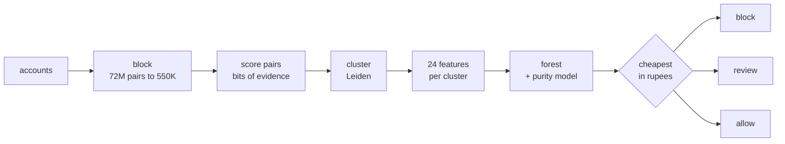

# Jaal

**A merchant offers Rs.200 off your first order. One person opens fifty
accounts and takes it fifty times. Jaal finds those fifty accounts.**

There is no bad transaction anywhere in that. All fifty orders are placed once,
paid for, and delivered. Look at any single payment and you see a normal
first-time customer, because in isolation that is exactly what it is. A model
that scores payments one at a time cannot see this, however large it is. The
thing that is wrong is not inside any payment. It is that fifty of them belong
to one person.

So Jaal scores the relationships between accounts and decides about the group.
The unit of detection is the cluster, never the transaction.

> **Defence only, synthetic data only.** Every account here is generated by
> `detector/generate_accounts.py`, which is a test fixture, not a product.
> Real promo abuse is unlabelled, so there is no other way to measure a
> detector against a known answer. No payment rails are touched, real or test.
> No real personal data exists in this repository.

Razorpay Buildathon 2026, Track 02 (AI Risk Manager).
*Jaal* (जाल) means both net and web in Hindi.

---

## Results

100 worlds per tier, 12,000 accounts each, 0.80% of accounts in a ring.
Seeds 900-999, **SEALED**, opened once. Never averaged across tiers, because
the variation is the finding.

| tier | net against doing nothing | PR-AUC | precision | recall, blocked | recall, blocked or reviewed |
| --- | --- | --- | --- | --- | --- |
| obvious | **+Rs.1,148,700** | 0.9974 | 1.0000 | 0.5016 | 0.9931 |
| moderate | **+Rs.569,400** | 0.9971 | 1.0000 | 0.1425 | 0.9609 |
| sophisticated | **+Rs.343,100** | 0.9763 | 0.9961 | 0.0266 | 0.9129 |
| adaptive | **+Rs.191,850** | 0.8046 | n/a (no blocks) | 0.0000 | 0.5669 |

Pooled: **+Rs.2,253,050** against Rs.7,680,000 for deploying nothing, at
0.9998 precision. One false positive in 4.8 million accounts.

**A rules-only detector on the same worlds comes out Rs.48,028,800 worse than
deploying nothing at all.** It catches more rings than Jaal and still loses
money. The next section is why.

---

## The one number that explains every design choice

| | cost |
| --- | --- |
| missing an abuser | Rs.200, one farmed coupon |
| wrongly blocking a real customer | Rs.15,000, lost lifetime value |
| sending a cluster to a human | Rs.150 |

**One false positive is worth 75 false negatives.** Blocking only pays above
**98.68%** precision. The rules baseline runs at about 91% precision, so every
ring it catches is paid for several times over by the real customers it blocks
alongside them.

That is why Jaal blocks rarely, and why there is a third action. Uncertain
clusters go to a person instead of being guessed at. Every two-action
threshold we tested, all 101 of them, loses money.

---

## Where it stops working

Against the most careful operator we modelled, a fresh device and a fresh
address for every account, **Jaal blocks nothing at all**. Precision there is
undefined, not zero, because there is no denominator.

It still routes 57% of those ring accounts to a human, which is worth
Rs.191,850 and is not detection. We know where this stops working and it is in
the table above, not in a footnote.

Three more things we would rather not have found:

- **An operator that adapts kills blocking in two moves.** The review queue
  survives, but for a reason we got wrong the first time and had to withdraw.
- **A small neural net scored better than the shipped forest.** The bottleneck
  here is linkage, not model capacity, so it bought nothing.
- **Rejoining split rings cost Rs.1,431,700.** The code is kept, and disabled.

[docs/05-where-it-fails.md](docs/05-where-it-fails.md) has all of it.

---

## Run it

```bash
python3 -m venv .venv && .venv/bin/pip install -r requirements.txt
./run.sh
```

Offline. Ten pip packages. About 35 minutes, or `./run.sh quick` for two.
Every number above is rebuilt from scratch, and `pytest -q` asserts the tables
in these docs still match the files in `results/`.

---

## Where to read next

| | |
| --- | --- |
| [docs/01-problem.md](docs/01-problem.md) | the scam, and why fraud models miss it |
| [docs/02-how-it-works.md](docs/02-how-it-works.md) | the seven stages, a diagram each |
| [docs/03-the-model.md](docs/03-the-model.md) | the maths, the weights, the hyperparameters |
| [docs/04-results.md](docs/04-results.md) | every measured number |
| [docs/05-where-it-fails.md](docs/05-where-it-fails.md) | the honest half |
| [docs/06-run-and-integrate.md](docs/06-run-and-integrate.md) | calling it from your own system |

## How it works, in one diagram

Seven stages. Accounts in, priced decisions out.



There is no threshold anywhere in that last step. It prices all three actions
and takes the cheapest.
