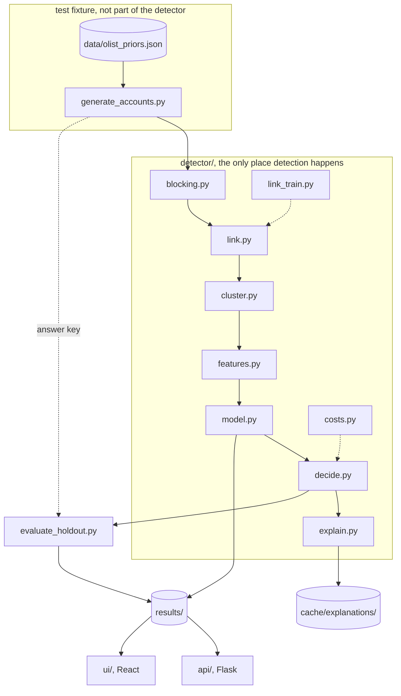

# Architecture

How the pieces fit, and where the boundaries are.

## The shape of it

## The three boundaries that matter

**The answer key never reaches the detector.** `generate_accounts.py` returns
two tables. `accounts` is everything observable and it is all any detector module
sees. `truth` carries `operator_id` and `is_ring`, and only evaluation code
touches it. Phase 4 has a leakage audit that reads the source of every feature
function and fails if it mentions a truth column.

**Nothing downstream of `results/` computes anything.** The Flask API and the
React dashboard read files the pipeline wrote. If a route handler starts
calculating a feature, it belongs in `detector/features.py`.

**The LLM does no detection.** `explain.py` turns numbers into a sentence.
Disconnect the network and every metric still computes, every decision is
unchanged, and the notes fall back to a template. That is what makes the results
reproducible by someone with no API key.

## How data moves

| Stage | In | Out |
| ----- | -- | --- |
| generate | seed, tier | accounts table, truth table |
| blocking | accounts | ~32,000 candidate pairs as row positions |
| link | pairs, `link_params.json` | bits per pair, plus a per-comparison breakdown |
| cluster | pairs, bits | list of clusters, weighted graph |
| features | cluster, graph, accounts | 25 numbers per cluster |
| model | feature table | calibrated probability, predicted purity |
| decide | probability, purity, size | block, allow or review, priced in rupees |
| explain | features, decision, evidence | a sentence a human can act on |

Everything between `blocking` and `features` works in row positions rather than
account ids, because a pair encoded as one int64 deduplicates with a sort
instead of a Python set, and 543,000 pairs make that difference visible.

## Where the state lives

Nothing is held in memory between runs and there is no database. The plan does
not need one and adding one would add a failure mode on a judge's machine.

| Path | What it holds | Committed? |
| ---- | ------------- | ---------- |
| `data/olist_priors.json` | Distributions from 99,441 real orders | yes |
| `data/raw/` | The raw Olist CSVs | no |
| `results/*.json` | Every measured number | yes |
| `results/*.png` | The four charts | yes |
| `results/features_*.csv` | Feature tables, rebuilt by run.sh | no, a 200-row sample is |
| `results/model.pkl` | Fitted forest, purity model, calibrators | yes |
| `cache/explanations/` | LLM or template review notes | yes |

## Resource discipline

This runs on a laptop that someone else is using at the same time.

Every entry point calls `detector.resources.apply()` before it does anything
heavy. That reads `MemAvailable` from `/proc/meminfo`, reserves 3 GB for the
desktop, refuses to run if less than 1.5 GB is left after that, and sets a hard
`RLIMIT_AS` so a runaway job dies instead of swapping. Worker counts are derived
from free threads and current load and capped at four. `n_jobs=-1` appears
nowhere.

Three specific blow-ups are guarded rather than hoped about:

- **Pair explosion.** `config.MAX_CANDIDATE_PAIRS` is 2,000,000 and blocking
  raises if it produces more.
- **Degenerate blocks.** Any blocking bucket over 400 members is skipped and
  counted, because one /24 network covering 694 accounts is 240,000 pairs on
  its own.
- **Holding many worlds.** Feature tables are built one world at a time and each
  is deleted before the next is generated. 400 worlds never coexist.
