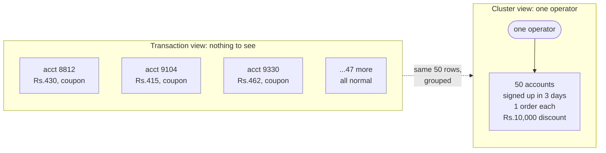
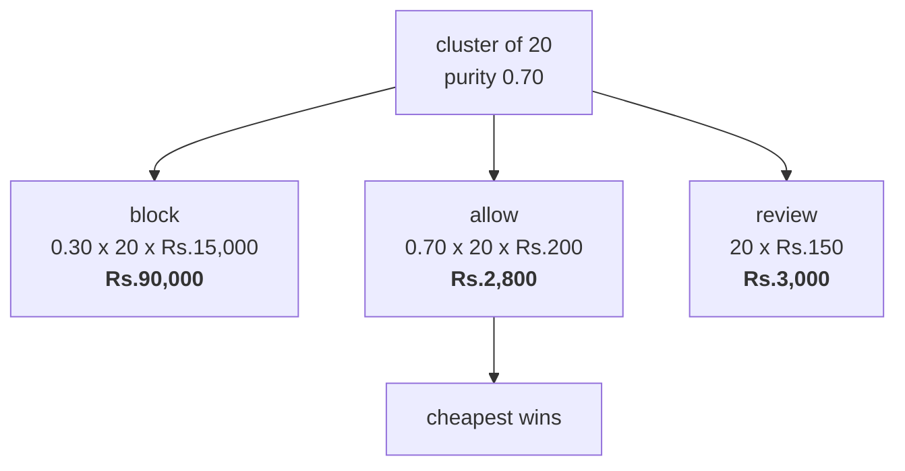

# The problem

## The scam

A merchant runs a first-order promo: Rs.200 off any order over Rs.400.
It is meant to buy a first-time customer.

One person opens fifty accounts and claims it fifty times.

Every one of those fifty orders is real. Placed, paid for with a working card,
delivered to a real door. Nothing is stolen, no card is fraudulent, no chargeback
is filed. The merchant ships fifty orders and hands out Rs.10,000 of discount to
acquire zero customers.

That is the whole scam. It is not theft, it is a supply of identities.

## Why a transaction model cannot see it

There is no bad transaction here.

Pick any single payment out of those fifty and look at it as hard as you like.
A new account. One order. Value Rs.430, just over the coupon floor. Coupon
claimed, card authorised, delivered. That is a normal first-time customer,
because in isolation that is exactly what it is. The record is not a disguise.
It is genuinely a first order by a genuinely new account.

So a payment-level classifier of any size, any architecture, any amount of
training data cannot find this. The thing that is wrong is not inside any
payment. It is that fifty of them belong to one person.



The two boxes hold the same fifty rows. The left one is unclassifiable and the
right one is obvious. Nothing changed except the unit of detection.

**This is the central idea of the project.** The unit of detection is the
cluster, never the transaction. Everything downstream falls out of it: why there
is a linkage stage at all, why features are computed per group and not per
account, why the model reads 25 numbers about a group rather than a row about a
payment.

## The cost asymmetry

Detection is not the hard part. Deciding what to do about it is.

From `config.py`:

| event | cost | where it comes from |
| --- | --- | --- |
| one farmed coupon (`COST_MISSED_ABUSER`) | Rs.200 | the discount itself |
| one wrongly blocked real customer (`COST_BLOCKED_INNOCENT`) | Rs.15,000 | lost lifetime value (about Rs.750 margin) plus referral loss |
| one analyst review (`COST_ANALYST_REVIEW`) | Rs.150 | ten minutes at a loaded Rs.900/hour |

**One false positive is worth 75 false negatives.**

`detector/costs.py` turns that ratio into a number:

```python
return COST_BLOCKED_INNOCENT / (COST_BLOCKED_INNOCENT + COST_MISSED_ABUSER)
# 0.9868
```

Blocking loses money below 98.7% precision. A detector at 95% precision, a good
result by any normal standard, costs the merchant more than doing nothing.

So the F1-optimal detector is not the one you want. F1 treats a false positive
and a false negative as the same mistake. Here they differ by 75x.

It is also why a third action exists. If the only choices are block and allow, a
cluster you are 70% sure about has no good answer. With a review queue it does.
The arithmetic, from the docstring of `detector/decide.py`, for a cluster of 20
accounts at 70% predicted ring purity:



Allowing is cheaper than blocking even at 70% confidence that it is a ring. No
probability threshold produces that answer. Only pricing the actions does.

## Why hard rules fail

The obvious approach is a rule: same device, same address, three or more
accounts, block them. That is `detector/baseline.py`, built first so there is
something to compare against. Exact `device_id` and `address_id` matches,
union-find, minimum group size 3.

It works, in the sense that it finds the rings. From
`results/baseline_holdout.json`, 100 sealed seeds, 12,000 accounts each:

| tier | precision | recall | cost | vs doing nothing |
| --- | --- | --- | --- | --- |
| obvious | 0.9116 | 1.0000 | Rs.13,965,000 | Rs.12,045,000 worse |
| moderate | 0.9172 | 0.9997 | Rs.12,990,600 | Rs.11,070,600 worse |
| sophisticated | 0.9037 | 0.8291 | Rs.13,048,200 | Rs.11,128,200 worse |
| adaptive | 0.0000 | 0.0000 | Rs.15,705,000 | Rs.13,785,000 worse |

Pooled, the rules baseline is **Rs.48,028,800 worse than deploying nothing**.

Read the first row again. Recall 1.0. It caught every single ring account in a
million-account population, and still lost Rs.12M, because 931 of the accounts
it blocked were innocent and each of those costs 75 times a missed coupon.

Precision 0.91 is respectable almost anywhere. Against a break-even of 0.9868 it
is a disaster. Closing that gap is what the rest of this project is for.

The adaptive row is the other half. Precision 0.0 at recall 0.0: it blocked 919
accounts and not one was a ring account. An operator who stops reusing devices
and addresses turns an exact-match rule into a pure false-positive generator.

## The hard part: innocent groups look like rings

Rules fail because sharing an identifier is normal. `config.LOOKALIKE_KINDS`
defines four kinds of benign group that a naive rule cannot tell from a ring.

| kind | size | shares | span | repeat rate |
| --- | --- | --- | --- | --- |
| family | 2 to 5 | device, address, **and card** | 200 to 900 days | 0.7 |
| flatmates | 2 to 4 | address | 30 to 400 days | 0.5 |
| hostel | 20 to 60 | address, IP | 60 to 700 days | 0.3 |
| office | 8 to 25 | address | 1 to 14 days | 0.6 |

A family shares more than most rings do: same phone, same door, same card. Any
rule that flags shared identity flags every family on the platform. The office
row is the dangerous one. Eight to twenty-five people, one address, signing up
inside two weeks, all ordering lunch. On identity and timing that is
indistinguishable from a ring.

The separator is not how much a group shares. It is whether the behaviour
persists. The comment at the top of `detector/features.py` says it directly:

> Real families share more than rings do: one real card, one address, years of
> orders. A ring shares a device by accident and fakes the rest, so the
> separator is whether the behaviour persists, not how much the group shares.

The office orders again next week. The ring does not, because there is no second
coupon to claim. That is why `repeat_rate`, `lifespan_days` and
`signup_span_days` are features, and why the model weighs them against the
identity evidence rather than after it.

## Four adversary tiers

There is not one adversary, there is a dial. Where it sits decides whether
detection is easy, hard or impossible. `config.TIERS`:

| tier | device_reuse | signup_window_days | value_jitter | camouflage | accounts_per_drop | who this is |
| --- | --- | --- | --- | --- | --- | --- |
| obvious | 1.00 | 0.04 | Rs.80 | 0.00 | 20 | one phone, one hour, one address. A first attempt. |
| moderate | 0.60 | 3 | Rs.200 | 0.00 | 8 | rotates some devices, spreads signups over days. |
| sophisticated | 0.10 | 21 | Rs.600 | 0.00 | 3 | a fresh device almost every time, three weeks of signups. |
| adaptive | 0.00 | 45 | Rs.1,200 | 0.15 | 1 | never reuses a device or a drop address, and plants decoy behaviour. |

`accounts_per_drop` is how many ring accounts share one delivery address. At
the adaptive tier it is 1, so exact address matching finds nothing at all.

**Results are never averaged across tiers.** A pooled number would say something
like "recall 0.6" and hide that one tier is at 0.99 and another at 0.00. The
variation is the finding. Every results table in this repo is per tier, and
where a tier scores zero, the zero is printed.

## Synthetic data, and why

Every account, order, device and address here is invented.
`detector/generate_accounts.py` is a test fixture, not an attack tool.

The reason is measurement. Real promo abuse is unlabelled. A merchant knows what
it paid out, not which accounts belonged to one person, so there is no answer
key to score a detector against. The generator writes the answer key first
(which accounts share an operator) and then writes a world consistent with it.
That is the only way to report precision and recall as facts.

The distributions are not made up. `detector/calibrate_from_olist.py` pulls them
from the Olist Brazilian E-Commerce dataset (99,441 orders, 112,650 order items,
96,096 customers) into `data/olist_priors.json`: order value percentiles, the
hour-of-day curve, and a real repeat rate of 0.0312. Values are scaled to a
target median of Rs.450. The raw dataset is not committed, the priors are.

Defence only. Nothing here helps anyone farm a coupon, and the generator is
useless for it anyway, because it produces fake accounts no payment processor
would accept.

### The honest exposure

The main methodological weakness of this project is simple: we built the test
and then passed it. A generator written by the same person who wrote the
detector can encode, without meaning to, exactly the signals the detector looks
for.

The strongest honest counter is the results table. The fixture was written to
make detection fail at the top tier, and it does. The adaptive row on the sealed
holdout blocks nothing: 0 accounts blocked, recall 0.0. A rigged fixture does
not produce a 0% row, because nobody rigs a test to fail. The tiers were also
fixed in `config.py` before the detector existed and never adjusted to improve a
score.

What is still missing, plainly: this detector has never been scored against real
labelled abuse. No such dataset is public.

Next: [how it works](02-how-it-works.md), the seven stages end to end.
