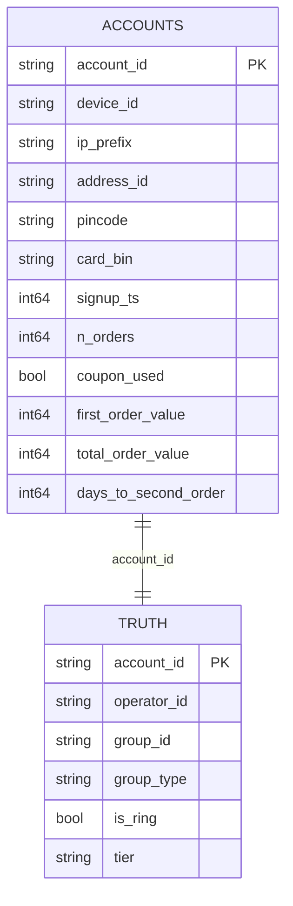

# Data model

Two tables come out of the generator. The detector sees one of them.

## accounts

Everything the detector is allowed to see. One row per account.

| Column | Type | Meaning |
| ------ | ---- | ------- |
| `account_id` | str | `a000000` style. Opaque, assigned after shuffling. |
| `device_id` | str | Device fingerprint. Rings reuse one at low tiers, none at the top tier. |
| `ip_prefix` | str | First three octets of the signup IP, so a household or hostel shares one. |
| `address_id` | str | A specific delivery address. |
| `pincode` | str | Six digits. The area the address sits in. |
| `card_bin` | str | First six digits of the payment card, which identify the issuer. |
| `signup_ts` | int64 | Unix seconds. Worlds run for 365 days from 2026-01-01. |
| `n_orders` | int64 | Lifetime order count. |
| `coupon_used` | bool | Whether the first-order coupon was claimed. |
| `first_order_value` | int64 | Rupees. Integer, never float. |
| `total_order_value` | int64 | Rupees across all orders. |
| `days_to_second_order` | int64 | Gap to the second order, or -1 if there never was one. |

## truth

The hidden answer key. Used to score the detector and for nothing else. Any
feature computed from this table is a bug, and Phase 4 has a leakage audit that
looks for exactly that.

| Column | Type | Meaning |
| ------ | ---- | ------- |
| `account_id` | str | Joins to `accounts`. |
| `operator_id` | str | The real person controlling the account. **Only ring accounts share one.** |
| `group_id` | str | The group the account was generated in, ring or benign. |
| `group_type` | str | `normal`, `ring`, `family`, `flatmates`, `hostel`, `office`. |
| `is_ring` | bool | The label. |
| `tier` | str | Sophistication of the ring, empty for everything else. |

## Why operator_id is not group_id

A family of four shares a device, a card and an address, so it has one
`group_id`. But it is four different people, so it has four different
`operator_id` values. A ring of forty accounts is one person, so it has one
`operator_id` for all forty.

This matters at two places. Phase 2 measures pairwise linkage against "same
operator", so a family pair is a **negative** even though the two accounts share
three attributes. Phase 7 measures false positives against `group_type`, so it
can report which kind of benign group gets wrongly flagged, not just how many.

## Money

Every rupee value is a Python or numpy integer. Float drift on currency looks
exactly like a real discrepancy, and there is no rounding question worth the
risk. `tests/test_config.py` and `tests/test_generator.py` both check this.
