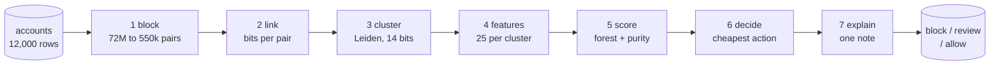
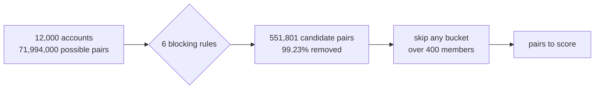
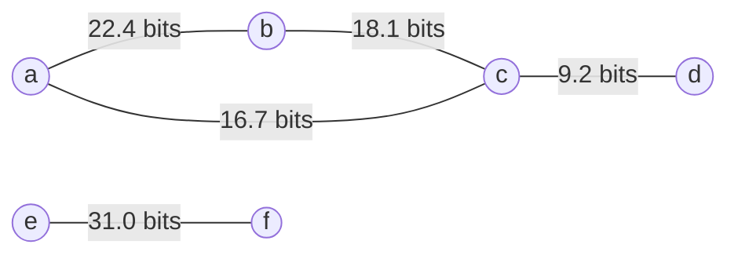
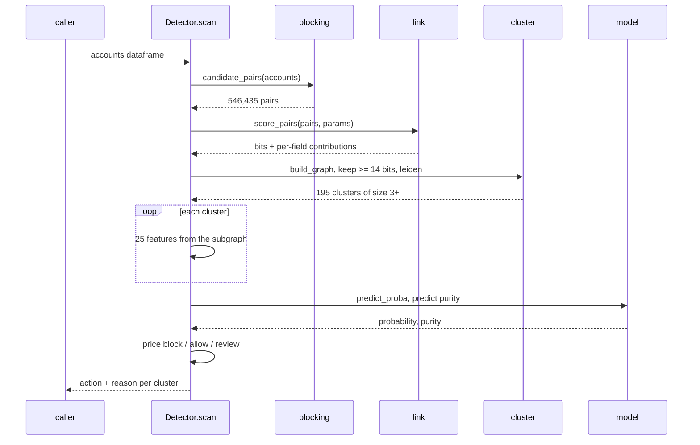

# How it works

Seven stages. Accounts go in one end, one decision per cluster comes out the
other. `detector/pipeline.py` runs them in order and is the spine of the whole
system:

```python
from detector.pipeline import Detector
d = Detector.load()
for cluster in d.scan(accounts_dataframe):
    print(cluster["action"], cluster["accounts"])
```

Here is the whole thing.



Read it left to right. Everything before stage 4 exists to turn loose accounts
into groups, because the model cannot score a group that was never assembled.
Stage 0 below is the generator, which only exists because the data is synthetic.

---

## 0. Generate

`detector/generate_accounts.py`

**In:** a seed and a tier. **Out:** 12,000 accounts and a hidden answer key.

A world holds singletons, rings (one operator farming the coupon many times) and
lookalike groups (families, flatmates, hostels, offices) who share a device or an
address for innocent reasons. Only rings share an operator, and that is the
answer key. Ring prevalence is 0.8%, 40 lookalike groups per world.

Same seed in, byte-identical world out: `results/generator_check.json` records
`determinism.byte_identical: true` for seed 5, sophisticated tier. 100 worlds
generate in 5.26 seconds. One table from that file explains the whole difficulty
gradient:

| tier | device collisions within rings | address collisions within rings | ring signup span, median days |
| --- | --- | --- | --- |
| obvious | 919 | 907 | 0.04 |
| moderate | 528 | 843 | 2.56 |
| sophisticated | 65 | 655 | 19.34 |
| adaptive | **0** | **0** | 42.25 |

At the obvious tier, 919 pairs of ring accounts share a device. At the adaptive
tier, none do, and none share an address either. Every identity shortcut has
been removed by hand. What is left is behaviour.

**Design choice that mattered:** the answer key is written before the world, not
derived from it. That is the only way to score precision honestly.

---

## 1. Block

`detector/blocking.py`

**In:** 12,000 accounts. **Out:** about 550,000 candidate pairs.

12,000 accounts make 71,994,000 possible pairs. Scoring all of them would not
fit in memory. So we only compare accounts that agree on some coarse key.



99.23% of the work is thrown away before any scoring happens.

Six rules, each finding a different kind of pair: `device`, `address`,
`pin_bin`, `pin_month`, `pin_month_shift`, `bin_week`. No rule blocks on pincode
alone, because the busiest pincode holds 2,639 accounts. From
`results/blocking.json`, 10 seeds:

| tier | blocking recall | pair reduction | candidate pairs |
| --- | --- | --- | --- |
| obvious | 1.0000 | 0.9923 | 551,801 |
| moderate | 1.0000 | 0.9925 | 542,431 |
| sophisticated | 0.9949 | 0.9925 | 543,506 |
| adaptive | 0.9528 | 0.9923 | 551,733 |

Blocking recall is a ceiling, not a score. A true pair no rule produces can
never be recovered later. Why six rules and not two, from `recall_by_rule` on
the adaptive tier:

| rule | recall |
| --- | --- |
| device | **0.0000** |
| address | **0.0000** |
| pin_bin | 0.8188 |
| pin_month | 0.5144 |
| pin_month_shift | 0.5108 |
| bin_week | 0.1178 |

The two identity rules find nothing at all. `pin_bin` (same pincode, same card
BIN) carries the tier almost single-handed. A blocking stage built on device and
address, which is what most people write first, would have a ceiling of zero
here and every stage after it would be scoring an empty set.

**Guards:** `MAX_BLOCK_SIZE = 400` skips any key matching more than 400
accounts, because one 5,000-member bucket generates 12 million pairs on its own.
`MAX_CANDIDATE_PAIRS = 2,000,000` refuses to run rather than exhaust memory.
About 1 bucket per world is skipped.

---

## 2. Link

`detector/link.py`

**In:** candidate pairs. **Out:** a score in bits for each, plus a per-field
breakdown.

Fellegi-Sunter. For each comparison field, ask whether the two accounts agree,
and add `log2(m / u)` bits, where `m` is how often that field agrees for one
operator and `u` is how often it agrees by chance. Sum the bits.

The headline: **six weak signals can add up to more than one device match.**
Same pincode, similar signup hour, same card BIN, one order each, coupon used by
both, signup within seven days. No single one of those means anything. Added up
in bits they can outweigh an exact device hit. Exact matching cannot do that, it
has no way to express partial evidence.

The output is two things. The total decides whether an edge exists. The
per-field breakdown is what a human reviewer reads in stage 7. How `m` and `u`
are estimated, and which two comparisons were dropped, is in
[the model](03-the-model.md).

---

## 3. Cluster

`detector/cluster.py`

**In:** scored pairs. **Out:** groups of accounts.

Keep every pair scoring at least 14 bits, treat those as graph edges, run Leiden
community detection. Resolution 1.0, minimum cluster size 3, seed 42.



The a-b-c triangle survives and becomes a cluster. The c-d edge is under 14 bits
so it never exists, and d is never pulled in. The e-f pair is strong but only
two accounts, under the minimum size, so it is dropped.

From `results/clustering.json`, 10 seeds at 12,000 accounts:

| tier | pair recall | pair precision | mean ring recovered | clusters |
| --- | --- | --- | --- | --- |
| obvious | 1.0000 | 0.1277 | 1.0000 | 1,854 |
| moderate | 1.0000 | 0.1131 | 1.0000 | 1,915 |
| sophisticated | 0.9729 | 0.1008 | 0.9889 | 1,904 |
| adaptive | 0.4412 | 0.0469 | 0.5818 | 1,851 |

Pair precision of 0.128 looks terrible and is fine. This stage is not making a
decision. Its job is to hand the model a group that contains the ring, and the
model then reads 25 numbers about that group and decides. A cluster with extra
members can still be judged. A ring split across two clusters cannot be
reassembled, so recall is the number to watch.

The threshold was originally 6 bits, chosen on an edge budget. At 6 bits Leiden
returned clusters of up to 1,812 accounts and a pairwise F1 of 0.0014. A blob
holding every ring in the world is not a detection. Sweeping against cluster
quality moved it to 14 bits (D-018).

Louvain was compared honestly. On the 14 bit graph that ships it gives zero
disconnected communities and the same pairwise F1 to four decimal places across
40 worlds. Leiden stays the default because its guarantee is free, not because
Louvain broke (D-019).

---

## 4. Features

`detector/features.py`

**In:** one cluster and its subgraph. **Out:** 25 numbers.

Four groups:

- **structural**, from the evidence graph: `size`, `mean_edge_bits`,
  `edge_density`, `degree_gini`
- **temporal**: `signup_span_days`, `signup_burstiness`, `lifespan_days`
- **behavioural**: `repeat_rate`, `coupon_rate`, `near_min_rate`,
  `distinct_device_ratio`
- **economic**: `total_discount`, `discount_to_revenue`

The full table with what each one separates is in
[the model](03-the-model.md).

Nothing here may read the answer key, and that is enforced rather than assumed.
`results/feature_audit.json` over 45,324 clusters reports
`forbidden_columns_referenced: []` and `leaks: []`. `tests/test_features.py`
greps the source for `is_ring`, `group_id`, `group_type` and `operator_id` and
fails the build if any appears.

**Design choice that mattered:** features are per cluster, never per account. An
account-level feature averaged up to a cluster loses the thing that matters,
which is how the members relate to each other.

---

## 5. Score

`detector/model.py`

**In:** 24 of the 25 features (`discount_per_account` is dropped, it correlates
1.00 with `coupon_rate`). **Out:** a calibrated probability and a predicted ring
purity.

A random forest, calibrated with isotonic regression, plus a second forest that
predicts what fraction of the cluster is ring rather than whether it is majority
ring. On the sealed holdout the Brier score is 0.00067 on the obvious tier and
0.01035 on the adaptive tier. Full details, including the model that beat the
forest and why the purity model exists, in [the model](03-the-model.md).

---

## 6. Decide

`detector/decide.py`

**In:** predicted purity and cluster size. **Out:** block, review or allow.

Three actions, each priced in rupees, cheapest wins. No probability threshold
anywhere. For a cluster of 20 at purity 0.70: block costs an expected Rs.90,000,
allow costs Rs.2,800, review costs Rs.3,000, so it is allowed. Why that is right
given a 75:1 cost ratio is in
[the problem](01-problem.md#the-cost-asymmetry), the measured outcome per tier
is in [results](04-results.md).

---

## 7. Explain

`detector/explain.py`

**In:** a flagged cluster. **Out:** a note a human can act on in ten seconds.

Three sources, tried in order: the committed cache (keyed on the evidence), a
live call to Ollama Cloud if `OLLAMA_API_KEY` is set, and a hand-written
template. The template never fails, so the pipeline has no network dependency.

**The LLM does no detection.** It cannot see 12,000 rows and it cannot do graph
maths. Every number in a note comes from the pipeline, the model only writes the
prose around them. With no API key set, every metric and every decision in this
repo is unchanged.

From `results/explanations.json`: 1,334 notes, 40 written live, 1,294 from the
template, all 1,334 served from the committed cache on a fresh run.
`notes_with_unverified_numbers` is **0**, checked by comparing every figure in a
note against the cluster it describes.

---

## One batch, end to end

`Detector.scan` in one picture.



The numbers on the arrows are the real ones for 12,000 accounts, moderate tier,
seed 700, from `results/scan_timing.json`. Note where the answer key appears:
nowhere. `scan` takes a dataframe of 12 columns and never sees a label.

---

## How long it takes

From `results/scan_timing.json`, moderate tier, seed 700, 3 repeats,
explanations off because they are cached lookups rather than computation.

| accounts | block | link | cluster | features | score | **total** | accounts/sec |
| --- | --- | --- | --- | --- | --- | --- | --- |
| 3,000 | 42.6 ms | 19.8 ms | 69.1 ms | 10.4 ms | 66.3 ms | **210.5 ms** | 14,252 |
| 6,000 | 99.6 ms | 66.6 ms | 150.7 ms | 49.6 ms | 77.1 ms | **453.4 ms** | 13,233 |
| 12,000 | 295.4 ms | 184.7 ms | 415.5 ms | 175.0 ms | 66.8 ms | **1,173.3 ms** | 10,228 |

12,000 accounts scan in about 1.17 seconds, roughly 10,200 accounts per second,
on a laptop, single process.

The number that matters is the growth exponent. 4x the accounts costs 5.57x the
time, an exponent of **1.24**. Close to linear, not quadratic. Blocking buys
that: without it pairs grow as n squared, and 12,000 accounts would mean 72
million comparisons instead of 546,435.

Scoring is flat (66.3 ms at 3,000 accounts, 66.8 ms at 12,000) because forest
cost is per cluster and clusters grow slowly. Clustering is the largest single
cost at every size.

---

Next: [the model](03-the-model.md), or skip to
[the results](04-results.md).
