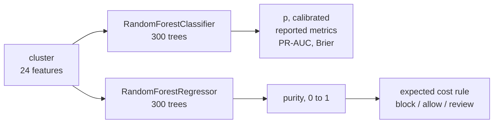
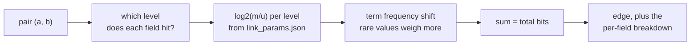
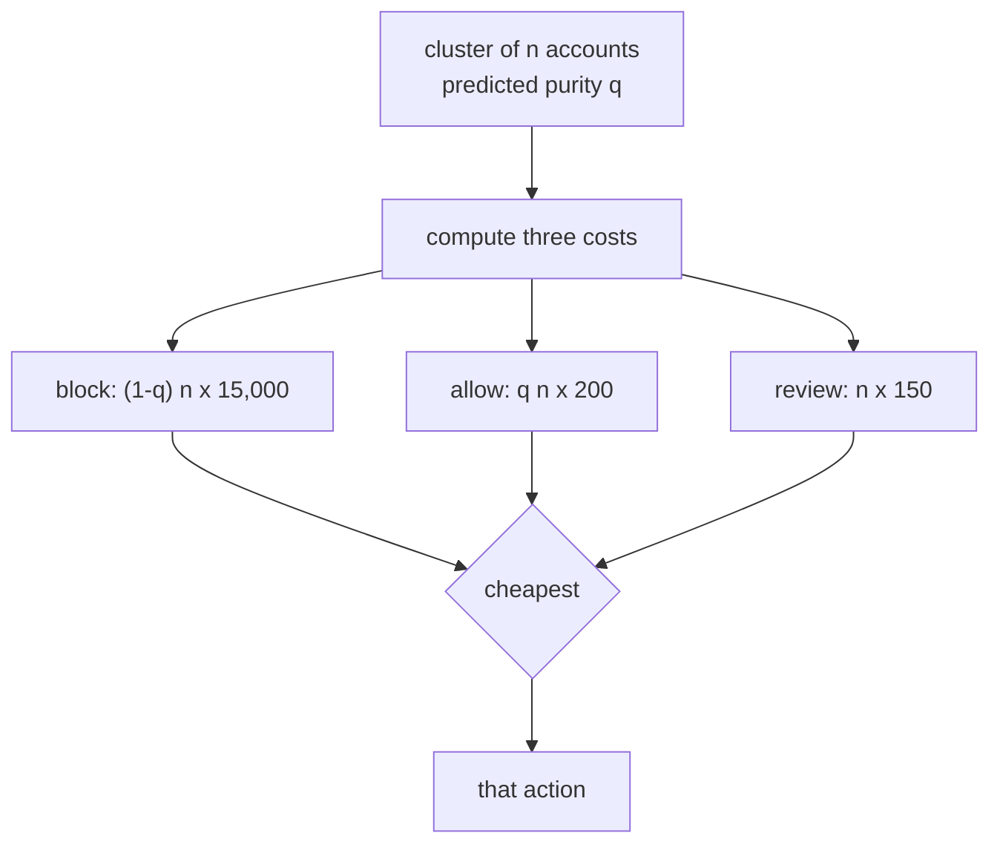

# The model

Jaal scores groups of accounts, not transactions. This page is what happens
after the graph is built: what the models eat, what maths they do, what their
parameters are, and how a probability turns into an action.

There are two models, not one.

---

## 1. Two models, two questions

A `RandomForestClassifier` answers "is this cluster a ring". A
`RandomForestRegressor` answers "what fraction of this cluster's accounts are
really ring accounts". The second number is called ring purity.

The cost rule uses purity. It does not use the class probability.



The classifier feeds the scoreboard. The regressor feeds the decision.

**Why.** Blocking a cluster bills you for every innocent member of it at
Rs.15,000 each. A cluster that is 90% ring accounts gets labelled a ring, and
blocking it still destroys the other 10%. The class probability cannot see
those people. It only says the majority is guilty.

Measured on the validation seeds, that difference is the whole result. The
same table is in the docstring on `make_purity_model`:

| decision rule uses | accounts blocked | precision | money |
| --- | --- | --- | --- |
| class probability | 20,081 | 0.933 | **lost Rs.16,355,550** |
| predicted purity | 3,875 | 0.9997 | **made Rs.1,317,750** |

Same classifier. Same features. Different question asked of the data.

---

## 2. Before the model: scoring a pair in bits

The features the model eats are built from a graph, and the graph's edges come
from Fellegi-Sunter pair scoring in `detector/link.py`.

The idea: for each field, compare two accounts. Ask how often that field agrees
when two accounts really are one operator (call it `m`), and how often it
agrees by chance between strangers (call it `u`). The comparison is worth
`log2(m / u)` bits. Agreement on a field where `m` is high and `u` is tiny is
strong evidence. Agreement on a field where `m` and `u` are about equal is
worth nothing.

Add the bits from every field. That total is the edge weight.



The breakdown is kept, not just the total, so a flagged cluster can be
explained later.

### The learned weights

From `results/link_params.json`, trained on seeds 0-19. This is the best level
of each comparison, in bits (`results/field_ablation.json`,
`field_weights_bits`):

| comparison | best level | m | u | bits |
| --- | --- | --- | --- | --- |
| device | exact | 0.3139 | 0.0000107 | **+14.83** |
| signup_gap | within 1h | 0.7393 | 0.000127 | **+12.51** |
| address | exact | 0.5507 | 0.000142 | **+11.93** |
| pincode | exact | 0.9937 | 0.0724 | +3.78 |
| card_bin | exact | 0.7362 | 0.0867 | +3.09 |
| order_value | within Rs.50 | 0.7480 | 0.1267 | +2.56 (not scored) |
| coupon_floor | both near floor | 0.9917 | 0.1872 | +2.41 (not scored) |
| hour_of_day | within 1h | 0.7752 | 0.1638 | +2.24 |
| coupon_used | both used | 0.9959 | 0.3063 | +1.70 |
| order_count | both one order | 0.9994 | 0.9003 | +0.15 |
| ip_prefix | exact | 0.008323 | 0.007678 | **+0.12** |

Six weak signals can outweigh one device match. Exact matching cannot do that.

**ip_prefix is worth nothing.** Look at its row: `m` is 0.008323 and `u` is
0.007678. Two accounts run by one operator share an IP prefix 0.83% of the
time. Two strangers share one 0.77% of the time. The rates are almost
identical, so the agreement carries no information, and `log2(m/u)` comes out
at 0.12 bits. It stays in the comparison list and it stays close to useless.

**Two comparisons are switched off.** `EXCLUDED_COMPARISONS` in `link.py` drops
`coupon_floor` and `order_value` from scoring. Both punish a ring for varying
its order values, which is exactly what the harder tiers do. The comment
records the effect: dropping them lifts pair recall on the hardest tier from
0.14 to 0.50. Nine comparisons are scored, not eleven.

### The term frequency adjustment

A global `u` treats every shared device the same. It should not. A device two
accounts share is much stronger evidence than one three hundred accounts share.

So for the five identifier fields (`device`, `address`, `pincode`, `card_bin`,
`ip_prefix`), agreement gets an extra term based on how common that particular
value is in the world. `TF_WEIGHT = 0.75` says apply three quarters of the
adjustment, not all of it. The comment gives the reason: 0.75 gave the best
mean pair F1 over ten validation worlds, 0.6049 against 0.5957 for the full
adjustment.

### Where m and u come from, with no labels

`detector/link_train.py`, three passes:

1. **u from random pairs.** At this prevalence a random pair is two strangers,
   so agreement rates on random pairs are chance rates. 4,000,000 sampled pairs.
2. **m from a seed set.** Pairs sharing a device held by six or more accounts.
   Six is one more than the largest household in `config.LOOKALIKE_KINDS`, so a
   device that popular means one operator. 37,124 seed pairs, measured 99.32%
   truly one operator. `m` for `device` itself cannot come from this set (every
   pair in it shares a device), so a second pass bootstraps it from pairs
   already over 22.34 bits without device evidence.
3. **EM refinement.** Run, saved as `m_em`, and not used. `m_source` in
   `link_params.json` is `"bootstrap"`, because the bootstrap estimate beat EM
   on every tier.

The prior match rate is 1.87e-05, about one pair in 53,500.

### A worked sum

A pair on the same device, same pincode, same card BIN, signing up 40 minutes
apart:

```
device      exact       +14.83
signup_gap  within_1h   +12.51
pincode     exact        +3.78
card_bin    exact        +3.09
                        -------
                         34.21 bits, before the term frequency shift
```

The other five scored comparisons then add their own levels, which are negative
when they disagree. `bits_to_probability` turns the final total into a real
probability using the 1.87e-05 prior.

---

## 3. The 25 features

`detector/features.py` turns one cluster into a row of numbers. It defines 25
features in four groups. Nothing in it may read the answer key, and
`tests/test_features.py` checks that.

Correlation column: absolute correlation with the cluster label, from
`results/feature_audit.json` over 45,324 training clusters. Importance column:
permutation importance from `results/model.json`, measured by shuffling one
feature at a time on the validation set and watching average precision drop.

### Structural, from the evidence graph

| feature | what it measures | corr | importance |
| --- | --- | --- | --- |
| `size` | accounts in the cluster | 0.2458 | 0.01140 |
| `edge_density` | edges present over edges possible | 0.0053 | -0.00039 |
| `mean_edge_bits` | average match weight inside it | 0.3800 | 0.00326 |
| `min_edge_bits` | weakest edge holding it together | 0.1660 | 0.00008 |
| `weight_spread` | standard deviation of edge weights | 0.3766 | 0.00288 |
| `diameter` | longest shortest path, -1 if none | 0.1231 | -0.00052 |
| `degree_gini` | is one node the hub | 0.0491 | -0.00034 |
| `top_signal_share` | share of evidence from one field | 0.0911 | -0.00014 |

### Temporal

| feature | what it measures | corr | importance |
| --- | --- | --- | --- |
| `signup_span_days` | first signup to last | 0.0437 | 0.00429 |
| `signup_burstiness` | largest share signing up in one hour | 0.0465 | 0.00051 |
| `hour_concentration` | 1 minus entropy of signup hour | 0.1766 | 0.00194 |
| `median_gap_minutes` | median gap between signups | 0.0664 | 0.00610 |
| `lifespan_days` | longest days to a second order | 0.0370 | 0.00026 |

### Behavioural

| feature | what it measures | corr | importance |
| --- | --- | --- | --- |
| `coupon_rate` | share of accounts that used the coupon | 0.0665 | 0.00805 |
| `repeat_rate` | share that ordered more than once | 0.0519 | 0.00092 |
| `near_min_rate` | share ordering just above the Rs.400 floor | 0.0178 | 0.01688 |
| `value_cv` | spread of order values over their mean | 0.0557 | 0.01797 |
| `distinct_bin_ratio` | distinct card BINs per account | 0.2804 | **0.02611** |
| `bin_concentration` | share on the single most common BIN | 0.0667 | 0.00793 |
| `distinct_device_ratio` | distinct devices per account | 0.2762 | 0.00013 |
| `distinct_address_ratio` | distinct addresses per account | 0.1810 | 0.00352 |
| `pincode_concentration` | share on the most common pincode | 0.0267 | 0.00032 |

### Economic

| feature | what it measures | corr | importance |
| --- | --- | --- | --- |
| `total_discount` | rupees of coupon this cluster took | 0.3923 | 0.02485 |
| `discount_per_account` | rupees per account | 0.0665 | dropped |
| `discount_to_revenue` | discount over total order value | 0.0634 | 0.01607 |

**24 features go into the model, not 25.** `discount_per_account` is
`coupon_rate` times Rs.200 and correlates with it at exactly 1.0000, so
`DROPPED_FEATURES` in `model.py` removes it. The audit found no leaks: no
feature correlates above 0.95 with the label, and no feature function
references a truth column.

Three other correlated pairs were found and kept, because a forest is
untroubled by collinearity: `size` with `total_discount` (0.9605),
`edge_density` with `degree_gini` (-0.9008), `lifespan_days` with
`distinct_address_ratio` (-0.9019).

---

## 4. Correlation is not importance

The two columns above disagree, and the disagreement is the interesting part.

- `total_discount` has the highest correlation with the label at 0.3923. Its
  permutation importance is 0.02485, second.
- `distinct_bin_ratio` correlates at only 0.2804, well down the list. It is the
  single most important feature at 0.02611.
- `distinct_device_ratio` correlates at 0.2762, fifth by correlation. Its
  importance is 0.00013, near the bottom. The forest gets that signal from
  elsewhere.

Four features have **negative** permutation importance. Shuffling them makes
the model very slightly better: `top_signal_share` (-0.00014), `degree_gini`
(-0.00034), `edge_density` (-0.00039), `diameter` (-0.00052). They are noise.
They are still in the model. Nothing was pruned on the strength of one
permutation run, and the effect sizes are small enough to be run-to-run
variation.

---

## 5. Hyperparameters

Classifier, `make_forest` in `detector/model.py`:

```python
RandomForestClassifier(
    n_estimators=300, min_samples_leaf=5, class_weight="balanced",
    random_state=RANDOM_STATE, n_jobs=n_jobs)      # RANDOM_STATE = 42
```

Purity regressor, `make_purity_model`:

```python
RandomForestRegressor(
    n_estimators=300, min_samples_leaf=5,
    random_state=RANDOM_STATE, n_jobs=n_jobs)
```

- `class_weight="balanced"` on the classifier. Cluster level prevalence is
  0.02318, so without it the forest can score everything zero and be right 97.7%
  of the time. The regressor has no class weighting because it is not
  predicting a class.
- `min_samples_leaf=5` stops the forest memorising single clusters.
- `n_estimators=300` for a stable average.
- `random_state=42` because rule 7 of the project is that every seed is fixed
  and the same input gives the same output.
- `n_jobs` comes from `resources.budget()` at runtime, capped at 4. Never
  `n_jobs=-1`.

**These were not tuned.** There is no hyperparameter sweep in `results/`. They
were chosen once and fixed. Section 8 is why more model tuning was not worth the
time.

---

## 6. Training, and why the split is by seed

The committed run trains on seeds 0-59 and validates on 700-759, at 12,000
accounts per world. From `results/model.json`:

| | |
| --- | --- |
| fit seeds | 0 to 44 |
| calibration seeds | 45 to 59 |
| validation seeds | 700 to 759 |
| training clusters | 45,324 |
| validation clusters | 45,159 |
| cluster level prevalence | 0.02318 (1,047 positives) |

`split_by_seed` holds back whole worlds, 25% of the training seeds
(`CALIBRATION_FRACTION = 0.25`), never individual rows.

**Why that matters.** Every cluster in one world came out of one generator run,
with one set of random draws for device pools, address drops and signup times.
Clusters from the same world share those artefacts. Split rows at random and
the model sees a sibling of every test cluster during training, so every score
comes out inflated and nothing warns you. `main()` asserts train and validation
share no seed.

Seeds 900-999 are sealed and were opened once, in `results/holdout.json`.

---

## 7. Calibration, and an honest disagreement

A random forest's 0.80 does not mean 80%. Averaging many trees makes errors
near the boundaries one sided and squeezes probabilities toward the middle. The
decision stage works out rupees straight from the score, so the score has to be
right, not just correctly ranked.

Two calibrators are fitted on the held-back seeds and both are saved. From
`results/model.json`, pooled over all tiers on the validation seeds:

| variant | PR-AUC | Brier |
| --- | --- | --- |
| forest, raw | 0.94182 | 0.00527 |
| forest, Platt (sigmoid) | 0.94182 | 0.00323 |
| forest, isotonic | 0.92976 | 0.00313 |

Calibration cuts the Brier score roughly in half. Isotonic wins it, just, at
0.00313 against 0.00323, so `model.json` records
`"calibration_method": "isotonic"`. But isotonic costs ranking: its PR-AUC
drops to 0.92976 where Platt leaves the raw forest's 0.94182 untouched, because
Platt is monotone and isotonic's step function ties scores together.

`results/decisions.json` records `"calibration_method": "sigmoid"`. That stage
picks on rupees rather than on Brier, and the two methods come out at exactly
the same three-action cost of Rs.3,290,250, so it is a tie broken in favour of
keeping the ranking. `results/holdout.json` records `isotonic`.

So the files disagree, and the honest answer is that at this operating point it
does not matter: the decision the merchant gets is identical either way.

See `results/reliability.png` for the diagram. It plots predicted probability
against observed frequency in ten uniform bins, with a log-scale count
histogram underneath, because at 2.3% prevalence a quantile split would cram
nine bins out of ten into [0, 0.001].

---

## 8. The MLP won, and it did not matter

`make_mlp` trains a small network on the same 24 features purely as a
comparison: `StandardScaler` into `MLPClassifier(hidden_layer_sizes=(32, 16),
max_iter=400, early_stopping=True, random_state=42)`.

It beat the forest. From `results/model.json`:

| | PR-AUC | Brier |
| --- | --- | --- |
| `mlp_raw` | **0.94487** | **0.00291** |
| `forest_raw` | 0.94182 | 0.00527 |
| `forest_sigmoid` | 0.94182 | 0.00323 |

Uncalibrated, it beats both the raw forest and the calibrated forest on both
numbers. Per tier it is ahead on sophisticated (0.98752 against 0.97072) and
marginally behind on adaptive (0.85686 against 0.85829).

That is a real result and it is reported as one. What it means is the useful
part. The gap is 0.003 PR-AUC. The gap between the forest's sophisticated tier and its
adaptive tier is 0.11. The gap between blocking on a class
probability and blocking on purity is Rs.17.67 million. The bottleneck in this
project is linkage, whether two accounts can be tied together at all, not model
capacity. A better classifier reading the same features buys almost nothing.

The forest ships because it is the model whose output the decision rule and the
review notes are built on, and swapping it for a 0.003 PR-AUC gain would change
none of the numbers that matter.

---

## 9. From probability to action

There is no threshold anywhere in `detector/decide.py`. There is arithmetic
that picks the cheapest of three actions.

Costs, from `config.py`, all integer rupees:

| | |
| --- | --- |
| `COST_MISSED_ABUSER` | Rs.200, one farmed coupon |
| `COST_BLOCKED_INNOCENT` | Rs.15,000, lost lifetime value plus referral loss |
| `COST_ANALYST_REVIEW` | Rs.150, ten minutes of an analyst |

A false positive is worth 75 false negatives. `breakeven_precision()` is
`15000 / (15000 + 200)` = **0.9868**. Below 98.68% precision, blocking loses
money against doing nothing.

For a cluster with predicted purity `q` and `n` accounts:

```
block   (1 - q) * n * 15,000     the innocent members you just lost
allow        q * n * 200         the coupons you just gave away
review           n * 150         analyst time, human then decides correctly
```

The worked example from the module docstring, a cluster of 20 at 70%:

```
block   0.3 x 20 x 15,000 = Rs.90,000
allow   0.7 x 20 x    200 = Rs.2,800
review       20 x    150  = Rs.3,000
```

Allowing is cheaper even at 70% confidence that it is a ring. Blocking only
wins once purity is very close to 1.



Review is the escape hatch. It caps the loss on any cluster at Rs.150 an
account, which is why the rule reaches for it whenever it is unsure.

### What that produces

On the validation seeds, from `results/decisions.json` (45,159 clusters,
2,880,000 accounts, 23,040 ring accounts):

| policy | precision | recall | accounts blocked | cost | against doing nothing |
| --- | --- | --- | --- | --- | --- |
| block above 0.50 | 0.9084 | 0.9169 | 23,256 | Rs.32,348,000 | -Rs.27,740,000 |
| block above F1-optimal 0.73 | 0.9162 | 0.9119 | 22,934 | Rs.29,250,800 | -Rs.24,642,800 |
| best two-action threshold | n/a | 0.0000 | 0 | Rs.4,608,000 | Rs.0 |
| **three actions, cost rule** | **0.9997** | 0.1681 | 3,875 | **Rs.3,290,250** | **+Rs.1,317,750** |

Read the third row. The cost-optimal threshold in a block-or-allow world is
1.00, which means block nothing. Every two-action threshold loses money against
deploying nothing at all. Only adding the review queue makes the system worth
running.

The three-action rule blocks 142 clusters with one false positive, reviews
1.395% of clusters, and its recall including review is 0.8445. See
`results/cost_curve.png`.

---

## 10. The purity model's error, stated plainly

The decision rule leans entirely on predicted purity, so its error matters more
than the classifier's. From `results/model.json`:

| | |
| --- | --- |
| mean absolute error, all clusters | 0.00756 |
| mean absolute error, ring clusters | **0.15623** |
| mean predicted purity | 0.02126 |
| mean actual purity | 0.02117 |

The overall 0.00756 looks excellent and mostly is not a measure of skill.
97.7% of clusters have a true purity near zero and the model predicts near
zero, so the average is dominated by easy rows.

On the clusters that are actually rings the error is 0.156. Those are exactly
the clusters the decision rule has to price. An error of 0.156 on a cluster of
20 accounts is three accounts misjudged, worth Rs.45,000 if the mistake runs
toward blocking. That the realised false positive count is 1 out of 3,875
blocked accounts says the error mostly runs the safe way, toward under-blocking
and over-reviewing, not that the estimate is precise.

---

## Files

| file | what it does |
| --- | --- |
| `detector/link.py` | Fellegi-Sunter scoring, term frequency shift, per-field breakdown |
| `detector/link_train.py` | estimates m and u with no labels, prints the weight table |
| `detector/features.py` | 25 features, four groups, plus the leakage audit |
| `detector/model.py` | forest, calibrators, purity regressor, MLP comparison |
| `detector/decide.py` | expected cost rule, threshold sweep, cost sensitivity |
| `detector/costs.py` | rupee cost functions, break-even precision |
| `results/link_params.json` | learned m and u per level |
| `results/feature_audit.json` | correlation with the label, leaks, redundant pairs |
| `results/model.json` | every metric in sections 4 to 8 and 10 |
| `results/decisions.json` | every metric in section 9 |
| `results/reliability.png` | calibration diagram |
| `results/cost_curve.png` | cost against threshold, with the three-action line |
