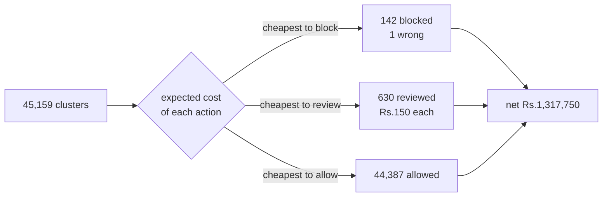

# Results

Every number on this page comes from a file in `results/`. The file is named
next to each table. Nothing here is estimated, rounded up, or carried over from
an older run.

## How to read this

**The holdout is sealed.** Seeds 900 to 999 were never trained on and never
tuned against. They were opened once, into `results/holdout.json`, and re-run
twice since with identical output.

**Never averaged across tiers.** There are four adversary tiers and the spread
between them is the finding. A pooled row appears at the bottom of the headline
table because a merchant runs one queue, not four, but no tier number is ever
blended into another.

**Two prevalences, two denominators.** Account-level prevalence is 0.0080 on
every tier: 9,600 ring accounts in 1,200,000. Cluster-level prevalence is what
the model sees, and it moves: 0.0203 obvious, 0.0207 moderate, 0.0216
sophisticated, 0.0305 adaptive. PR-AUC is scored against the cluster figure,
recall against the account figure.

**Precision on the adaptive tier is undefined, not zero.** See the section
below. It matters.

---

## The headline table

Source: `results/holdout.json`, `results_matrix`. 100 worlds per tier, 12,000
accounts each, 75,402 clusters in total.

| tier | net vs doing nothing | PR-AUC | precision | recall (blocked) | recall (incl. review) | Brier | accounts blocked | accounts reviewed |
| --- | --- | --- | --- | --- | --- | --- | --- | --- |
| obvious | Rs.1,148,700 | 0.9974 | 1.0000 | 0.5016 | 0.9931 | 0.00067 | 4,815 | 5,054 |
| moderate | Rs.569,400 | 0.9971 | 1.0000 | 0.1425 | 0.9609 | 0.00055 | 1,368 | 8,504 |
| sophisticated | Rs.343,100 | 0.9763 | 0.9961 | 0.0266 | 0.9129 | 0.00162 | 256 | 9,298 |
| adaptive | Rs.191,850 | 0.8046 | `n/a (no blocks)` | 0.0000 | 0.5669 | 0.01035 | 0 | 5,977 |
| **pooled** | **Rs.2,253,050** | | 0.9998 | 0.1677 | 0.8585 | | 6,439 | 28,833 |

Across 400 worlds and 4,800,000 accounts, Jaal blocked 6,439 accounts and got
one of them wrong. One false positive costs Rs.15,000, which is 0.7% of the
Rs.2,253,050 net.

The rupee column is first on purpose. A reader who sees 0.0266 recall before
they see Rs.343,100 forms the wrong opinion. Blocking is deliberately rare. The
money comes from blocking only what is certain and routing the rest to a person.

---

## The three reference lines

Two of them come from `detector/costs.py`: `do_nothing_cost` charges Rs.200 for
every farmed coupon, `block_everyone_cost` charges Rs.15,000 for every innocent
customer. The third is the rules baseline in `results/baseline_holdout.json`,
re-run on the same sealed seeds so the comparison is like for like.

| what you do | cost over the 400 holdout worlds | net vs doing nothing |
| --- | --- | --- |
| do nothing | Rs.7,680,000 | Rs.0 |
| block everyone | Rs.71,424,000,000 | -Rs.71,416,320,000 |
| rules baseline | Rs.55,708,800 | -Rs.48,028,800 |
| Jaal | Rs.5,426,950 | Rs.2,253,050 |

The baseline is a hard rule: link on shared device or address, flag any group of
three or more. Per tier, from `results/baseline_holdout.json`:

| tier | precision | recall | accounts flagged | false positives | net vs doing nothing |
| --- | --- | --- | --- | --- | --- |
| obvious | 0.9116 | 1.0000 | 10,531 | 931 | -Rs.12,045,000 |
| moderate | 0.9172 | 0.9997 | 10,463 | 866 | -Rs.11,070,600 |
| sophisticated | 0.9037 | 0.8291 | 8,807 | 848 | -Rs.11,128,200 |
| adaptive | 0.0000 | 0.0000 | 919 | 919 | -Rs.13,785,000 |

The baseline catches almost every ring on the first three tiers. It still loses
Rs.48,028,800. Break-even precision for blocking is 0.9868, from the Rs.15,000
to Rs.200 cost ratio. The baseline runs at 0.90 to 0.92. Nine tenths right
sounds fine and is roughly seven points short of where blocking starts paying
for itself. This is the whole argument for the three-action decision rule.

On the adaptive tier the baseline's 0.0000 precision is real: it flagged 919
accounts and every one of them was innocent.

---

## Precision is undefined on the adaptive tier, not zero

Jaal blocks zero accounts on the adaptive tier. Precision is 0 true positives
out of 0 blocks, which has no denominator. `detector/decide.py` defines

```python
NO_BLOCKS = "n/a (no blocks)"
```

and `format_precision` exists so that this prints as `n/a (no blocks)` rather
than `0.0000`. Those are different claims. `0.0000` says everything Jaal blocked
was innocent. Nothing was blocked. The same false zero was sitting on 14 points
of the detection curve and was corrected there too (D-029).

The pooled precision of 0.9998 is unaffected: a tier that blocks nothing adds no
numerator and no denominator.

---

## Where the model stands

Source: `results/model.json`. Trained on seeds 0 to 44, calibrated on 45 to 59,
scored on validation seeds 700 to 759. 45,159 validation clusters, 1,047 of them
rings.

| variant | pooled PR-AUC | pooled Brier | lift over prevalence |
| --- | --- | --- | --- |
| forest, raw | 0.94182 | 0.00527 | 40.62x |
| forest, sigmoid | 0.94182 | 0.00323 | 40.62x |
| forest, isotonic (shipped) | 0.92976 | 0.00313 | 40.10x |
| MLP, raw | 0.94487 | 0.00291 | 40.75x |

**The MLP scored better than the forest** on PR-AUC and on Brier, and it is not
what ships. The gap is 0.003 PR-AUC against the raw forest, which is inside the
noise of one validation split. The forest ships because it calibrates cleanly
and because its permutation importances are readable, which the explanation
layer needs. That is a trade, and it is reported as a trade rather than left
out.

Per tier, the shipped isotonic forest: 1.00000 obvious, 0.99979 moderate,
0.95621 sophisticated, 0.83350 adaptive.

The purity regressor, which is what the decision rule actually consumes, has a
mean absolute error of 0.00756 overall and 0.15623 on ring clusters. It is
twenty times worse exactly where it is being asked to work.

Charts: `results/pr_curve.png`, `results/reliability.png`.

---

## The review queue, costed two ways

### 1. What if the reviewer is wrong sometimes

Source: `results/review_accuracy.json`. Every rupee the queue earns assumes a
person resolves the cluster correctly. A reviewer who fails on a ring cluster
leaves those accounts unrecovered at Rs.200 each. 26,527 ring accounts reach the
queue, so a reviewer who is right half the time costs up to Rs.5,305,400.

Pooled break-even accuracy is 0.5753. Below that the whole system loses money.

| reviewer accuracy | obvious | moderate | sophisticated | adaptive | pooled |
| --- | --- | --- | --- | --- | --- |
| 1.0 | Rs.1,148,700 | Rs.569,400 | Rs.343,100 | Rs.191,850 | Rs.2,253,050 |
| 0.9 | Rs.1,054,320 | Rs.412,260 | Rs.172,920 | Rs.83,010 | Rs.1,722,510 |
| 0.8 | Rs.959,940 | Rs.255,120 | Rs.2,740 | -Rs.25,830 | Rs.1,191,970 |
| 0.7 | Rs.865,560 | Rs.97,980 | -Rs.167,440 | -Rs.134,670 | Rs.661,430 |
| 0.6 | Rs.771,180 | -Rs.59,160 | -Rs.337,620 | -Rs.243,510 | Rs.130,890 |
| 0.5 | Rs.676,800 | -Rs.216,300 | -Rs.507,800 | -Rs.352,350 | -Rs.399,650 |

The tiers do not share the burden. The obvious tier never goes negative, because
blocking carries it whatever the reviewer does. The sophisticated tier needs
0.7984 and the adaptive tier needs 0.8237, because every rupee they earn comes
from the queue. The harder the adversary, the more the result depends on a
person doing their job.

### 2. What if you only have so many analysts

Source: `results/review_capacity.json`. The full queue is 1,074 clusters over
400 worlds, 2.69 per world. Clusters are ranked by expected value of review.
Blocking alone, with no analyst at all, nets Rs.1,440,000, so review is
responsible for Rs.813,050 of the Rs.2,253,050 total.

| budget | per world | net | share of what review adds |
| --- | --- | --- | --- |
| 347 | 0.87 | Rs.1,862,400 | 52% |
| 674 | 1.69 | Rs.2,103,950 | 82% |
| 801 | 2.00 | Rs.2,178,400 | 91% |
| 892 | 2.23 | Rs.2,217,700 | 96% |
| **1,038** | **2.60** | **Rs.2,256,850** | **best measured** |
| 1,074 | 2.69 | Rs.2,253,050 | whole queue |

The best budget is 1,038 clusters, not the whole queue. The curve is not
monotonic. Four of the 60 steps paid less with more capacity:

| step | change in net |
| --- | --- |
| 0 to 1 | -Rs.7,350 |
| 437 to 456 | -Rs.9,950 |
| 1,038 to 1,056 | -Rs.1,350 |
| 1,056 to 1,074 | -Rs.2,450 |

A cluster pushed out of the queue falls back to blocking, and blocking a
genuinely pure cluster costs nothing, so a larger queue can move a cluster from
a free block into a paid review. Left in rather than smoothed.

---

## Every two-action threshold loses money

Source: `results/decisions.json`, `threshold_sweep`, 101 thresholds from 0.00 to
1.00 on 45,159 validation clusters holding 23,040 ring accounts.

| threshold | blocked | precision | recall | net vs doing nothing |
| --- | --- | --- | --- | --- |
| 0.00 (block everything) | 296,252 | 0.0732 | 0.9408 | -Rs.4,114,304,800 |
| 0.50 | 23,256 | 0.9084 | 0.9169 | -Rs.27,740,000 |
| 0.99 (best that blocks) | 20,081 | 0.9332 | 0.8133 | -Rs.16,382,200 |
| 1.00 (block nothing) | 0 | `n/a (no blocks)` | 0.0000 | Rs.0 |

The best threshold that blocks anything at all loses Rs.16,382,200. The only
two-action policy that does not lose money is the one that blocks nothing.
Maximising F1 gives threshold 0.73 and -Rs.24,642,800, which is why F1 is not
used anywhere in this project.

The three-action rule on the same clusters: 142 blocked, 630 reviewed, 44,387
allowed, precision 0.9997, recall 0.1681, recall including review 0.8445, net
**Rs.1,317,750**.



Look at the middle branch. It is the only thing separating Rs.1,317,750 from the
best two-action result of -Rs.16,382,200.

`results/decisions.json`, `sensitivity`, sweeps the false-positive cost from
Rs.2,000 to Rs.40,000. At 25x and above, no threshold beats doing nothing, and
the three-action rule stays between Rs.1,271,700 and Rs.1,478,600. The result
does not depend on the cost ratio being exactly 75x.

---

## Throughput

Source: `results/scan_timing.json`. Moderate tier, seed 700, median of 3 repeats,
explanations off because they are cached lookups rather than computation.

| accounts | block | link | cluster | features | score | total | accounts/sec |
| --- | --- | --- | --- | --- | --- | --- | --- |
| 3,000 | 42.6 ms | 19.8 ms | 69.1 ms | 10.4 ms | 66.3 ms | 210.5 ms | 14,251.8 |
| 6,000 | 99.6 ms | 66.6 ms | 150.7 ms | 49.6 ms | 77.1 ms | 453.4 ms | 13,233.3 |
| 12,000 | 295.4 ms | 184.7 ms | 415.5 ms | 175.0 ms | 66.8 ms | 1,173.3 ms | 10,227.6 |

Four times the accounts costs 5.57 times the time, a growth exponent of 1.24.
Blocking is what keeps that below quadratic: at 12,000 accounts there are
71,994,000 possible pairs and 546,435 candidates, a 99.2% reduction. Scoring is
flat at about 66 ms because it is one batched forest call.

---

## Reproducibility

```bash
./run.sh          # full pipeline, offline, about 25 minutes
./run.sh quick    # smaller worlds and fewer seeds, about 2 minutes
```

`./run.sh quick` **overwrites `results/*.json` with smaller, noisier runs**.
The published numbers on this page are the committed ones. To put them back:

```bash
git checkout results/
```

The generator is deterministic: `results/generator_check.json`, `determinism`,
records a byte-identical repeat of seed 5 on the sophisticated tier. Nothing on
this page needs the internet. The LLM explanation layer is cached in
`cache/explanations/` and is optional.

---

## Degraded input

Source: `results/field_ablation.json`. Not every caller can send every column.
Each profile retrains blocking, linking and the model on the columns it has, on
validation seeds 700 to 759.

| profile | columns missing | recall (blocked) | recall (incl. review) | precision | net |
| --- | --- | --- | --- | --- | --- |
| full | none | 0.1681 | 0.8445 | 0.9997 | Rs.1,317,750 |
| sdk_payload | none | 0.1681 | 0.8445 | 0.9997 | Rs.1,317,750 |
| aggregator_plus_address | coupon flag | 0.1940 | 0.7967 | 0.9987 | Rs.1,288,750 |
| no_device | device id | 0.1534 | 0.8211 | 1.0000 | Rs.1,233,350 |
| aggregator | address, coupon flag | 0.1174 | 0.7242 | 0.9989 | Rs.979,150 |
| aggregator_strict | address, pincode, signup time, coupon flag | 0.3648 | 0.4062 | 1.0000 | Rs.1,726,850 |

Adding a hashed delivery address to the aggregator profile is worth Rs.309,600
and 7 points of recall including review, from one column. `aggregator_strict` is
the trap: with 4 comparisons and 1 blocking rule it finds far fewer clusters, so
it blocks the few obvious ones and sends almost nobody to review. Its high net
is a smaller queue bill, not better detection, and its 0.4062 recall including
review is the worst on the table.

---

Where the system stops working, and why, is in
[05-where-it-fails.md](05-where-it-fails.md).
