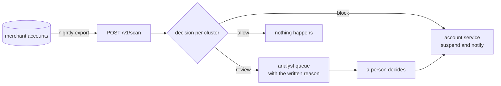

# Running this for real

How a merchant would actually use Jaal, what it costs to run, and where a person
fits into it.

## It is a batch job, not a gate on checkout

Jaal cannot answer "should this payment go through". The signal it uses does not
exist at the moment of a single payment. It exists across a population of
accounts, so it needs a population to look at.

The natural shape is a nightly job over the accounts that signed up recently.



Blocking is rare by design. On the sealed holdout it blocked 0.14% of accounts
and sent 0.55% to a person. Everything else it left alone.

## The one call that matters

`POST /v1/scan` takes the raw account fields a merchant already has. It does not
ask the caller to compute anything.

```bash
curl -s http://127.0.0.1:5001/v1/scan \
  -H 'content-type: application/json' \
  -d '{
    "accounts": [
      {"account_id": "a000001", "device_id": "dv0000001a2b",
       "ip_prefix": "103.21.44", "address_id": "ad0004521",
       "pincode": "560001", "card_bin": "518244",
       "signup_ts": 1782560322, "n_orders": 1, "coupon_used": true,
       "first_order_value": 432, "total_order_value": 432,
       "days_to_second_order": -1}
    ]
  }'
```

The response is one entry per cluster that needs a decision:

```json
{
  "n_accounts": 12000,
  "n_clusters": 195,
  "summary": {"block": 1, "review": 2, "allow": 192,
              "accounts_blocked": 34, "accounts_for_review": 64,
              "discount_at_risk_rupees": 12800},
  "timings_ms": {"block_ms": 375.4, "link_ms": 190.3, "cluster_ms": 425.5,
                 "features_ms": 174.6, "score_ms": 85.0, "total_ms": 1288.0},
  "clusters": [
    {
      "cluster_id": 4,
      "size": 39,
      "accounts": ["a000076", "a000306", "..."],
      "probability": 1.0,
      "predicted_ring_purity": 0.9548,
      "action": "review",
      "expected_cost_rupees": {"block": 26421, "allow": 7448, "review": 5850},
      "discount_at_risk_rupees": 7800,
      "strongest_signal": "pincode",
      "evidence_bits": {"mean_edge": 28.3, "weakest_edge": 15.7},
      "reason": "39 accounts created over 273.6 days, 100% of them in one pincode...",
      "reason_source": "template"
    }
  ]
}
```

**Read `expected_cost_rupees` before `probability`.** In the example above the
model is certain the cluster is a ring, at probability 1.00, and the action is
still `review`. Blocking 39 accounts that are 95% ring accounts still throws away
about two real customers, which costs Rs.26,421. A person looking at it costs
Rs.5,850. So a person looks at it.

The other endpoints:

| endpoint | what it does |
| --- | --- |
| `GET /health` | is the service up, is the model loaded |
| `GET /v1/schema` | the fields to send, and the cost constants in force |
| `POST /v1/score` | one cluster whose features you already computed |
| `GET /runs/<id>` | a saved batch result, for example `/runs/holdout` |

## What it costs to run

Measured on a 12th Gen Intel i5-12450H laptop, 4 worker threads, one batch of
12,000 accounts:

| stage | time |
| --- | --- |
| blocking | 375 ms |
| pair scoring | 190 ms |
| clustering | 426 ms |
| features | 175 ms |
| model and decision | 85 ms |
| **total** | **1.29 s** |

Memory stays under 400 MB for a batch this size. The dominant cost is blocking
and clustering, and both grow faster than linearly, so batches are capped at
20,000 accounts per call. A merchant with more accounts than that runs several
batches, ideally split by city or region, since a ring lives inside one pincode
and splitting on geography loses almost nothing.

No GPU. No database. No queue. The service is a Flask process holding a 4.7 MB
model file.

## Where the language model fits, and where it does not

The language model writes the sentence an analyst reads. It makes no decision,
sees no accounts, and receives only numbers the pipeline already computed.

Pull the network cable and the service still works. Every score, every action and
every rupee figure is unchanged, and the reason falls back to a template. That is
deliberate: a review note that cannot be produced offline is a dependency on a
third party for a fraud decision.

Set `OLLAMA_API_KEY` and pass `"live": true` to get written notes. They are
cached by the evidence they describe, so the same cluster never costs two calls.

## What a person actually sees

The review queue entry is the `reason` field. It reads like this:

```
39 accounts created over 273.6 days, 100% of them in one pincode. 100% used
the first-order coupon and 0% ever ordered again, extracting Rs.7,800 in
discounts. Calibrated probability 1.00. Recommended: review.
Strongest linking evidence:
  - pincode agreement, average edge: +28.3 bits
  - weakest link inside the cluster: +15.7 bits
  - spread of edge strength: +11.9 bits
```

Every figure in that note is checked against the pipeline output before it is
stored. A note quoting a number the pipeline did not produce is treated as a bug,
not as a stylistic choice.

## Things to get right before trusting it

**Recalibrate on your own costs.** Rs.15,000 for a wrongly blocked customer and
Rs.200 for a farmed coupon are the numbers this was built against. They live in
`config.py`, and the whole decision rule moves when they do. The sensitivity
table in `results/decisions.json` shows how far.

**Retrain on your own population.** The model here was fitted on synthetic
worlds. The linkage weights in particular describe how often fields agree in
that generator, and a real population will differ.

**Watch the review queue size.** A system that sends everything to a person is
not a system. This one sends 0.55% of accounts, and if that climbs the cost
model is telling you the classifier has stopped separating.

**Do not block on a shared address alone.** The false positive that costs most
is a hostel or an office. Both share an address and a signup burst with a ring
and differ only in whether they keep ordering.
