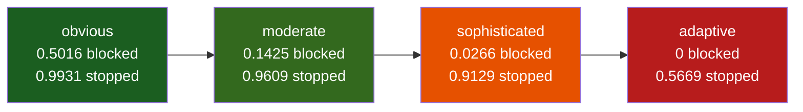
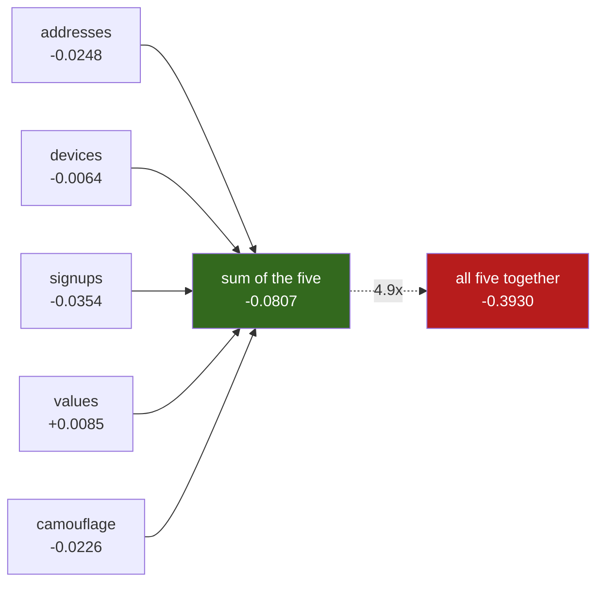

# Where it fails

Most of this project's interesting output is negative. This page collects it.
Every number comes from a file in `results/`, named next to the claim.

---

## 1. The detection curve

Source: `results/holdout.json`, `results_matrix`. Blocked recall across the four
adversary tiers:

| tier | recall (blocked) | recall (incl. review) | accounts blocked |
| --- | --- | --- | --- |
| obvious | 0.5016 | 0.9931 | 4,815 |
| moderate | 0.1425 | 0.9609 | 1,368 |
| sophisticated | 0.0266 | 0.9129 | 256 |
| adaptive | 0.0000 | 0.5669 | 0 |

Blocking dies well before review does. That gap is the system.

**Automatic blocking stops working at the adaptive tier.** Every ring account
there is a stranger to every other one: `results/generator_check.json` records 0
device collisions and 0 address collisions inside adaptive rings, against 919 and
907 on the obvious tier. Nothing static is shared, so nothing clears the 14-bit
edge threshold.

What is still true past that point: Jaal routes 57% of adaptive ring accounts to
a human (0.5669 recall including review), worth Rs.191,850 over 100 worlds. That
is not detection. It is a queue pointed at the right people.

The `detection_curve` block in the same file sweeps sophistication in 21 steps
and shows it continuously. Blocked recall reaches 0.0000 at sophistication 0.35,
where the operator is down to 7.01 accounts per drop address and 0.65 device
reuse. Chart: `results/detection_curve.png`.

---

## 2. The adversarial loop

Source: `results/adaptive_loop.json`, code in `detector/adapt.py`.

Setting a sophistication dial and reporting that detection falls invites a fair
objection: we wrote the fraud, so of course we catch it. This closes that loop.
An operator starts at the moderate tier and adapts to its own outcomes. It never
sees the detector's code, weights, or thresholds, only what happened to its own
rings. It has five knobs, from the `parameters` block:

| knob | range | evasive direction |
| --- | --- | --- |
| `device_reuse` | 0.00 to 1.00 | down |
| `accounts_per_drop` | 1.00 to 20.0 | down |
| `signup_window_days` | 0.04 to 45.0 | up |
| `value_jitter` | 80.0 to 1200.0 | up |
| `camouflage` | 0.00 to 0.50 | up |

Each round it runs 100 worlds at settings scattered around where it stands,
correlates each knob against how often it got stopped, and commits one knob 30%
of its range toward evasion. From `history`:

| round | blocked recall | stopped (incl. review) | `signup_window_days` |
| --- | --- | --- | --- |
| 0 | 0.1354 | 0.9631 | 3.00 |
| 1 | 0.0293 | 0.9557 | 3.00 |
| 2 | 0.0000 | 0.9544 | 16.49 |
| 3 | 0.0000 | 0.9460 | 16.49 |
| 4 | 0.0050 | 0.9331 | 16.49 |
| 5 | 0.0000 | 0.9283 | 29.98 |

Blocking is effectively gone from round 2, with one round back at 0.0050. The
operator moved one knob, signup timing, and nothing else: `device_reuse` stayed
at 0.600 and `accounts_per_drop` at 8.00 for all six rounds.

That was not the expected answer. The detection curve says rotating delivery
addresses is what defeats this system. In round 1 the operator measured signup
window at rho -0.3205 and drop addresses at +0.2544. Both point toward evasion.
It took the stronger measurement and never came back for the other one, because
a greedy operator moves the knob it can measure best, not the knob that would
help most.

Meanwhile the review queue fell 0.9631 to 0.9283 over the same five rounds. It
eroded. It did not collapse.

---

## 3. Visibility sweep

Source: `results/adaptive_visibility_replicates.json`, three replicates, five
rounds, `worlds_per_round` 100.

The loop above gave the operator sight of blocks and not reviews. That was a
restriction we imposed, so it had to be tested. Review visibility became a
setting `q`, the chance the operator notices a cluster being held, decided per
review because an operator notices a whole cluster going quiet rather than
single accounts. Everything else is identical, including a separate random
stream for detection so trial settings match at every level. Means computed with
`detector.adapt._mean_curve(runs, "recall_including_review")`:

| what the operator sees | round 0 | round 5 | fall |
| --- | --- | --- | --- |
| blocks only (q = 0.00) | 0.9631 | 0.9222 | 0.0409 |
| blocks and reviews (q = 1.00) | 0.9631 | 0.8867 | 0.0764 |

Seeing the queue roughly doubles the erosion and does not collapse it.

The three replicates of each setting, final `recall_including_review`:

| replicate | blocks only | blocks and reviews |
| --- | --- | --- |
| 1 | 0.9283 | 0.8918 |
| 2 | 0.9295 | 0.8907 |
| 3 | 0.9089 | 0.8775 |

The worst blind replicate finished at 0.9089 and the best seeing replicate at
0.8918, so the two settings **do not overlap**. One replicate was not enough to
say that: `results/adaptive_visibility.json` ran a single replicate at five
values of q and the ordering between the middle three was noise, so no threshold
in q is claimed.

Blocked recall reaches 0.0000 by round 5 at both settings. Visibility changes
how fast the queue erodes, not whether blocking survives.

---

## 4. The claim we published and then withdrew

An earlier round of this project published that the review queue is
adversarially safe **because it is invisible**. That reading **was wrong**, and
the measurement that killed it is in section 3: the queue holds at 0.8867 with
the operator watching every review.

Blindness was not even protecting the right thing. Across three replicates the
blind operator went for signup timing five times and address rotation once. The
seeing operator went for address rotation six times and twice drove it to its
limit. Address rotation is what the detection curve says defeats this system.
Only the seeing operator finds it, pushes it to the limit, and the queue holds
anyway.

So why does it hold? Source: `results/adaptive_mechanism.json`, eight fixed
configurations over 100 worlds each, seeds 100 to 199.

| configuration | recall (incl. review) | change vs ordinary |
| --- | --- | --- |
| ordinary | 0.9631 | 0.0000 |
| addresses rotated only | 0.9383 | -0.0248 |
| devices rotated only | 0.9568 | -0.0064 |
| signups spread only | 0.9277 | -0.0354 |
| values jittered only | 0.9717 | +0.0085 |
| camouflage only | 0.9405 | -0.0226 |
| both devices and addresses rotated | 0.9145 | -0.0486 |
| **everything at its limit** | **0.5701** | **-0.3930** |

**The five single behaviours sum to -0.0807. All five together cost -0.3930.**
That is 4.9 times the sum of the parts. Jittering order values on its own even
helps the detector, by 0.0085.

The dashed arrow is the whole result. Evasion here is superadditive: no single
move is worth making, and the combination is devastating.

That configuration reads 0.5701. The adaptive tier on the sealed holdout reads
0.5669. Same destination, different route.

So the destination exists, it is reachable with knobs the operator already has,
and a greedy operator that changes one thing per round never assembles all five,
because the payoff for any one change looks like noise beside the payoff for all
five. This is a **search failure by the attacker**, not a property of the
defence. An attacker moving two knobs at once, or running a coarse grid over the
five, would find it. That is a slightly better attacker, not a different kind of
one, and this submission does not claim otherwise.

---

## 5. A feature that lost money and was kept, switched off

Source: `results/reassembly.json`, code in `detector/reassemble.py`.

Weak edges break one ring into several clusters, each then judged alone. A second
pass merges two clusters that share a pincode and whose signups overlap within 30
days, gated so the joined group's predicted purity is at least the size-weighted
purity of its parts. Measured on 200 validation worlds, seeds 700 to 749:

| | as is | reassembled |
| --- | --- | --- |
| clusters | 37,633 | 18,731 |
| accounts blocked | 3,159 | 1,825 |
| recall (blocked) | 0.1645 | 0.0950 |
| recall (incl. review) | 0.8410 | 0.6379 |
| net vs doing nothing | Rs.1,079,900 | -Rs.351,800 |

`delta_net_rupees` is -1431700 and `improves` is false. Of 47,212 proposed
merges 18,902 were accepted, which halved the cluster count, and recall fell
alongside it.

The code stays in the tree, off by default, reachable with
`python -m detector.reassemble --seeds 700-799`. Rejoining split rings is the
obvious next move after reading F4 below, so the code that measured it stays
re-runnable rather than being replaced by a paragraph.

---

## 6. Failure catalogue

Five failures, each observed on a real run and recorded in
`results/holdout.json`, `failure_catalogue`.

| | what fails | evidence | why | what a fix needs |
| --- | --- | --- | --- | --- |
| **F1** | ring accounts never form a cluster | adaptive tier, seed 954: 55 of 96 ring accounts joined no cluster above 14 bits | every account has its own device and address, so the only shared attribute is a pincode and thousands of strangers share that | a signal this generator does not produce, such as behaviour over time or a payout graph. Not a better model. |
| **F2** | ring cluster found, then allowed | sophisticated tier, seed 906, cluster 4: 38 ring accounts, class probability 1.00, predicted purity 0.75, action allow. Rs.7,600 in farmed coupons | expected cost said allowing was cheaper than reviewing, because the purity estimate was too low to justify either | a better purity regressor, which is exactly where the model is weakest (section 7) |
| **F3** | camouflaged repeat orders | adaptive tier, seed 946, cluster 22: 8 accounts, repeat rate 0.38, action allow | 15% of adaptive ring accounts place a second order on purpose, aimed straight at the feature meant to separate rings from families | a feature the camouflage does not also produce. We do not have one. |
| **F4** | one ring split across several clusters | adaptive tier, seed 912: 11 ring clusters in a world holding at most 5 rings | weak edges fragment a ring and each fragment is judged alone, so one small enough to look harmless is allowed | the obvious fix was built and lost Rs.1,431,700 (section 5) |
| **F5** | the operator rotates delivery addresses | sophistication 0.30 on the swept curve: blocked recall below 0.05 at 8.14 accounts per drop and 0.70 device reuse | nothing static is shared but the pincode | no fix inside this feature set. The curve is how the system says so. |

F1 is the one that matters most. It is upstream of everything, so no later stage
can recover from it.

---

## 7. Limitations of the whole approach

**The data is synthetic.** `detector/generate_accounts.py` writes the worlds and
also writes the answer key. Every number here is measured against fraud we
invented. The generator is calibrated on real Olist order values and repeat
rates (`data/olist_priors.json`), and the loop in section 2 exists so
sophistication is not only a dial we set. Neither makes it real data. A real
ring will not match our parameters. The first thing to do with production data
is re-run the detection curve against it.

**The model is trained on this generator's worlds.** Train, validation and
holdout are independent draws from one generator with one set of parameters, so
there is no distribution shift to fail to generalise across. That is why the
holdout is not worse than validation (net per world Rs.5,633 against Rs.5,491).
It is a fact about the split, not a sign of quality. The seed split stops
world-level artefacts leaking between train and test, and that is all it can
do.

**Blocking recall is the ceiling on everything downstream.** If a pair never
becomes a candidate, no later stage can recover it. From `results/blocking.json`,
pair recall is 1.0000 obvious, 1.0000 moderate, 0.9949 sophisticated and 0.9528
adaptive, worst single world 0.8778. Every headline number is capped by those.

**The purity model is worst where it works hardest.** From `results/model.json`,
`purity_model`: mean absolute error 0.00756 overall, 0.15623 on ring clusters.
It is 20 times worse on exactly the clusters whose purity decides whether to
block, review, or allow. F2 above is what that error costs in rupees.
