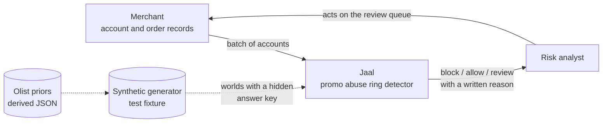

# L0: Context

Who touches Jaal and what crosses the boundary. Look at the arrows into the box:
only account records go in, and only cluster decisions come out. Jaal never
touches a payment rail and never sees a real person's data.

The dotted arrows are the test harness, not production. In a real deployment the
generator is absent and the answer key does not exist, which is the whole reason
the generator has to exist here.

Take away: Jaal is a batch decision service over an account population, and its
most valuable output is often "a human should look at this".
