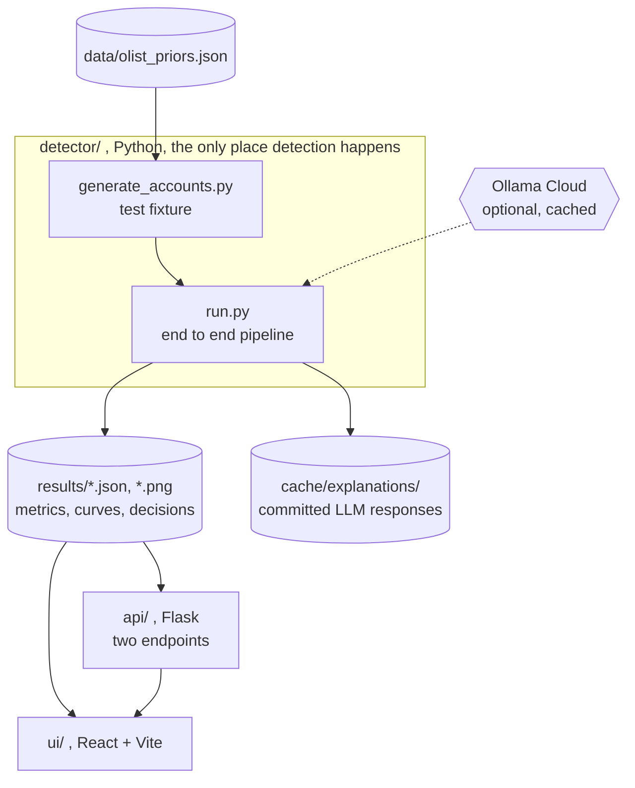

# L1: Containers

The runnable parts and where data rests between them. Everything that produces a
number lives in `detector/`. The API and the UI only read what it wrote.

`run.sh` drives `detector/run.py` and needs no network. The Ollama call is the
only outbound arrow in the whole system, it only writes review sentences, and
its answers are committed to `cache/explanations/` so a judge with no API key
reproduces every result.

Take away: there is a hard boundary at `results/`. No detection logic exists on
the far side of it.
