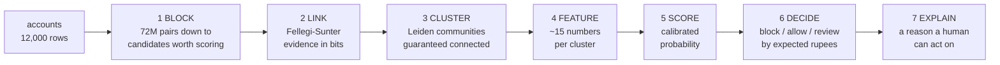

# L2: Pipeline

The seven stages, left to right. Stages 1 to 4 are the hard part. Stage 5 is a
few lines of scikit-learn, and stage 6 is where the cost asymmetry is paid for.

The unit changes twice. It starts as an account, becomes a pair at stage 1,
becomes a cluster at stage 3, and stays a cluster to the end. No stage after 3
ever looks at a single account again, because a single ring account is
indistinguishable from an ordinary first-time customer.

Take away: the decision is made about a group. That reframing is the whole
project, and it is why a per-transaction fraud model cannot solve this.
