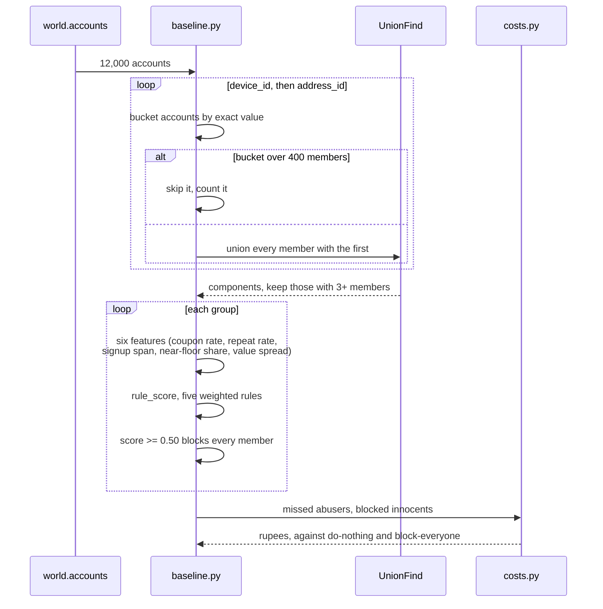

# L3: Inside the rules baseline

What happens to one world when the baseline runs over it, and where it goes
wrong. This is the reference every later phase reports against.

The single most important line is the `alt` branch. It exists because the first
version of this had no size guard and linked on IP prefix as well. One /24
network covering 694 accounts chained through shared devices into a component of
5,754 accounts, which held every ring in the world and was never flagged.

Take away: exact matching has no way to express a weak edge. It either merges
two accounts completely or not at all, and one coarse field is enough to merge
half the population. Phase 2 replaces this with an edge weight in bits.
