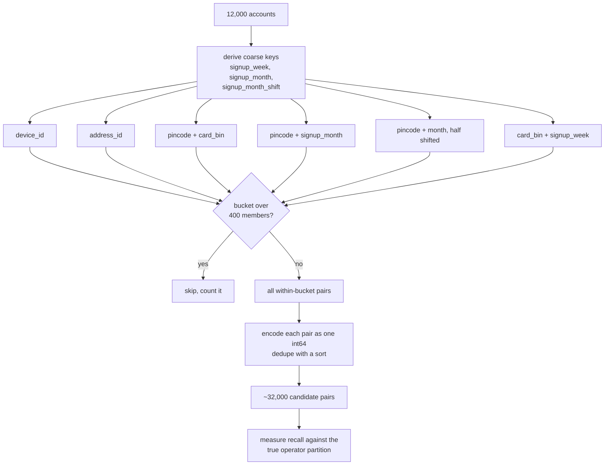

# L3: Inside blocking

72 million pairs to about 32,000. What matters is not the speed-up, it is the
hole the speed-up leaves behind, which is why this stage reports its own ceiling.

Nothing blocks on pincode alone or card BIN alone. The busiest pincode holds
2,639 accounts and the busiest BIN 2,964, which is over five million pairs from
a single bucket. Paired with anything else they become usable, and `pin_bin` is
then the single most valuable rule at the top tier, recovering 0.8188 of adaptive
ring pairs on its own when `device` and `address` recover exactly zero.

The half-shifted month bucket exists because two accounts three days apart can
fall either side of a boundary. The shifted copy catches them for one more pass.

Take away: every rule left out is a permanent recall ceiling. Adaptive blocking
recall is 0.9528 on average and 0.8778 in the worst of ten worlds, so roughly one
adaptive ring pair in eight is unrecoverable in a bad world no matter how good
the scoring is.
