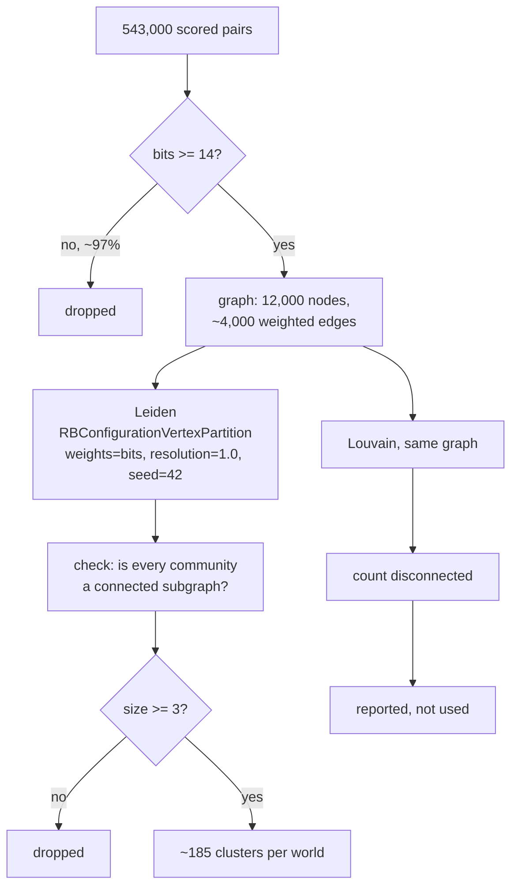

# L3: Inside clustering

From a pile of scored pairs to a set of candidate groups, and the two guards
that keep the result honest.

The threshold on the first branch is the number this phase changed. Phase 2 set
it to 6 bits on an edge budget. At 6 bits Leiden returned clusters of up to 1,812
accounts, because a graph where 96% of edges are wrong has no structure in it.
At 14 bits the largest cluster is 69 accounts and every tier's recall ceiling is
at its highest.

The `check` step is not decoration. Leiden guarantees connected communities, and
the test suite asserts it rather than trusting the guarantee.

Take away: the threshold that maximises pair quality and the threshold that
maximises cluster quality are different numbers, and the second one is the one
that matters, because clusters are what everything downstream can see.
