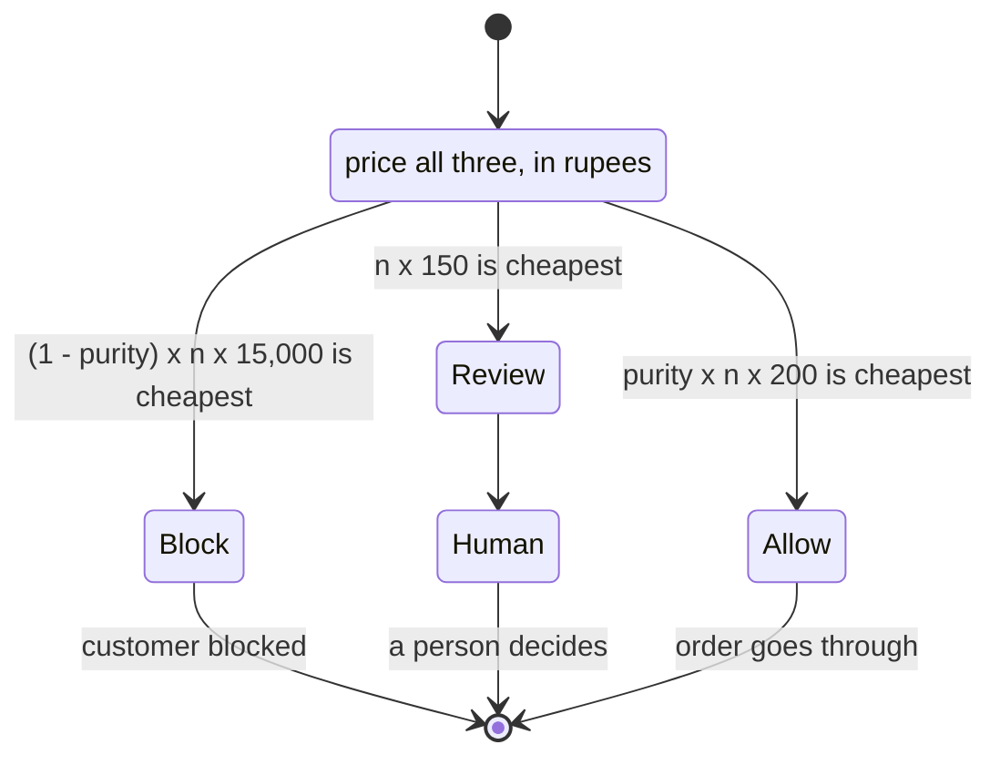

# L3: Inside the decision

Three actions, priced, with no threshold anyone tunes.



The threshold is not a setting. It falls out of the arithmetic. Blocking beats
allowing only when

```
(1 - purity) x 15,000  <  purity x 200
```

which needs purity above **98.7%**. Review beats blocking whenever

```
150  <  (1 - purity) x 15,000
```

which holds for any purity below 99%. So the rule blocks only near-certain
clusters, reviews the band between, and allows the rest, and nobody chose those
boundaries.

On the validation set that gives precision 0.9997 and recall 0.1681. Both
numbers are honest and neither is the point. The point is Rs.1,317,750 saved
against deploying nothing, where every two-action threshold from 0.00 to 1.00
loses money.

Take away: the review queue is not a hedge, it is the cheapest action across
most of the probability range, and a system without it is worse than no system.
