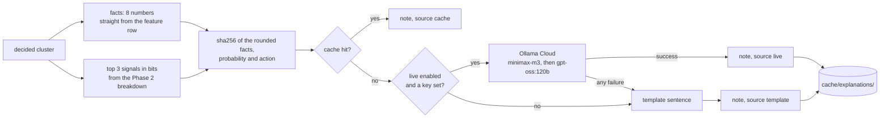

# L3: Inside the explanation layer

The rule that shapes this whole stage: the model does no detection.

The prompt is built entirely from numbers the pipeline produced, and it opens
with "Use ONLY the facts below". That is not politeness. Without it the model
invents plausible details, and an invented number in a fraud review note is
worse than no note at all. `audit_note` checks every numeric token in a returned
note against the feature dict and reports any that do not trace back.

The signals list carries only quantities genuinely measured in bits. Cluster size
is the most eye-catching number on the row and it is not a bit count, so it goes
in the sentence and not in the evidence bullets.

Take away: pull the network out and the pipeline finishes, every metric
unchanged, with template notes instead of written ones.
