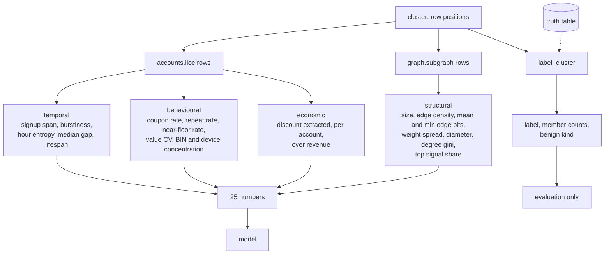

# L3: Inside feature extraction

One cluster in, 25 numbers out, and a hard wall between the numbers and the
answer key.

The dotted line is the only place the answer key is touched, and the audit in
`features.audit` reads the source of every solid-line function to make sure it
stays that way.

Two features do more work than their names suggest. `hour_concentration` is one
minus the normalised entropy of signup hour-of-day: a script run at 3am gives
near zero and real people spread across the day. `diameter` is small for rings
because they hang off one shared asset and are star shaped, while organic groups
spread out.

The economic block exists to connect this phase to the decision. A cluster
extracting Rs.400 is noise. One extracting Rs.40,000 is the target.

Take away: the labels come out of the same function call as the features and are
kept strictly apart from them, because a feature that encodes the answer produces
a model that scores beautifully and does nothing.
