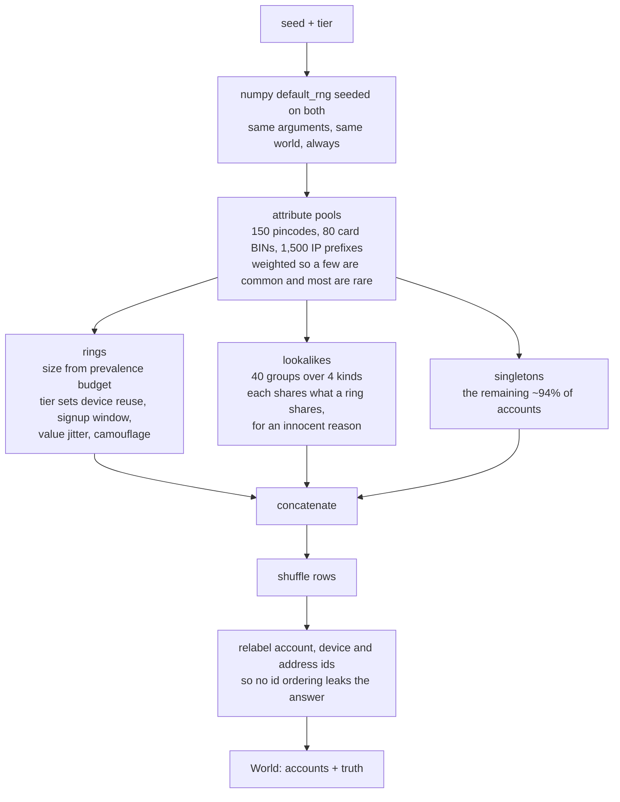

# L3: Inside the generator

What one call to `generate(seed, tier)` does. This is a test fixture, not part
of the detector, but every number in the project is measured inside what it
produces, so it is worth reading closely.

Two details carry most of the weight.

The pools are deliberately skewed. Sharing a card BIN that 3,000 accounts use is
almost no evidence. Sharing one that four accounts use is a great deal. Phase 2
weights by exactly that rarity, so a generator with flat pools would make the
term frequency work look pointless.

The relabel step exists because rings are built first. Without it every ring
account carried one of the lowest ids in the world, which is a fingerprint that
correlates perfectly with the answer.

Take away: determinism and the absence of fingerprints are the two properties
that make results from this fixture worth anything.
