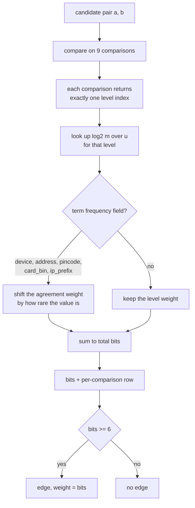

# L3: Inside pair scoring

How one candidate pair turns into a number of bits, and why the breakdown is
kept rather than summed away.

The `exactly one level` step is the part that is easy to get wrong. A pair 30
minutes apart satisfies "within an hour", "within a day" and "within a week" at
once. Adding all three counts the same evidence three times. Levels are ordered
and mutually exclusive, so `signup_gap` contributes +12.51 bits or +5.99 or
+3.15 or -5.06 or -7.22, never a sum of them.

Two comparisons, `coupon_floor` and `order_value`, are computed here and then
left out of the sum. Their m was learned from careless operators, so their
no-agreement levels punish a ring for jittering its order values, which is
backwards. Removing them raised adaptive pair recall from 0.14 to 0.50.

Take away: the output is two things. The total decides whether an edge exists.
The per-comparison row is what a human reviewer reads in Phase 8, and it is the
actual computation rather than a rationalisation invented afterwards.
