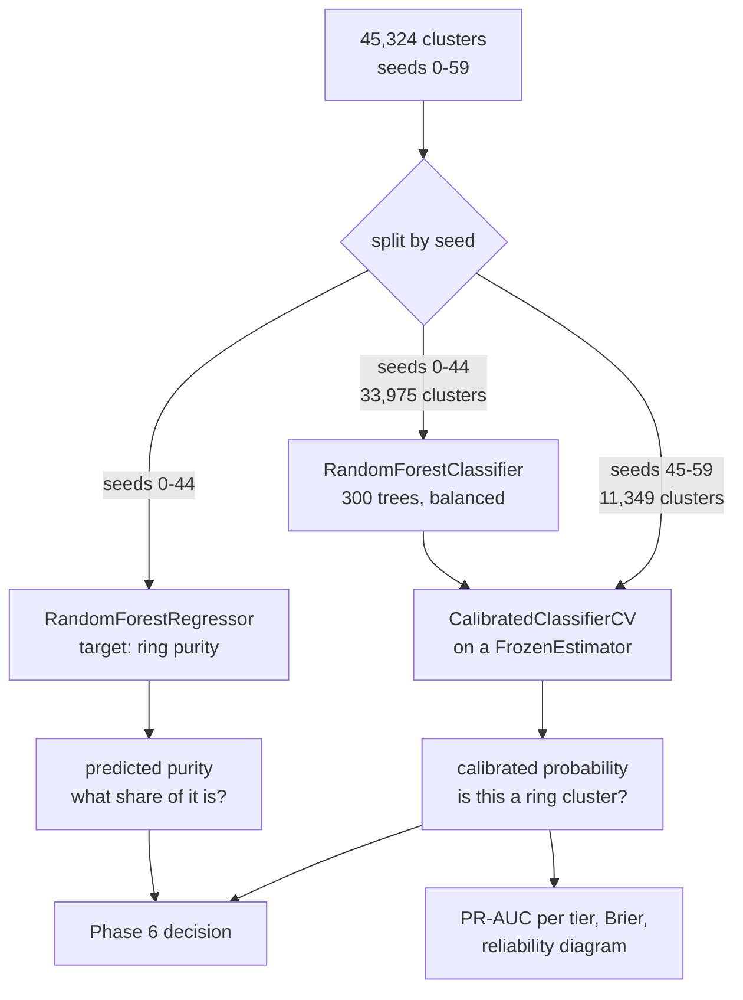

# L3: Inside the model

Two models, because the classifier and the cost function ask different
questions.

**Why two.** The classifier answers "is this cluster majority ring". Blocking a
cluster blocks everyone in it, so the bill is the innocent accounts caught in the
net, and a cluster that is 90% ring still costs 10% of its members at Rs.15,000
each. Using the class probability in the cost model turned a Rs.1.3 million gain
into a Rs.16.4 million loss.

**Why split by seed.** Clusters from one generated world share generator
artefacts. A random row split leaks them across the boundary and inflates every
score. Seeds 0 to 44 fit, 45 to 59 calibrate, 700 to 759 validate, 900 to 999
stay sealed.

**Why calibrate at all.** A random forest averages many trees, so for it to
output 0 every tree must output 0, and probabilities get squeezed toward the
middle. Raw, clusters it scored 0.55 were rings 21% of the time. After Platt
scaling that bin reads 36%.

Take away: a probability that does not mean what it says makes the entire cost
model arithmetic on a meaningless number.
