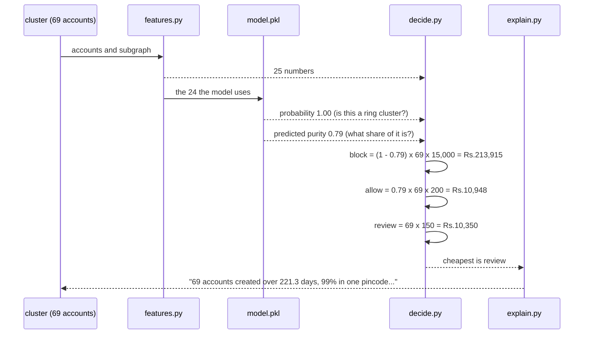

# Sequence: one cluster to an action

What happens between a cluster existing and a decision being made about it. The
surprise is in the last step.

Read the two model outputs together. The classifier is **certain** this is a
ring cluster, at probability 1.00. The purity model says only 79% of its members
are actually ring accounts, so blocking it would destroy roughly 14 real
customers.

Blocking costs Rs.213,915. Reviewing costs Rs.10,350. A human looks at it.

That is the whole argument for the third action, in one worked example. A
two-action system with a threshold anywhere below 1.00 blocks this cluster and
loses two hundred thousand rupees being right about it.

Take away: certainty that a group contains fraud is not the same as certainty
about every member of it, and the cost model needs the second one.
