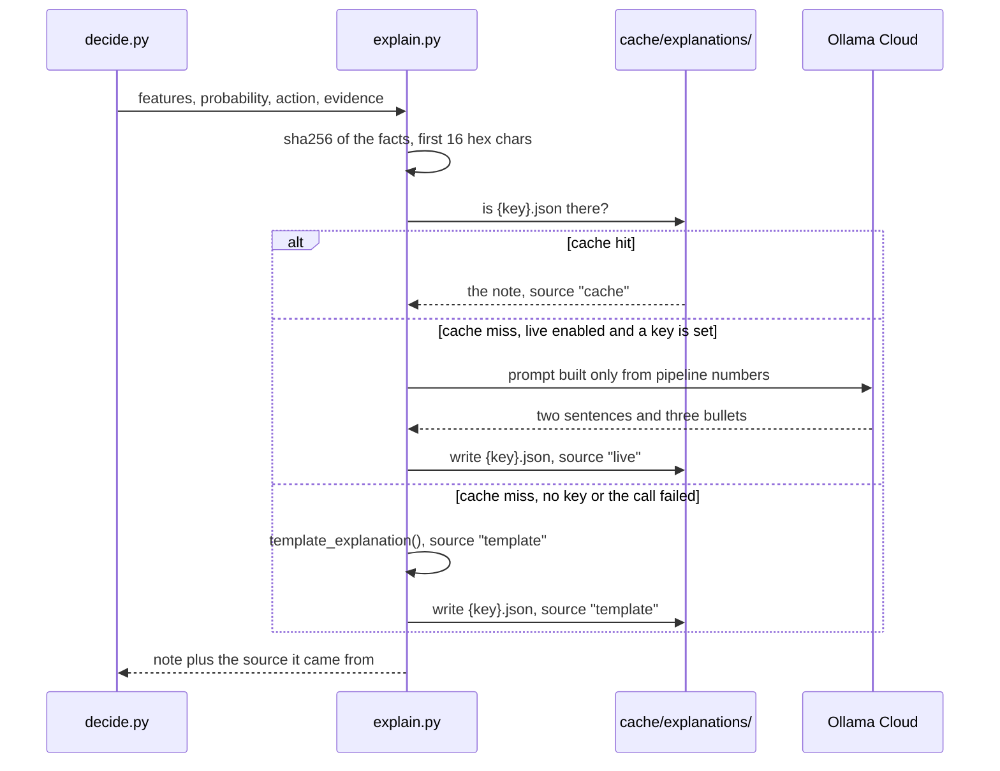

# Sequence: cache hit and cache miss

Why the explanation layer is reproducible by someone with no API key.

Three things about this that are deliberate.

**The key is the evidence, not the cluster id.** Two clusters with identical
rounded facts share a note, and re-running the pipeline reproduces the same key,
so a committed cache keeps working.

**Every branch writes to the cache.** A template note is cached the same way a
live one is, so the source is recorded honestly rather than being recomputed and
silently changing.

**Failure is not an error.** Any exception from the live path falls through to
the template. The pipeline finishes with the network unplugged.

Take away: the model writes prose and nothing else. Pull the network out and
every number in this repository still computes.
