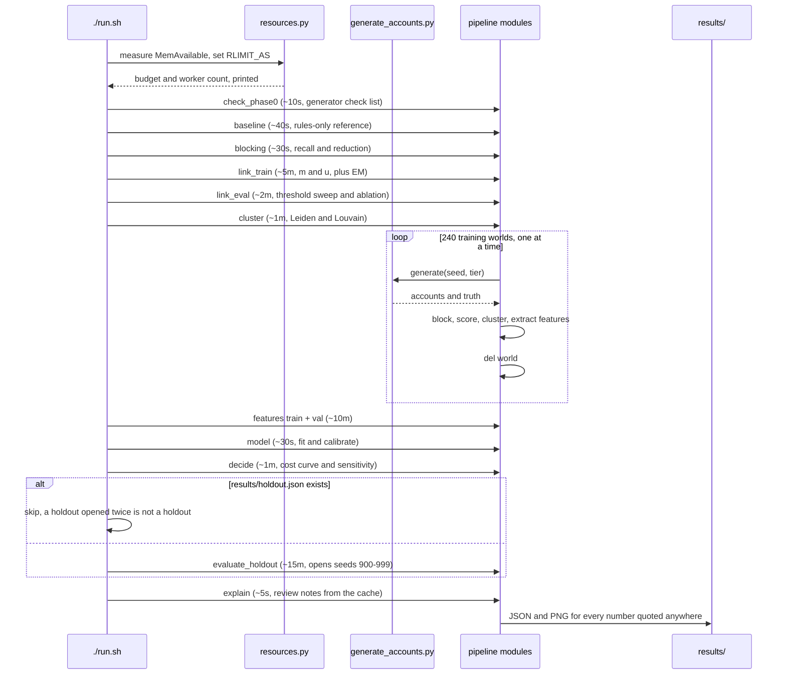

# Sequence: run.sh start to results

What one command does, in order, and roughly what each step costs.

The loop is the part that matters for a laptop. Worlds are generated one at a
time and deleted before the next, so 240 worlds of 12,000 accounts never coexist.
Holding them all would be roughly 3 million account rows in memory at once.

`./run.sh quick` runs the same sequence on 4,000-account worlds and a tenth of
the seeds, in about four minutes. The numbers it produces are real but noisier,
and the ones published in the README come from the full run.

Take away: no network access anywhere in this diagram.
