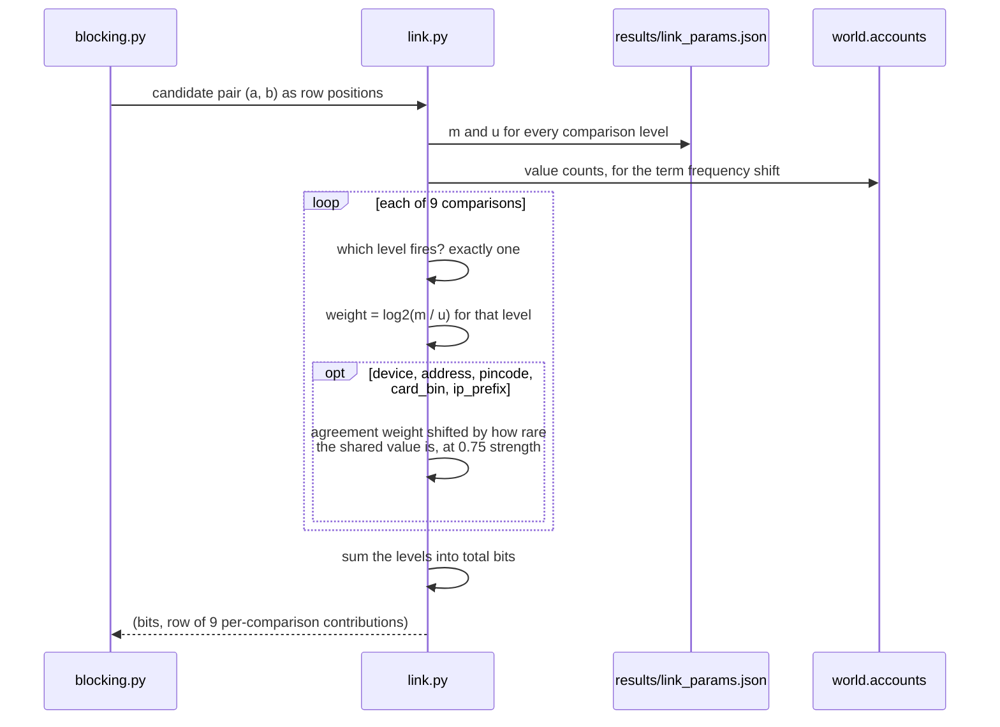

# Sequence: scoring one candidate pair

Every pair that survives blocking goes through the same path. The important part
is that the per-field breakdown survives to the end, because the explanation
layer in Phase 8 needs to say *why* a pair matched, not just that it did.



A worked example: seed 700 on the sophisticated tier, the highest scoring pair
in that world at **61.02 bits**. Both accounts really do belong to ring01.

```
address      +18.78   an address only these two accounts use
pincode      +13.39   and a pincode almost nobody else is in
card_bin     +12.78   on a card BIN that is rare here
signup_gap   +12.51   both signed up inside the same hour
hour_of_day   +2.24   at the same time of day
coupon_used   +1.70   both claimed the coupon
order_count   +0.15   both ordered exactly once
device        -0.54   different devices, weak evidence against
```

The device row is worth noticing. These two accounts do **not** share a device,
and the pair still scores 61 bits. That is the entire point of the phase: exact
matching would have found nothing here.

Take away: the total is what builds the graph. The breakdown is what makes the
decision defensible to the person who has to act on it.
