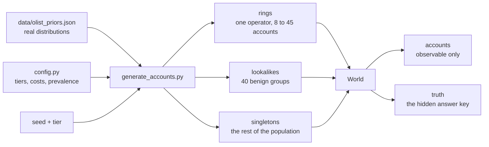

# Phase 0: Foundation reset

## What this phase does

Builds the world the whole project is measured in. A generator produces
synthetic account populations where 0.8% of accounts belong to a coupon-farming
ring, alongside benign groups of real people who share a device or an address
and therefore look like a ring. The order values, repeat rate and signup hours
come from 99,441 real Olist orders rather than from invented constants. The
generator also emits a hidden answer key, because real promo abuse is
unlabelled and there is no other way to score a detector against a known truth.

## Why it matters

Everything downstream is a number measured in this world. Two things would
quietly poison every one of them.

The first is prevalence. At 10% fraud a detector looks excellent, because for
every real ring account there are only nine innocent ones available to be caught
by mistake. At 0.8% there are 124. Precision falls off a cliff and the cost
model changes sign. Any number measured at the wrong base rate is a fact about a
world that does not exist.

The second is generator artefacts. If the generator leaves a fingerprint that
correlates with the answer, a model will find it, score well, and mean nothing.
One such artefact was found and fixed during this phase, described under Key
decisions.

## How it works

A world is built in three blocks, then shuffled together.



The split between `accounts` and `truth` is the point of the design. The
detector only ever sees `accounts`. `truth` carries `operator_id`, and only ring
accounts share one. A family of four is four different people, so it is four
different operators who happen to share a card. That is what makes lookalikes
the interesting false positive rather than a labelling mistake.

**Ring sophistication is a parameter, not a fixed setting.** Four tiers describe
how careful the operator is:

| Tier | Device reuse | Signup window | Value jitter | Camouflage | Accounts per drop address |
| ---- | ------------ | ------------- | ------------ | ---------- | ------------------------- |
| obvious | 100% | 1 hour | Rs.80 | none | 20 |
| moderate | 60% | 3 days | Rs.200 | none | 8 |
| sophisticated | 10% | 21 days | Rs.600 | none | 3 |
| adaptive | 0% | 45 days | Rs.1,200 | 15% | 1 |

Camouflage means a slice of the ring behaves like a real customer: they order
again, and half of those skip the coupon. It is aimed straight at the repeat
rate, which is the strongest single feature available. The `adaptive` tier
exists so the project can state honestly where detection stops working.

What the operator cannot change is the neighbourhood. Goods have to arrive somewhere, so
every ring shares one pincode and a handful of drop addresses regardless of
tier. At the adaptive tier that is nearly all the evidence left.

**Lookalikes** are four kinds, each trapping a different rule:

| Kind | Shares | Span | Repeat rate |
| ---- | ------ | ---- | ----------- |
| family | device, address, card | 200 to 900 days | 0.7 |
| flatmates | address | 30 to 400 days | 0.5 |
| hostel | address, network | 60 to 700 days | 0.3 |
| office | address | 1 to 14 days | 0.6 |

`office` is the one that matters. Twenty people at a new company signing up in
the same week from the same address are structurally identical to a ring on
every static attribute. Only repeat behaviour separates them.

## Files

| File | What it does | Key functions |
| ---- | ------------ | ------------- |
| `config.py` | Every tunable constant, single source of truth | none, constants only |
| `detector/resources.py` | Measures free memory before any heavy run | `budget`, `apply`, `announce` |
| `detector/cli.py` | Shared `--accounts` and `--seeds` handling | `parse_seeds`, `add_common_args` |
| `detector/calibrate_from_olist.py` | Turns raw Olist CSVs into committed priors | `order_values`, `repeat_rate`, `hour_weights` |
| `detector/generate_accounts.py` | Builds worlds and the hidden answer key | `generate`, `ring_sizes`, `lookalike_plan` |
| `detector/check_generator.py` | Runs the plan's check list at full size | `run`, `timing`, `determinism` |

## Key decisions

**Order value is the total of an order, not one line item.** The plan's sketch
takes deciles of `order_items.price`, which is one item's price. An order can
hold several, and the Rs.400 coupon floor applies to the order total. Grouping
by `order_id` first moves the scaled median from Rs.388 to Rs.450. Both are in
the priors JSON. See D-004.

**Prices scaled to a target median, not an FX rate.** Olist is in BRL.
Converting at a market rate would put the median order at roughly Rs.1,100
against a Rs.400 coupon floor, making the floor meaningless. Prices are
multiplied by 5.1784 so the median lands at Rs.450, which puts the floor just
below the median. That is where a merchant sets it: most customers have to add
one more item to qualify. See D-006.

**The priors carry the 95th and 99th percentiles, not just deciles.** Olist's
top decile runs from Rs.1,398 to Rs.69,597. Sampling uniformly inside that band
would give one order in ten a value near Rs.35,000. See D-005.

**Ordinary coupon users also pile up just above the floor.** 55% of first-time
customers claim the coupon, and those whose basket falls short top it up to
clear Rs.400. Without this, sitting on the coupon floor would be something only
ring accounts do, and the whole problem would be trivially easy and dishonest.

**Drop addresses thin out as the operator gets careful.** The plan's tier table
varies device reuse, signup window, value jitter and camouflage, but not
addresses, so every ring shared three to five drop addresses whatever its tier.
Measured on seed 700, an adaptive ring of 38 accounts rotated all 38 devices and
still shared 4 addresses. Exact address matching therefore recovered every ring
at every tier, which contradicts the premise Phase 2 rests on, that exact
matching fails once the operator rotates identifiers. An `accounts_per_drop`
parameter was added so a careful operator rotates drop points too. This makes
the generator harder, not easier, and it was changed before any model existed.
See D-009.

**Opaque ids are relabelled after shuffling.** Rings are built first, so in the
first version of the generator every ring account carried one of the lowest
account ids and one of the lowest device ids. That is a generator fingerprint
that correlates perfectly with the answer. Ids are now handed out after the rows
are shuffled, and `test_opaque_ids_do_not_leak_group_membership` fails if that
regresses.

## Results

Real numbers, from `results/phase0_check.json`.

```
$ python -m detector.check_generator --accounts 12000 --seeds 0-9

tier            prevalence      rings  lookalikes  dev reuse  addr reuse  ring span (d)  office span (d)
obvious         0.0080-0.0080   3-5    40-40       919        907         0.037          12.90
moderate        0.0080-0.0080   3-5    40-40       528        843         2.560          12.42
sophisticated   0.0080-0.0080   3-5    40-40       65         655         19.342         12.54
adaptive        0.0080-0.0080   3-5    40-40       0          0           42.249         12.37

seed 5 generated twice, byte identical: True
100 worlds of 12,000 accounts: 5.1s (under 60s: True)
```

"dev reuse" and "addr reuse" count how many ring accounts reused a device or an
address another ring account already had, summed over 10 worlds. Both fall to
zero at the adaptive tier: 919, 528, 65, 0 for devices and 907, 843, 655, 0 for
addresses. That is the sophistication gradient made visible. At the top tier
there is no exact-match edge to find at all, only a shared pincode.

The Olist extraction, from `data/olist_priors.json`:

```
$ python -m detector.calibrate_from_olist --raw-dir data/raw

99,441 orders, 96,096 unique customers
BRL to INR scale 5.1784 (median order Rs.450)
repeat rate 0.0312
busiest hour 16:00 (6.7% of orders)
```

Behaviour of one generated world, seed 0, 12,000 accounts:

| Measure | Value |
| ------- | ----- |
| repeat rate, ordinary population | 0.0284 |
| repeat rate, ring accounts, obvious tier | 0.0000 |
| repeat rate, ring accounts, adaptive tier | 0.1354 |
| coupon use, ordinary population | 0.5516 |

Every item on the plan's Phase 0 check list passes, and each one is also a test
in `tests/test_generator.py` so it cannot quietly stop being true.

## Known limitations

**The repeat rate prior is low and that weakens the strongest feature.** Olist's
population repeat rate is 3.1%, because it is a marketplace where most customers
buy once. An Indian food delivery merchant would be far higher. This is the
plan's stated choice: the prior sets the contrast against ring behaviour, it
does not set ring behaviour. The consequence is that "never ordered again"
barely separates a ring account from an ordinary account, since ordinary
accounts rarely reorder either. It still separates rings from lookalike groups,
which is where the false positives come from, so the feature earns its place.
It is weaker than it would be on a merchant with real repeat business.

**Olist is Brazilian marketplace data, not Indian food delivery.** The shape of
the distributions transfers: long-tailed order values, most customers never
return, activity peaks in the late afternoon. The absolute values do not, which
is why they are rescaled and the factor is recorded.

**Pincode sharing does not vary by tier.** Drop addresses now thin out as the
operator gets careful, but every ring still sits in one pincode. That is
deliberate, since goods must be delivered somewhere reachable, but it means the
generator never models an operator spread across a city. A real operator using a
parcel forwarding service in three pincodes would defeat this, and Jaal would
not see them at all.

**Rings never overlap with lookalike groups.** No ring in this generator
recruits from a hostel or runs out of an office. Real ones sometimes do, and
that case is not represented.

**One tier per world.** A world contains rings of a single sophistication, which
is what makes per-tier reporting clean. A real population would hold a mix.
