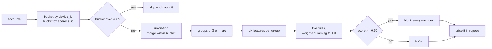

# Phase 1: The honest baseline

## What this phase does

Builds the dumb detector first: link accounts that share an identifier exactly,
group them with union-find, score each group with five hand-written rules, block
anything scoring 0.5 or above. Then prices every decision in rupees against two
reference lines, doing nothing and blocking everyone. The result is frozen into
`results/baseline.json` and locked by a test.

## Why it matters

Two reasons, and the second is the bigger one.

If the machine learning cannot beat hand-written rules, that needs to surface on
day two, not day fourteen. And without a published baseline, nobody, the author
included, can tell whether the model contributed anything at all. A submission
that reports "precision 0.94" with nothing to compare against has not reported a
result, it has reported a number.

The cost model is written before the detector on purpose. Once the numbers are
on the table it becomes obvious that the detector you would build to maximise F1
is not the detector you want.

## How it works



The five rules, unchanged from the plan:

| Rule | Weight |
| ---- | ------ |
| more than 90% of the group used the coupon | 0.30 |
| fewer than 10% of the group ever ordered again | 0.30 |
| the whole group signed up inside 3 days | 0.20 |
| more than 70% ordered within Rs.200 of the coupon floor | 0.15 |
| order values vary by less than 20% of their mean | 0.05 |

They are meant to be beaten, so they are not tuned.

**The one number to remember.** Blocking a real customer costs Rs.15,000.
Missing an abuser costs Rs.200, one coupon. So blocking a group pays only while

```
p * 200 > (1 - p) * 15,000
```

which needs precision above **98.7%**. Every precision figure below should be
read against that line, not against 100%.

## Files

| File | What it does | Key functions |
| ---- | ------------ | ------------- |
| `detector/costs.py` | Prices a set of decisions, and the two reference lines | `decision_cost`, `do_nothing_cost`, `block_everyone_cost`, `breakeven_precision` |
| `detector/baseline.py` | Exact-match linking, rules, per-tier reporting | `UnionFind`, `exact_match_groups`, `rule_score`, `run` |
| `results/baseline.json` | The frozen reference, 100 worlds per tier | data |
| `results/baseline_lock.json` | Three worlds per tier, re-run by the test suite | data |

## Key decisions

**Linking on IP prefix destroys the whole thing.** The first version linked on
`device_id`, `address_id` and `ip_prefix`. An IP prefix is a /24 network, and on
seed 700 a single prefix covered 694 accounts. Union-find then chained those
buckets together through shared devices into one component of **5,754 accounts**
that contained every ring in the world, scored 0.30, and was never flagged.
Recall was 0.000 on all four tiers. The fix was to drop `ip_prefix`. Card BIN
and pincode are excluded for the same reason: an issuer and an area are not a
person.

This is not a tuning detail, it is the finding that justifies Phase 2. Exact
matching plus transitive closure has no way to say "this edge is weak". One
coarse field poisons every group it touches. Weighted edges and community
detection exist precisely because of this failure.

**Micro-averaged, not macro-averaged.** Counts are summed across the 100 worlds
first and the rates computed on the totals. Averaging per-world precision would
let a world with three flagged accounts weigh the same as one with three hundred.

**The baseline runs on validation seeds, 700 to 799.** The holdout, 900 to 999,
is sealed. In Phase 7 the baseline is re-run on the holdout alongside the model
so the comparison happens on the same worlds. A test asserts the frozen file
never touched a sealed seed.

## Results

```
$ python -m detector.baseline --accounts 12000 --seeds 700-799 --out results/baseline.json

Rules baseline, 12,000 accounts per world, seeds 700-799 (100 worlds per tier)
linked on device_id, address_id, groups of 3+, flagged at rule score >= 0.5
blocking pays only above 98.7% precision

tier            prev   groups  flagged  prec     recall   FP accts  net vs nothing
obvious         0.80   5985    656      0.9129   1.0000   916       -Rs.11,820,000
moderate        0.80   5885    697      0.9115   0.9995   932       -Rs.12,061,000
sophisticated   0.80   7092    1824     0.9037   0.8373   857       -Rs.11,247,400
adaptive        0.80   5501    298      0.0000   0.0000   964       -Rs.14,460,000
```

**Every tier loses money.** Not one of them, all four. That is the result of
this phase and it should be read slowly.

Take the `obvious` row. Precision 0.9129, recall 1.0000. On any ordinary
scoreboard that is an excellent detector: it caught every single ring account in
100 worlds. It also blocked 916 innocent customers doing it. Those 916 cost
Rs.13,740,000. The 9,600 coupons it saved were worth Rs.1,920,000. Net,
it destroyed **Rs.11.8 million** of value against the alternative of deploying
nothing at all.

The `adaptive` row is the other kind of failure and it is cleaner. Zero true
positives, 964 innocent customers blocked, Rs.14.5 million burned for no benefit
whatsoever. When every account in the ring has its own device and its own
address, exact matching has nothing to match on, and the five rules never see a
group to score.

Where the false positives come from:

| tier | normal | flatmates | office | family |
| ---- | ------ | --------- | ------ | ------ |
| obvious | 875 | 16 | 19 | 6 |
| moderate | 899 | 19 | 11 | 3 |
| sophisticated | 819 | 21 | 14 | 3 |
| adaptive | 917 | 21 | 20 | 6 |

Most wrongly blocked accounts are ordinary strangers, not the carefully built
lookalike groups. They are people who happened to share a cyber cafe device or a
building, whose three-account group happened to be all coupon users who never
came back. The lookalikes mostly escape because `office` and `family` have real
repeat business, which fails the second rule. The trap was built for a detector
that leans on structure, and this baseline leans on behaviour, so it walks past
it and blocks strangers instead.

`sophisticated` flags 1,824 groups against 656 for `obvious`, because rings
there are broken into many small fragments by partial device and address reuse.
More groups, each smaller, each still scoring high enough to block.

## Known limitations

**The rules are not tuned and should not be.** A threshold sweep would improve
these numbers. It would also turn the baseline into a second model, which
defeats the purpose of having one.

**Two actions, not three.** The baseline blocks or allows. It has no review
queue, so it pays Rs.15,000 for every mistake it could have paid Rs.150 to
avoid. Adding the third action is Phase 6, and the gap between this table and
that one is what Phase 6 is worth.

**Group size 3 is arbitrary.** Pairs are excluded. A real two-account ring is
invisible to this baseline and to everything downstream of it.

**No probability anywhere.** A rule score of 0.8 is not a probability of
anything. Nothing here can be plugged into an expected-cost calculation, which
is exactly why Phase 5 spends its time on calibration rather than on accuracy.
