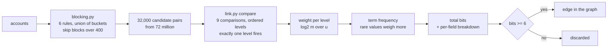

# Phase 2: Probabilistic linking

## What this phase does

Replaces "do these two accounts share a device?" with "how much evidence is
there that these two accounts belong to the same operator?" Three modules:
`blocking.py` cuts 72 million possible pairs down to about 32,000 worth
scoring, `link_train.py` learns how much each kind of agreement is worth
without any labels, and `link.py` scores every candidate pair in bits and keeps
the per-field breakdown that produced the number.

## Why it matters

The Phase 1 baseline scored **zero** on the adaptive tier. Not because the
scoring rules failed, but because no groups formed at all. Every account had its
own device and its own address, exact matching had nothing to match, and the
five rules never saw a group to score. A perfect classifier downstream still
scores zero when it is handed nothing.

Everything after this phase is standard. This is where the project is won or
lost.

## How it works

Each comparison contributes a weight in bits:

```
weight = log2(m / u)

m = how often this field agrees when the two really are one operator
u = how often it agrees between two strangers, by chance
```

Sharing a rare device is worth about +15 bits. Both signing up within an hour,
+12.5. Sharing a pincode, +3.8. Both using the coupon, +1.7. Weak on its own,
but six weak signals at 1.7 bits each outweigh one device match. Exact matching
discards every weak signal. This adds them up.



Three design points carry most of the weight.

**Comparison levels, not booleans.** Agreeing within an hour is much stronger
evidence than agreeing within a day. So a comparison holds ordered levels and
exactly one fires per pair. The plan's sketch listed `signup_1h` and
`signup_24h` as separate entries and summed everything that fired, which counts
the same evidence twice for any pair under an hour apart. Here `signup_gap` is
one comparison with five levels and the weights fall +12.51, +5.99, +3.15,
-5.06, -7.22.

**Term frequency.** Two accounts sharing a device seen twice in the population
is enormous evidence. Sharing one seen 300 times is almost none. A single weight
per field cannot express that, a per-value adjustment can, and it is the reason
this beats hand-tuned rules. The strength is a dial, `link.TF_WEIGHT`, the same
knob Splink calls `tf_adjustment_weight`. At full strength it over-credits rare
values of a low-cardinality field, because a pincode holding twelve unrelated
people is rare and is still twelve unrelated people. Measured over ten
validation worlds, strengths of 0.25, 0.5, 0.75 and 1.0 gave mean pair F1 of
0.6001, 0.6047, 0.6049 and 0.5957 across the three tiers that work at all. It
ships at 0.75.

**The breakdown is kept, not thrown away.** `score_pairs` returns a
(pairs x comparisons) matrix alongside the total. That is what lets a flagged
cluster say "matched on address +18.8 bits, pincode +13.4, card BIN +12.8"
instead of just "matched".

## Files

| File | What it does | Key functions |
| ---- | ------------ | ------------- |
| `detector/blocking.py` | Candidate pairs, plus recall and reduction | `candidate_pairs`, `true_pair_codes`, `measure` |
| `detector/link.py` | Comparison levels, weights, scoring, explanation | `compare`, `score_pairs`, `explain_pair`, `bits_to_probability` |
| `detector/link_train.py` | m and u without labels, plus EM | `train`, `popular_value_pairs`, `em_refine` |
| `detector/link_eval.py` | Threshold sweep and ablation | `sweep`, `best_threshold`, `ablation` |
| `results/link_params.json` | The trained parameters, committed | data |
| `results/blocking.json`, `results/link_eval.json` | Measured reports | data |

## Key decisions

**The plan's seed rule for m is backwards for this problem, and the measurement
says so.** The bootstrap takes pairs sharing a *rare* value on the reasoning
that two records holding a value nobody else has must be one entity. That is
right for deduplicating a customer table. Here, pairs sharing a device held by
two or three accounts are **0.7%** true matches. An operator does not run two
accounts, they run eight to forty-five, so their device is not rare, it is
popular. A device held by exactly two accounts is a couple sharing a phone.
Inverting the rule to "a device carrying six or more accounts", six being one
more than the largest household in `config.LOOKALIKE_KINDS["family"]`, gives
**99.3%** purity over 37,124 seed pairs. See D-014.

**Address cannot seed anything.** A hostel puts 20 to 60 unrelated students at
one address, so address-seeded pairs are 3.3% true matches at every window
tried. That rules out cross-seeding, so m for the device comparison comes from a
second pass: score every candidate pair with the device comparison switched off,
keep the pairs whose remaining evidence alone puts the posterior above 0.99, and
measure device agreement inside that set. Purity there is 43.5%, which is
reported rather than hidden.

**EM was built, measured, and lost.** The plan names Expectation Maximisation as
the proper fix for the seed bias, so it was implemented. Left free, the match
rate ran from 0.0098 to the 0.5 ceiling in nine iterations and every weight
collapsed to zero. Held fixed at the value config implies, and with Dirichlet
smoothing on the M step, it produced a sensible-looking table and still lost on
every tier: best pair F1 of 0.793 against 0.991 on obvious, 0.372 against 0.706
on moderate, 0.101 against 0.118 on sophisticated. The bootstrap estimate ships.
EM stays in `link_train.py` and its parameters stay in `link_params.json` under
`m_em`, because a measured negative result is worth more than a deleted one.
See D-015.

**Two comparisons are computed and then not scored.** `coupon_floor` and
`order_value` both say "the ring ordered near-identical amounts just above the
coupon floor". True of a careless operator, false of a careful one, and because
m comes from a seed set of careless operators their no-agreement levels carry
-6.6 and -7.0 bits. A ring that jitters its order values is actively punished
for it, which is exactly backwards. Measured on three independent blocks of ten
validation worlds, removing them lifts sophisticated pair recall from 0.60, 0.47
and 0.55 to 0.84, 0.74 and 0.86, and adaptive recall from 0.14, 0.17 and 0.20 to
0.50, 0.49 and 0.56, with better precision and fewer edges. See D-016.

**The edge threshold is chosen by budget, not by F1.** Pair F1 is the wrong
objective, because the pair scorer is not the product: it builds the graph
Leiden partitions in Phase 3. Optimising pair F1 picks 40 bits, where the
obvious tier reaches 0.9922 precision and the moderate tier has already lost 71%
of its true pairs. An edge that is never created can never be recovered later.
So the rule is: take every edge you can afford, at 50,000 per world, which is a
mean degree near 8. That lands on 6 bits.

## Results

### Blocking, seeds 0-9, 12,000 accounts per world

```
$ python -m detector.blocking --accounts 12000 --seeds 0-9

tier            recall   worst    reduction  candidate pairs  true pairs  blocks skipped
obvious         1.0000   1.0000   0.99234    551,801          1,327       1.0
moderate        1.0000   1.0000   0.99247    542,431          1,322       1.0
sophisticated   0.9949   0.9810   0.99245    543,506          1,256       1.0
adaptive        0.9528   0.8778   0.99234    551,733          1,393       1.0
```

Both bars clear: recall above 0.90 on all four tiers, reduction above 0.99. The
"worst" column is the single worst world rather than the mean, and on the
adaptive tier one world in ten fell to 0.8778. That variance is real and is
reported because it is a ceiling nothing downstream can lift.

What each rule recovers on its own, on the adaptive tier:

| rule | recall alone |
| ---- | ------------ |
| pin_bin | 0.8188 |
| pin_month | 0.5144 |
| pin_month_shift | 0.5108 |
| bin_week | 0.1178 |
| device | 0.0000 |
| address | 0.0000 |

Device and address recover exactly nothing at the top tier, which is the whole
problem restated. A seventh rule, pincode with a Rs.100 value band, was measured
and dropped: 291,868 pairs for 0.0795 adaptive recall, the worst trade of
anything tried. Week buckets were replaced by month buckets for the reverse
reason, costing more pairs each but lifting adaptive recall from 0.9293 to
0.9732 and the worst single world from 0.7975 to 0.9490.

### The match weight table, trained on seeds 0-19 across all four tiers

```
comparison    level              m           u    weight(bits)
device        exact         0.3139    0.000011      +14.83
              no            0.6861    0.999989       -0.54
address       exact         0.5507    0.000142      +11.93
              no            0.4493    0.999858       -1.15
pincode       exact         0.9937    0.072428       +3.78
              no            0.0063    0.927572       -7.20
card_bin      exact         0.7362    0.086722       +3.09
              no            0.2638    0.913278       -1.79
ip_prefix     exact         0.0083    0.007678       +0.12
              no            0.9917    0.992322       -0.00
signup_gap    within_1h     0.7393    0.000127      +12.51
              within_24h    0.1348    0.002117       +5.99
              within_7d     0.1181    0.013343       +3.15
              within_30d    0.0015    0.050304       -5.06
              no            0.0063    0.934109       -7.22
hour_of_day   within_1h     0.7752    0.163751       +2.24
              within_3h     0.0574    0.203099       -1.82
              no            0.1674    0.633150       -1.92
order_count   both_one      0.9994    0.900276       +0.15
              equal         0.0001    0.000525       -2.39
              no            0.0005    0.099199       -7.52
coupon_used   both_used     0.9959    0.306317       +1.70
              both_unused   0.0009    0.199585       -7.86
              no            0.0033    0.494097       -7.23

prior match rate 1.868e-05 (1 pair in 53,544)
```

`ip_prefix` at +0.12 bits is the honest one to point at. It agrees between true
pairs almost exactly as often as between strangers, so it carries no
information, and the model says so rather than being told. Rings in this
generator do not share a network, and the accounts that do share one are hostel
residents who are not one operator.

### Pair scoring at 6 bits, seeds 700-709, 10 worlds per tier

```
$ python -m detector.link_eval --accounts 12000 --seeds 700-709

tier            precision  recall   edges per world  true pairs found
obvious         0.0468     1.0000   32,254           15,104
moderate        0.0404     0.9911   31,866           12,861
sophisticated   0.0336     0.7904   32,967           11,086
adaptive        0.0193     0.4905   31,719           6,118
```

Read the recall column against Phase 1. Exact matching found 0.8373 of ring
accounts on `sophisticated` and **nothing at all** on `adaptive`. Probabilistic
linking recovers 0.79 and 0.49 of the true pairs on those two tiers. That is
what four days buys.

Read the precision column and do not be reassured. At 6 bits, 96% of edges are
wrong. That is deliberate: this graph is an input to community detection, not a
verdict, and a ring of thirty forms a near-clique while false edges scatter at
random. Whether Leiden can separate the two is Phase 3's question, and if it
cannot, the threshold moves.

### Ablation at 6 bits: recall lost when a comparison is removed

```
removed        obvious   moderate  sophisticated  adaptive
nothing         1.0000     0.9911      0.7904      0.4905
pincode        +0.0000    -0.0815     -0.3318     -0.3436
card_bin       +0.0000    -0.0101     -0.2939     -0.2697
coupon_used    +0.0000    -0.0103     -0.0652     -0.0651
ip_prefix      +0.0000    +0.0000     -0.0007     -0.0010
device         +0.0000    -0.0055     +0.0063     +0.0170
address        +0.0000    -0.0002     +0.0033     +0.0392
hour_of_day    +0.0000    +0.0006     +0.0073     +0.0429
order_count    +0.0000    +0.0000     -0.0031     +0.0840
signup_gap     +0.0000    -0.0262     -0.0045     +0.1180
+coupon_floor  +0.0000    +0.0088     -0.2344     -0.2723
+order_value   +0.0000    +0.0037     -0.1090     -0.1997
```

The last two rows are the excluded comparisons added back, so a minus there
means adding them costs recall.

This table is the concrete answer to "what if the operator hides X" for every X.
At the top tier the pincode and the card BIN are carrying the entire system:
remove either and adaptive recall roughly halves. Device and address contribute
nothing there, because there is nothing left to share.

`signup_gap` is the interesting row. Removing it *raises* adaptive recall by
0.118, for the same reason `coupon_floor` was excluded: its m was learned from
operators who sign up in bursts, so its `within_30d` and `no` levels punish an
operator who spreads signups over 45 days. It survives because dropping it costs
moderate recall, but the same bias is visible in it and it is worth naming.

### Cost

Blocking and scoring one 12,000 account world: **0.49 seconds** (0.29 blocking,
0.20 scoring), against the plan's 3 minute bar. The contribution matrix is
543,285 x 9 float32, 24 MB, and is kept.

## Known limitations

**m is fitted on careless operators and there is no way around it here.** Every
seed pair reused a device, so every m estimate describes an operator who reuses
devices. Cross-seeding on address is impossible because hostels poison it, and
EM measurably made things worse. Two comparisons had to be dropped outright
because the bias made them harmful. The estimates that ship are honest about
where they came from, and `seed_purity` and `device_seed_purity` are in the
committed parameters file so anyone can see it.

**96% of edges at the operating threshold are wrong.** This is a graph builder,
not a detector, and it must not be quoted as one.

**Blocking recall on the adaptive tier fell to 0.8778 in one world of ten.**
Roughly one adaptive ring pair in eight is unrecoverable in a bad world, whatever
happens downstream.

**No fuzzy string comparison anywhere.** Every comparison is exact agreement or
a numeric band. A real deployment would compare address strings with Jaro-Winkler
or similar, because "Flat 3, 12 MG Road" and "12 M.G. Road, Flat 3" are the same
door. The generator emits opaque address ids, so there is no string to fuzz and
this is untested.

**The prior is a population prior.** `bits_to_probability` uses the match rate
over all possible pairs, not over blocked pairs. Bits and thresholds are
unaffected, but a probability read off a single candidate pair is a
population-level posterior and should not be read as "the chance this specific
candidate matches".
