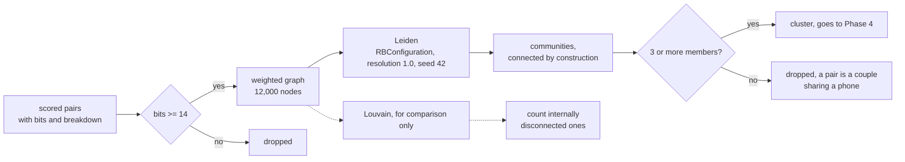

# Phase 3: Community detection

## What this phase does

Turns the weighted pair graph into candidate groups. Accounts are nodes, scored
pairs are edges, edge weight is evidence in bits, and Leiden cuts the graph into
communities that are strongly tied inside and weakly tied to everything else.

No training and no labels. This is a graph algorithm.

## Why it matters

Phase 2 produced edges. Nothing downstream can score an edge, only a group, and
a group that is really two unrelated clumps glued together is not a detection,
it is a mistake with a confident number attached.

This phase also carries the correction that Phase 2 deferred. The 6 bit edge
threshold was chosen on an edge budget with the note that cluster quality was
the real test. It failed that test, and the threshold moved.

## How it works



**Leiden rather than Louvain.** Louvain can produce badly connected communities
and, in the worst case, internally disconnected ones. Leiden adds a refinement
phase between local moving and coarsening and guarantees connected communities.
Both are run here and Louvain's failures are counted.

**The seed is pinned.** Community detection is randomised. An unseeded run gives
a different answer every time, which would make every number in this repository
unreproducible.

## Files

| File | What it does | Key functions |
| ---- | ------------ | ------------- |
| `detector/cluster.py` | Graph building, Leiden, Louvain, quality | `build_graph`, `leiden_clusters`, `louvain_clusters`, `count_disconnected`, `pairwise_quality` |
| `results/clustering.json` | The measured report at the operating point | data |
| `results/clustering_sweep.json` | Resolution 0.5 to 2.0 | data |
| `results/clustering_dense_graph.json` | The same at 6 bits, where Louvain fails | data |

## Key decisions

**The edge threshold moved from 6 bits to 14.** Phase 2 chose 6 on an edge
budget and recorded the risk. Measured here, a 6 bit graph gives Leiden clusters
of up to **1,812 accounts** and a pairwise F1 of **0.0014**. A graph where 96% of
edges are wrong has no structure left to find. Sweeping the threshold against
the recall ceiling the classifier inherits, 14 bits is where every tier peaks:
1.0000, 1.0000, 1.0000 and 0.7786 of ring accounts sit in a majority-ring
cluster. See D-018.

**Cluster quality is measured over pairs, not over rings.** "Every ring account
landed in some cluster" is trivially true when the partition is one blob.
Counting pairs punishes that directly: a cluster of 1,800 accounts holding a ring
of 30 claims 1.6 million co-operator pairs and earns credit for 435 of them.

**Resolution is 1.0 and it does not matter.** Swept 0.5 to 2.0 in steps of 0.1,
pairwise F1 moves by less than 0.002 on every tier. At 14 bits the graph is
already fragmented into small components, so there is little for the resolution
parameter to do. That is a stability result, and `test_results_are_stable_across_resolution`
fails if it stops being true.

## Results

### At the operating point, seeds 700-709, 10 worlds per tier

```
$ python -m detector.cluster --accounts 12000 --seeds 700-709

tier            clusters  pair prec  pair recall  pair F1  max size  leiden bad  louvain bad
obvious         1854      0.1277     1.0000       0.2255   62        0           0
moderate        1915      0.1131     1.0000       0.2028   64        0           0
sophisticated   1904      0.1008     0.9728       0.1822   69        0           0
adaptive        1851      0.0469     0.4412       0.0844   64        0           0
```

Rings recovered, counted over the same 10 worlds per tier:

| tier | rings | more than half in one cluster | fully intact in one cluster |
| ---- | ----- | ----------------------------- | --------------------------- |
| obvious | 35 | 35 | 21 |
| moderate | 42 | 42 | 11 |
| sophisticated | 37 | 37 | 6 |
| adaptive | 39 | 25 | 1 |

Every ring at the first three tiers ends up mostly inside a single cluster. On
`adaptive`, 25 of 39 do and 14 do not, which is the sophistication threshold
starting to show.

### Louvain: an honest non-result at the operating point

```
graph              worlds   Leiden disconnected   Louvain disconnected
14 bits (shipped)      40                     0                      0
6 bits (dense)         20                     0                      8
```

The plan expected Louvain to fail and it does, but only on the dense graph:
**8 internally disconnected communities across 20 worlds at 6 bits**, against
zero from Leiden. On the graph that actually ships, at 14 bits, Louvain produces
no disconnected communities and the same pairwise F1 to four decimal places.

That is worth stating plainly rather than dressing up. Leiden's guarantee is real
and it is why it is the default, but on this graph, at this threshold, it did not
change the answer. Where it would have mattered is exactly the configuration that
was rejected for other reasons.

## Known limitations

**Pair precision is around 0.10.** Most within-cluster pairs are not really
co-operator pairs. Clusters are candidates for a classifier, not verdicts.

**The adaptive ceiling is 0.7786 and falls out of this phase, not the next one.**
Roughly one adaptive ring account in five is not in a majority-ring cluster at
all, so no classifier can recover it. Phase 5 inherits that ceiling.

**Rings fragment.** Only 6 of 37 sophisticated rings survive fully intact in a
single cluster. The rest are split across several, so a detection catches part of
a ring and the remainder is missed. Account-level recall in Phase 7 pays for this.

**Isolated accounts are invisible.** An account with no edge above 14 bits joins
no cluster and can never be flagged. That is the correct behaviour for a system
whose unit is the group, and it is also a permanent floor on recall.
