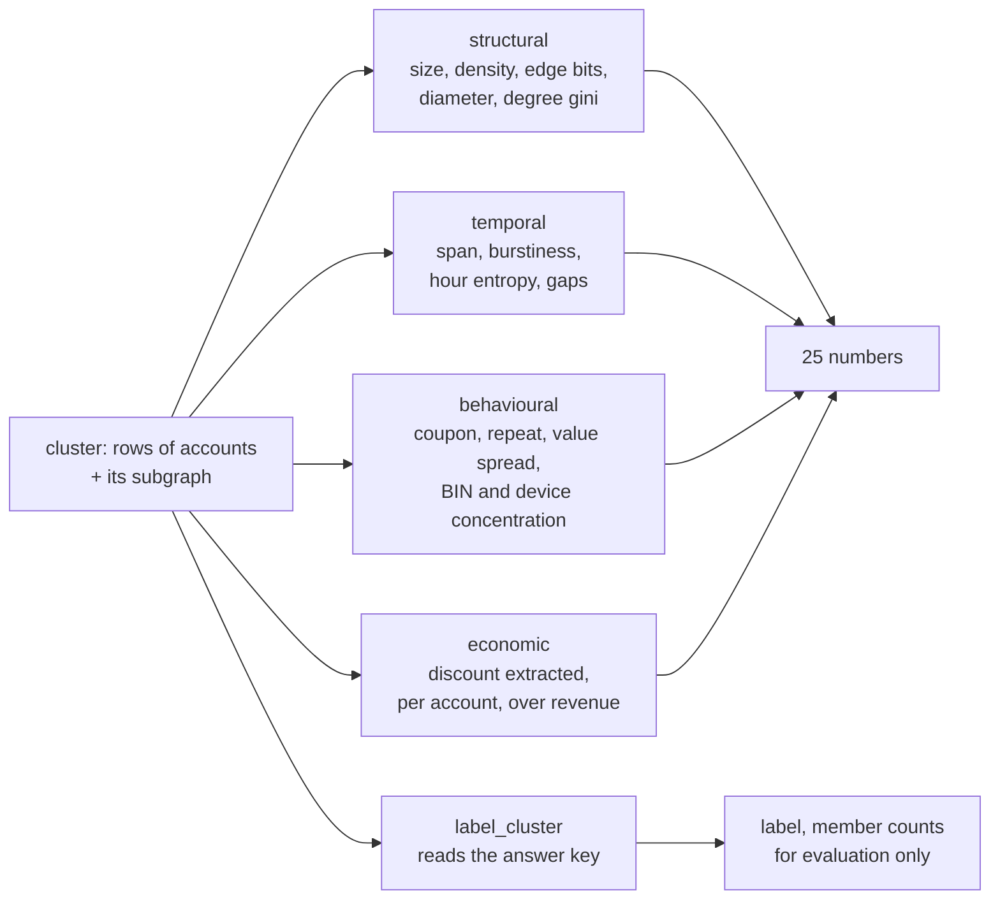

# Phase 4: Group features

## What this phase does

Turns each cluster into 25 numbers: structural facts from the evidence graph,
temporal shape, behaviour, and rupees extracted. Then it audits those numbers
for leakage and redundancy before any model sees them.

## Why it matters

The model cannot look at a cluster, only at numbers, and this decides which
numbers. Good features make almost any classifier work. Bad ones make none of
them work.

The leakage audit is the other half. A feature that quietly encodes the answer
produces a model that scores beautifully in testing and does nothing in
production. It is the single most common way a project like this produces
numbers that are fiction.

## How it works

The insight everything is built on: **real families share more than rings do.**
A family shares one actual card, one real address, one device, and orders for
years. A ring shares a device by accident and fakes the rest, because faking is
the point. So the separator is not how much a group shares, it is whether their
behaviour persists.

| Signal | Ring | Family | Office lunch group |
| ------ | ---- | ------ | ------------------ |
| Signup span | days | years | days, the trap |
| Repeat orders | almost none | routine | routine |
| Coupon usage | near 100% | some | some |
| Order values | near the coupon floor | scattered | scattered |
| Cards | many, one BIN | one shared card | many BINs |

The `office` column matches a ring on every static attribute and differs only on
repeat behaviour. That is why the generator had to include it.



Two features are worth calling out. `hour_concentration` is one minus the
normalised entropy of signup hour-of-day: real people sign up across the day and
a script does not, and it is a signal an operator does not think to hide. And the
economic block exists because a cluster extracting Rs.400 is noise while one
extracting Rs.40,000 is the target, so giving the model rupee-denominated
features makes its scores lean toward what the Phase 6 decision actually cares
about.

## Files

| File | What it does | Key functions |
| ---- | ------------ | ------------- |
| `detector/features.py` | 25 features, labels, table building, audit | `cluster_features`, `label_cluster`, `build_table`, `audit` |
| `results/features_sample.csv` | 200 rows, committed so it can be eyeballed | data |
| `results/feature_audit.json` | Leakage and redundancy report | data |

The full train and validation tables are rebuilt by `run.sh` and not committed.

## Key decisions

**A cluster is labelled a ring when most of its accounts are ring accounts.**
Not when any are. A cluster of 30 holding 2 ring accounts is a benign cluster
that swept up two abusers, and calling it positive would teach the model that
benign structure is suspicious.

**Labels carry member counts, not just a flag.** `n_ring_members` and
`n_innocent_members` come along because the Phase 6 cost model prices every
innocent account inside a blocked cluster individually, at Rs.15,000 each.

**Redundant pairs are recorded here and pruned in Phase 5, on measured PR-AUC
rather than on the correlation matrix alone.** Four pairs exceed |r| > 0.9 and
one of them, `coupon_rate` against `discount_per_account`, is exactly 1.0000
because the second is the first times Rs.200.

## Results

```
$ python -m detector.features --accounts 12000 --seeds 0-59
$ python -m detector.features --audit results/features_train.csv

45,324 clusters from 240 worlds, 25 features
cluster level label rate 0.0236
```

Note the two different prevalences. Accounts are 0.80% ring. Clusters are 2.36%
ring, because clustering concentrates them. Every metric in Phase 5 is quoted
against the cluster figure and Phase 7 reports both.

Positives per tier, over 60 worlds each:

| tier | clusters | labelled ring | rate |
| ---- | -------- | ------------- | ---- |
| obvious | 11,301 | 240 | 2.12% |
| moderate | 11,301 | 218 | 1.93% |
| sophisticated | 11,401 | 240 | 2.11% |
| adaptive | 11,321 | 370 | 3.27% |

The adaptive row has the *most* positive clusters. That is not the system doing
better there, it is the opposite: adaptive rings fragment into many small pieces,
each of which is majority ring, so one ring becomes several labelled clusters.
Each piece is easier to label and the ring as a whole is harder to catch.

### Leakage audit

```
no feature correlates above 0.95 with the label. Strongest is 0.3923.

total_discount          0.3923      hour_concentration      0.1766
mean_edge_bits          0.3800      min_edge_bits           0.1660
weight_spread           0.3766      diameter                0.1231
distinct_bin_ratio      0.2804      top_signal_share        0.0911
distinct_device_ratio   0.2762      coupon_rate             0.0665
size                    0.2458      repeat_rate             0.0519
distinct_address_ratio  0.1810      edge_density            0.0053

forbidden columns referenced by feature code: none
```

The audit reads the source of every feature function and fails if it mentions
`is_ring`, `group_id`, `group_type`, `operator_id`, `truth` or `label`.

### Redundancy, |r| > 0.90

| feature A | feature B | r |
| --------- | --------- | - |
| coupon_rate | discount_per_account | 1.0000 |
| size | total_discount | 0.9605 |
| lifespan_days | distinct_address_ratio | -0.9019 |
| edge_density | degree_gini | -0.9008 |

### Cost

240 worlds in 5 minutes 8 seconds, so 100 worlds in about 2 minutes 8 seconds,
against the plan's 3 minute bar.

## Known limitations

**`repeat_rate` is much weaker than the plan expects, and Phase 0 predicted it.**
The Olist population repeat rate is 3.1%, so ordinary accounts rarely reorder
either. Median `repeat_rate` is 0.000 for both ring and benign clusters. It
still separates rings from `office` and `family` groups, which is where the
false positives come from, and the test suite asserts that gap. On a merchant
with real repeat business it would be far stronger.

**`hour_concentration` and `signup_span_days` are confounded by cluster size.**
A benign cluster of three accounts has low hour entropy simply because it has
three samples. Ring clusters are larger, so they read as more spread out. The
model sees `size` alongside them and can compensate, but neither feature means
on its own what its name suggests.

**No feature crosses cluster boundaries.** Two clusters in the same pincode that
are really one ring are scored independently, so a fragmented ring is never
reassembled.
