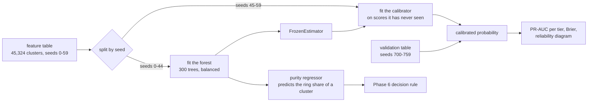

# Phase 5: Model and calibration

## What this phase does

Trains a random forest on the 24 cluster features, then makes its scores mean
what they say. Reports PR-AUC against the prevalence it must be read against,
compares Platt scaling to isotonic regression, and draws the reliability diagram
that proves the probabilities are real.

## Why it matters

Training is four lines. Calibration is the phase.

Random forests are badly calibrated by construction. The ensemble averages many
trees, so for it to output 0 every tree must output 0, and any noise in any tree
pushes the average up. Errors near the boundaries are one sided, so probabilities
get squeezed toward the middle.

That matters here more than usual, because Phase 6 computes expected cost in
rupees directly from `p`. If `p` is not a real probability, the entire cost model
is arithmetic on a meaningless number.

## How it works



**Split on the world seed, never on the row.** Clusters from one generated world
share generator artefacts. A random row split leaks them across the boundary and
silently inflates every score. Seeds 0 to 44 fit the forest, 45 to 59 fit the
calibrator, 700 to 759 are the validation set, and 900 to 999 stay sealed.

**PR-AUC, not ROC-AUC.** At 2.3% cluster prevalence ROC-AUC is dominated by the
true-negative pool. It reads 0.9910 here while PR-AUC reads 0.9418, and the
second number is the informative one.

## Files

| File | What it does | Key functions |
| ---- | ------------ | ------------- |
| `detector/model.py` | Fit, calibrate, evaluate, plot | `split_by_seed`, `train_and_calibrate`, `evaluate`, `plot_reliability` |
| `results/model.json` | Every metric, per variant and per tier | data |
| `results/model.pkl` | The fitted forest, purity model and both calibrators | data |
| `results/pr_curve.png`, `results/reliability.png` | The two charts | data |

## Key decisions

**A second model predicts cluster purity, and the decision rule uses it instead
of the class probability.** The classifier answers "is this cluster majority
ring", which is not the question the cost model asks. Blocking a cluster blocks
every account in it, so the bill is the innocent accounts caught in the net, and
a cluster that is 90% ring still costs 10% of its members at Rs.15,000 each.
Using the class probability made the decision rule incoherent and turned a
Rs.1.3 million gain into a Rs.16.4 million loss. See D-022.

**`cv="prefit"` is gone in scikit-learn 1.9, so the forest is wrapped in
`FrozenEstimator`.** Same effect: the calibrator learns only the mapping from
the fitted forest's scores to probabilities, on worlds the forest never saw.

**The calibration method is chosen on rupees, not on Brier.** Isotonic wins on
Brier by a hair (0.00313 against 0.00323) and loses on PR-AUC (0.9298 against
0.9418), because its step function creates ties that damage the ranking. The
reliability diagram shows why: between 0.3 and 0.8 isotonic has one or two
clusters per bin and swings wildly, while Platt stays smooth. Both are saved and
Phase 6 picks on total cost. See D-021.

**One feature was dropped.** `discount_per_account` is `coupon_rate` times
Rs.200, correlation exactly 1.0000. The other three redundant pairs from the
Phase 4 audit were kept, because a forest is untroubled by collinearity and
dropping them changed nothing measurable.

## Results

Validation seeds 700-759, 45,159 clusters, cluster-level prevalence 2.32%.

```
$ python -m detector.model

variant            PR-AUC    baseline   lift     Brier     ROC-AUC
forest_raw         0.9418    0.0232     40.6     0.00527   0.9910
forest_sigmoid     0.9418    0.0232     40.6     0.00323   0.9910
forest_isotonic    0.9298    0.0232     40.1     0.00313   0.9904
mlp_raw            0.9449    0.0232     40.8     0.00291   0.9929
```

**PR-AUC 0.9418 against a 0.0232 prevalence baseline, a 40.6x lift.** That is a
far more informative sentence than "AUC 0.99".

Per tier, with the calibrated forest:

| tier | clusters | positives | prevalence | PR-AUC | lift | Brier |
| ---- | -------- | --------- | ---------- | ------ | ---- | ----- |
| obvious | 11,258 | 214 | 0.01901 | 1.0000 | 52.6 | 0.00048 |
| moderate | 11,206 | 237 | 0.02115 | 0.9998 | 47.3 | 0.00069 |
| sophisticated | 11,278 | 243 | 0.02155 | 0.9562 | 44.4 | 0.00185 |
| adaptive | 11,417 | 353 | 0.03092 | 0.8335 | 27.0 | 0.00942 |

PR-AUC of 1.0000 on `obvious` was checked for leakage rather than celebrated. It
is real separation: an obvious ring cluster has a median of 28 accounts at 57.5
bits per edge with a value coefficient of variation of 0.055, against 3 accounts
at 16.7 bits and 0.395 for a benign one. There is no overlap to resolve. On
`adaptive` there are 6,152 benign clusters scoring above the weakest ring
cluster, which is what a PR-AUC of 0.8335 looks like.

**Calibration.** Brier falls from 0.00527 raw to 0.00323 with Platt and 0.00313
with isotonic. The reliability diagram in `results/reliability.png` shows the raw
forest sitting well below the diagonal: clusters it scored 0.55 were rings 21% of
the time. After Platt scaling that bin reads 36%, and after isotonic 33%.

**The small neural network wins, slightly.** PR-AUC 0.9449 against the forest's
0.9418, and a better raw Brier. Plan section 2.6 predicted the forest would win
at this data scale and it did not, by 0.003. That is inside the noise of a single
validation split and neither model is meaningfully better. The forest ships
because it calibrates cleanly and because its permutation importances are
readable, not because it scored higher. Reporting this the other way round would
have been easy and wrong.

**Purity model.** Mean absolute error 0.00756 across all clusters and 0.15623 on
ring clusters. It is accurate where most clusters live, near zero purity, and
much weaker on the ones that matter, which is a real weakness of the decision
rule that depends on it.

### Permutation importance, top 8

| feature | drop in average precision |
| ------- | ------------------------- |
| distinct_bin_ratio | 0.02611 |
| total_discount | 0.02485 |
| value_cv | 0.01797 |
| near_min_rate | 0.01688 |
| discount_to_revenue | 0.01607 |
| size | 0.01140 |
| coupon_rate | 0.00805 |
| bin_concentration | 0.00793 |

Three of the top five are economic or value-shape features. `repeat_rate`, which
the plan expected to be the strongest single feature, ranks fifteenth at 0.00092.
Phase 0 predicted that: the Olist population repeat rate is 3.1%, so ordinary
accounts rarely reorder either, and the feature separates rings from `office` and
`family` groups but not from ordinary strangers.

## Known limitations

**The purity model is weak exactly where it is load bearing.** 0.156 mean
absolute error on ring clusters means the decision rule is working with a purity
estimate that can be wrong by 15 percentage points, on the clusters where the
choice between block and review is decided.

**Cluster-level metrics are not account-level metrics.** Everything here is
measured over clusters at 2.32% prevalence. Accounts are at 0.80%. Phase 7
reports both and the account numbers are the ones that matter.

**The recall ceiling was set two phases ago.** Clustering leaves 22% of adaptive
ring accounts outside any majority-ring cluster. No model can recover them, so
the adaptive PR-AUC of 0.8335 is measured only over the clusters that exist.
