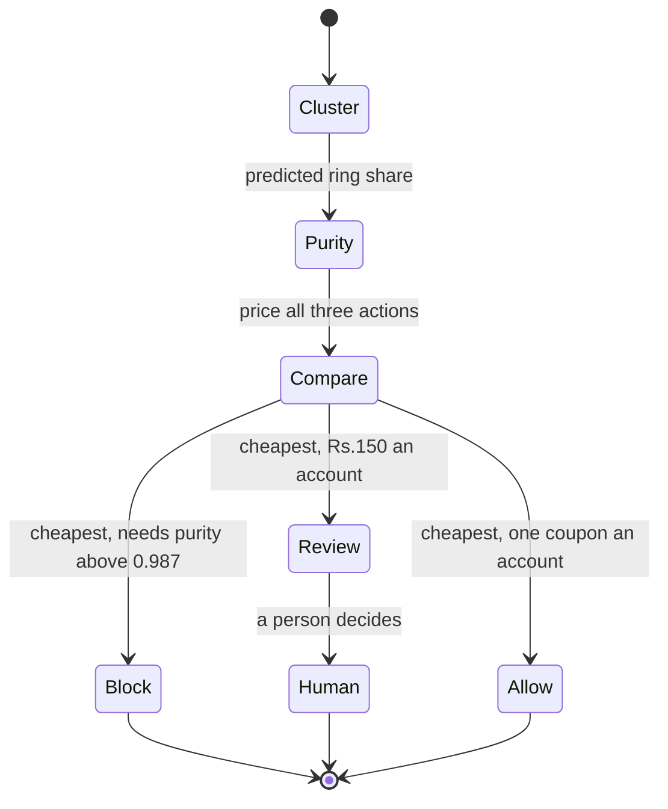

# Phase 6: Cost-optimal decisions

## What this phase does

Turns a calibrated probability into one of three actions: block, allow, or send
to a human. Prices every option in rupees, sweeps the naive threshold to show
what it costs, and tests the whole thing against the assumption it rests on.

## Why it matters

This is where the track is won.

Missing a promo abuser costs Rs.200, one coupon. Wrongly blocking a real
customer costs Rs.15,000, their lifetime value. That is 75 to 1, and at that
ratio optimising F1 is optimising the wrong thing, because F1 treats a false
positive and a false negative as equally bad when one is 75 times worse.

Work the plan's example. A cluster of 20 accounts, 70% of them ring accounts:

```
block   0.30 x 20 x 15,000 = Rs.90,000
allow   0.70 x 20 x    200 = Rs.2,800
review        20 x    150 = Rs.3,000
```

Allowing wins, at 70% confidence it is a ring. Counter-intuitive, and correct.

## How it works



The threshold is not a knob anyone turns. It falls out of the arithmetic:
blocking beats allowing only when

```
(1 - purity) x 15,000  <  purity x 200
```

which needs purity above **98.7%**. Every precision figure in this repository
should be read against that line rather than against 100%.

## Files

| File | What it does | Key functions |
| ---- | ------------ | ------------- |
| `detector/costs.py` | The cost model and its two reference lines | `decision_cost`, `do_nothing_cost`, `breakeven_precision` |
| `detector/decide.py` | Expected cost, the three actions, sweeps, sensitivity | `expected_costs`, `best_action`, `realised_cost`, `sweep`, `sensitivity` |
| `results/decisions.json` | Every policy, priced | data |
| `results/cost_curve.png` | The headline chart | data |

## Key decisions

**Expected cost uses predicted purity, not the class probability.** Blocking a
cluster blocks every account in it. The class probability answers "is this
cluster majority ring", which does not tell you how many innocent people are
inside. Using it gave a rule that blocked 20,081 accounts at 93% precision and
lost Rs.16.4 million. Using purity gives a rule that blocks 3,875 accounts at
99.97% precision and makes Rs.1.3 million. See D-022.

**Ring accounts that joined no cluster are still billed.** They are invisible to
every stage after Phase 3, and pretending they cost nothing would flatter every
number here. `unclustered_ring_accounts` finds them from the world totals carried
on each row.

**Review is assumed to resolve correctly.** A reviewed cluster costs Rs.150 an
account and nothing else. That is generous to the review action and it is stated
as a limitation rather than buried.

## Results

Validation seeds 700-759, 240 worlds, 2,880,000 accounts, 23,040 ring accounts.

```
$ python -m detector.decide

policy                              thr    prec     recall   blocked  reviewed  cost           net vs nothing
block above F1-optimal threshold    0.73   0.9162   0.9119   22,934   0         Rs.29,250,800  -Rs.24,642,800
block above 0.50                    -      0.9084   0.9169   23,256   0         Rs.32,348,000  -Rs.27,740,000
block above cost-optimal threshold  1.00   0.0000   0.0000   0        0         Rs.4,608,000   +Rs.0
three actions, expected cost rule   -      0.9997   0.1681   3,875    17,059    Rs.3,290,250   +Rs.1,317,750

deploy nothing: Rs.4,608,000
review queue: 1.40% of clusters, 17,059 accounts
```

Read those four rows in order.

**The F1-optimal detector destroys Rs.24.6 million.** It catches 91% of ring
accounts at 92% precision, which on any ordinary scoreboard is an excellent
result, and it blocks about 1,900 real customers doing it.

**Blocking at 0.5 is worse still**, at Rs.27.7 million lost.

**The cost-optimal two-action threshold is 1.00, which means block nobody.** Of
101 thresholds swept from 0.00 to 1.00, not one turns a profit. If two actions
are all you have, the correct deployment of this detector is not to deploy it.
`test_every_two_action_threshold_loses_money` asserts exactly that.

**The third action changes the sign.** Blocking only clusters it believes are
essentially pure, reviewing the uncertain ones and allowing the rest, the system
saves **Rs.1,317,750** against doing nothing. Precision is 0.9997, above the
98.7% breakeven, because the rule refuses to block anything it is not nearly
certain about. Recall is 0.1681, which is the honest price of that discipline,
and a further 17,059 accounts go to a human rather than being thrown away.

The review queue is 1.40% of clusters, below the plan's expected 2% to 20% band.
The rule is more decisive than the plan anticipated because the purity model is
confident at both ends.

### Sensitivity to the Rs.15,000 assumption

That number is an assumption, so it gets challenged here rather than by a judge.

| cost ratio | a wrong block costs | best two-action threshold | net, three actions |
| ---------- | ------------------- | ------------------------- | ------------------ |
| 10:1 | Rs.2,000 | 0.99 | +Rs.2,015,900 |
| 25:1 | Rs.5,000 | 1.00 | +Rs.1,478,600 |
| 50:1 | Rs.10,000 | 1.00 | +Rs.1,379,250 |
| 75:1 | Rs.15,000 | 1.00 | +Rs.1,317,750 |
| 100:1 | Rs.20,000 | 1.00 | +Rs.1,297,200 |
| 150:1 | Rs.30,000 | 1.00 | +Rs.1,277,250 |
| 200:1 | Rs.40,000 | 1.00 | +Rs.1,271,700 |

The conclusion survives disagreement about the number. At every ratio from 10:1
to 200:1 the three-action rule turns a profit, and from 25:1 upward no two-action
threshold does. Only at 10:1, where a wrong block costs Rs.2,000, does blocking
at a threshold become viable at all.

## Known limitations

**Recall is 0.1681.** The system catches about one ring account in six by
blocking. That is what the cost asymmetry buys, and calling it a detection rate
without the rupees beside it would be misleading.

**Review is assumed free of error.** A reviewed cluster is priced at analyst time
alone. Real analysts are wrong sometimes, and a more honest model would carry a
review error rate. It would reduce the gain, not reverse it, because review is
the cheap action either way.

**The cost model is per account and linear.** Blocking 30 accounts is priced at
30 lost customers. In reality, blocking a whole hostel makes the news and costs
more than 30 lifetime values.

**Everything here is measured on validation seeds.** Phase 7 opens the sealed
holdout once, and these numbers should be expected to get worse.
