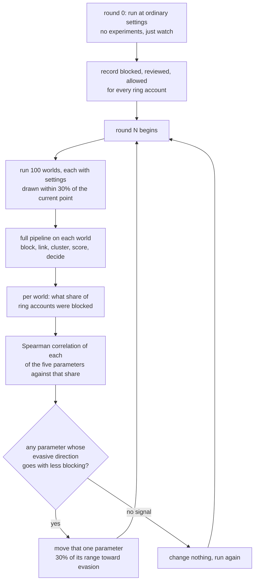

# Adversarial loop

## What this does

Operator sophistication has been a dial we set. That invites a fair objection:
we wrote the fraud, so of course we catch it.

This closes the loop. An operator starts at ordinary settings, watches what
happens to its own rings, works out which of its own behaviours is getting it
caught, changes that one thing, and tries again. It never sees the detector.

## What the operator can and cannot see

It controls five things about how it runs a ring:

| parameter | range | evasive direction |
| --- | --- | --- |
| device reuse | 0.00 to 1.00 | down |
| accounts per drop address | 1.0 to 20.0 | down |
| signup window, days | 0.04 to 45.0 | up |
| order value jitter, rupees | 80 to 1,200 | up |
| camouflage | 0.00 to 0.50 | up |

It observes exactly one thing: **the share of its accounts that were blocked.**

That is a deliberate and important restriction. A cluster sent to a human review
queue looks identical to one that was allowed, from the operator's side, until
somebody acts on it. Blocking is the only outcome an operator gets immediate
feedback on. Giving it the review outcome too would be giving it information a
real operator does not have.

It never sees the model, the weights, the thresholds, the features, or any
account that is not its own.

## Method

The operator moves the parameter with the **largest gain**, not the largest
correlation. A strong correlation pointing the wrong way is worth nothing to it.
Only one parameter moves per round, so the cause of any change in outcome is
never ambiguous.

## Why 100 worlds per round

Chosen by measurement, not by feel. The question is whether the operator's read
on which parameter matters is stable, or whether it is chasing noise.

Three independent replicates of a single round, each on different seeds:

| worlds per round | replicate 1 | replicate 2 | replicate 3 |
| --- | --- | --- | --- |
| 20 | no variation in the blocked rate at all | | |
| 40 | no variation in the blocked rate at all | | |
| 60 | signup window (rho -0.288) | **accounts per drop** (rho +0.313) | |
| 100 | signup window (rho -0.320, p 0.001) | signup window (rho -0.368, p 0.000) | signup window (rho -0.456, p 0.000) |
| 150 | signup window (rho -0.425, p 0.000) | signup window (rho -0.379, p 0.000) | signup window (rho -0.483, p 0.000) |

At 20 and 40 worlds the blocked rate is constant across every world, so there is
nothing to correlate and the operator learns nothing. At 60 the answer flips
between replicates. At 100 all three replicates agree at p of 0.001 or better,
and 150 adds nothing. So 100.

## Results

Six rounds, 100 worlds each, 12,000 accounts per world, starting from the
ordinary settings. Seeds 100 to 699, which the model was never fitted on.

| round | signup window (days) | blocked | blocked or reviewed | what the operator did |
| --- | --- | --- | --- | --- |
| 0 | 3.0 | 0.1354 | 0.9631 | watched, no experiments |
| 1 | 3.0 | 0.0293 | 0.9557 | found signup window, rho -0.321, p 0.001. Moved it to 16.5 days |
| 2 | 16.5 | **0.0000** | 0.9544 | nothing was blocked, so no signal to learn from |
| 3 | 16.5 | **0.0000** | 0.9460 | nothing was blocked, so no signal to learn from |
| 4 | 16.5 | 0.0050 | 0.9331 | found signup window again, rho -0.228, p 0.023. Moved it to 30.0 days |
| 5 | 30.0 | **0.0000** | 0.9283 | nothing was blocked |

The other four parameters never moved. Device reuse stayed at 0.60, drop
addresses at 8.0 accounts each, value jitter at Rs.200, camouflage at zero.

What the operator found in round 1, ranked:

| parameter | rho against being blocked | p |
| --- | --- | --- |
| signup window | -0.321 | 0.001 |
| accounts per drop address | +0.254 | 0.011 |
| value jitter | -0.138 | 0.172 |
| camouflage | -0.082 | 0.416 |
| device reuse | -0.053 | 0.601 |

## What actually happened

**It did not converge on address rotation.** The failure catalogue and the
detection curve both point at delivery addresses as the thing that defeats this
system, and an operator with the same five knobs and no access to any of that
went for signup timing instead. Address rotation was the second strongest signal
in round 1, at rho +0.254 against +0.321, and it was never chosen.

That is worth sitting with. Address rotation is what breaks blocking *and*
review. Spreading signups breaks blocking only. The operator picked the one it
could measure, which is exactly the one that helps it least in the end.

**Blocking collapsed in a single move, and stayed collapsed.** From 0.1354 to
0.0293 after one change, to zero after two. The operator, judged on the only
thing it can see, has won completely by round 2.

**The review queue barely moved.** 0.9631 to 0.9283 across all six rounds, a
fall of 3.6% of where it started, while blocking fell by 100% of where it
started. 93% of the adapted operator's accounts still reach a human.

**The operator ran out of signal.** In rounds 2, 3 and 5 not a single ring
account was blocked in 100 worlds. With nothing to correlate against, the
operator cannot learn anything more. It has optimised itself into a blind spot
of its own making: it can no longer tell whether any further change helps,
because the outcome it measures is already zero.

## What this means

The honest reading is that the loop confirms a weakness and reveals a strength,
and neither was designed in.

The weakness: a naive operator, with no knowledge of the system, needs two moves
and about two hundred experiments to reduce automatic blocking to nothing. If
this shipped as a blocking-only system it would be defeated inside a week.

The strength: the same operator cannot see the review queue, so it cannot
optimise against it, and it does not. The three-action design turns out to be
adversarially robust for a reason that has nothing to do with modelling. Not
because the queue is hard to evade, but because it is **invisible**. An operator
learns from feedback, and a review queue gives none.

That also names the way to break it. An operator patient enough to watch which
accounts get closed weeks later, rather than which get blocked at signup, would
recover the missing signal and could then optimise against review as well. This
loop does not model that operator, and nothing here suggests the system would
survive one.

## Known limitations

**One parameter moves per round.** A real operator would change several things
at once. Moving one keeps attribution clean and makes the loop slower to evade
than reality.

**The step size is fixed at 30% of each range.** A finer search would find a
cheaper move. A coarser one would overshoot.

**Five parameters is the whole action space.** A real operator has more: parcel
lockers, aged accounts bought from someone else, orders placed through a
different merchant first. None of that is modelled.

**Six rounds is not convergence.** The operator stopped learning at round 2
because its signal went to zero, not because it had finished. A longer run would
show the same flat lines.

**The detector never adapts back.** This is one-sided. A real deployment would
retrain, and the interesting experiment, which is not run here, is what happens
when both sides move.
